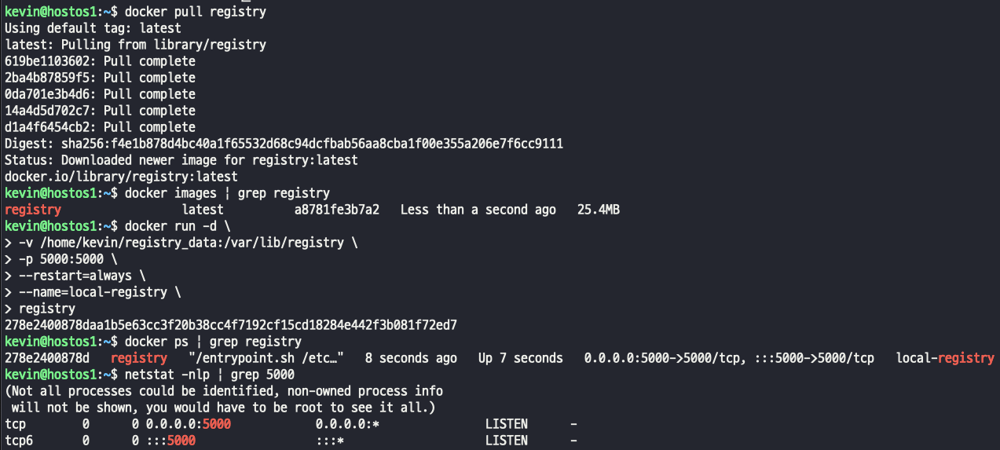
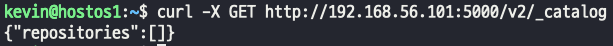
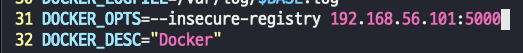
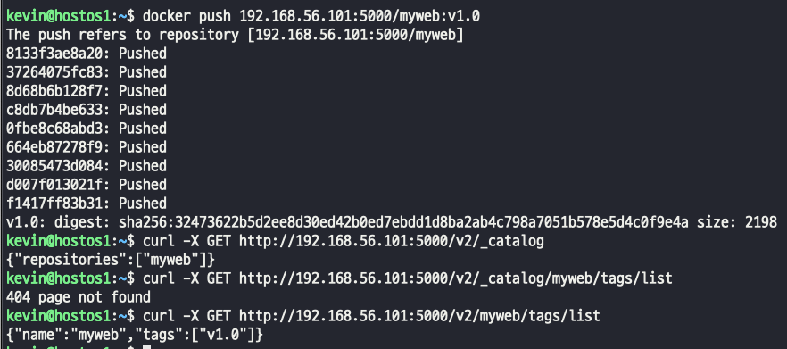

### docker container registry
- 기업 내부에서 생성한 프로젝트용 이미지를 public registry에 올리는 경우는 없다.
- image에 네트워크나 OS 및 미들웨어 설정 등의 정보가 포함되어 있으므로 보안상 Docker Hub와 같이 인터넷을 통해 불특정 다수에게 공개되는 곳에는 올릴 수 없는 경우에는 "Private Registry" 를 구축한다.
- Docker registry는 docker image 를 회사 서버에서 개별적으로 구축 관리하는 서비스다.
- 회사 인프라내에 private docker registry를 구축하기 위해서는, Docker Hub에 공개되어 있는 공식 image 인 "registry"를 사용한다.
- 적은 용량의 container service로 사용하기 적합하다.
- 프로젝트 파일의 용량이 큰 경우에는 git 혹은 Nexus 을 사용하는 경우가 많다.
>   
> -d : 백그라운드 실행  
> -v : volume Host에 있는 Registry data, 컨테이너에 있는 registry data 볼륨을 거쳐 매칭시켜서 데이터를 보존하겠다  
> -p : docker registry는 기본적으로 5000 포트를 EXPOSE 하고있다. 그래서 PORT를 5000번으로 열어주는것이다.
> > docker proxy를 사용해서 외부에서 컨테이너 내부 5000번 포트로 전달한다.

>   
> 5000 포트로 요청을 보낸다 -> /v2/_catalog 는 registry의 기본 주소값이다. 통신이 잘 된다.~
>

### 로그인 없이 만들어진 registry에 이미지 업로드 해보기
- local registry에 푸시하기전에 꼭 해야하는 작업은 docker에게 우리 local registry 주소를 알려줘야한다.
- 기본 default는 push를 하게 되면 docker.io로 업로드 되게 설정되어 있기 때문에 바로 push 하면 에러가 발생된다.
> #### 1. /etc/init.d/docker 를 vi로 열고 옵션을 추가한다.
> 
> #### 2. /etc/docker/daemon.json 을 생성하고 이미지 내용을 추가한다.
> 
> #### 3. 도커 restart
> 
> #### 4. docker info 아래쪽에 등록이 잘 되었는지 확인한다
> 
> #### 5. registry에 push, curl을 통해 이미지가 잘 푸시되어 있는지 확인한다.
> 
