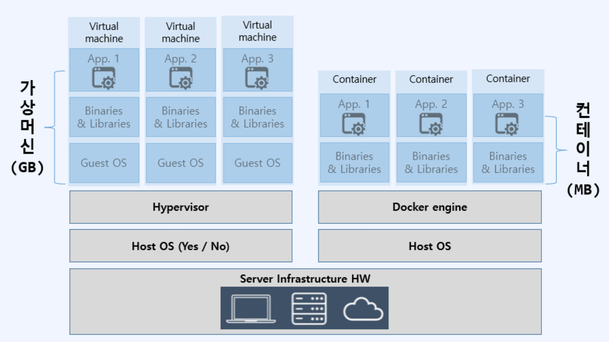

# 가상화란?

1. **일반적인 개념**
    - 서버, 스토리지, 네트워크, 애플리케이션 등을 가상화하여 하드웨어 리소스를 효율적으로 사용.
    - 이를 통해 기업은 효율적인 자원 활용, 자동화된 IT 관리, 빠른 재해 복구 등의 장점을 갖게 됨.
    - 물리적 하드웨어 유지보다 소프트웨어적으로 추상화된 가상화를 통해 리소스를 쉽게 관리하고 유지.
    - 하이퍼바이저 기반의 가상머신(VM, Virtual Machine)을 통해 수행 (예: Vmware, VirtualBox 등).

2. **컨테이너 가상화 vs VM 가상화**
    - 두 가상화 모두 애플리케이션 프로세스 및 종속 요소를 패키지, 즉 '이미지'화 하여 HostOS와 격리된 환경을 제공.
    - VM 가상화는 하드웨어 수준의 가상화로, 별도의 GuestOS(Kernel)를 두고 애플리케이션을 설치.
    - 컨테이너 가상화는 OS 수준의 가상화로, 경량이며 호스트 운영체제의 커널을 공유.
    - 결론: 하드웨어 수준의 가상화는 VM 가상화, OS수준의 가상화는 컨테이너 가상화.

3. **컨테이너화 (Containerization) 기술**
    - 리눅스 컨테이너 기술은 LXC(LinuX Container)를 이용한 시스템 컨테이너화로 시작.
    - OS 수준의 가상화 도구, cgroup, namespace 등의 커널 기술을 공유하며 컨테이너에 제공.
    - 초기 Docker 버전은 LXC를 활용해 컨테이너를 생성, 이후 containerd, runC를 이용하는 방식으로 발전.

### Docker 엔진의 구성

1. **runC**
    - 커널 기술의 공유를 통해 컨테이너 생성을 지원.
    - HOST 커널에 있는 소스를 공유받아서 컨테이너를 만드는 역할.

2. **containerd**
    - 생성된 컨테이너의 라이프사이클 관리 지원.

3. **dockerd**
    - 사용자가 입력하는 CLI의 명령어에 대한 관리.
    - swarmkit을 생성, 초기화 작업을 통해 3대의 hostOs를 생성하는 작업.
    - 이벤트 로그 및 Docker 플랫폼에서 발생하는 로그 관리.
    - 이미지 파일을 관리하는 Storage와 Docker와의 연동.
    - libnetwork (Docker의 기본 네트워크).
    - buildkit (이미지 빌드 관련).
    - DCT (이미지 보호 기능 - 위조 변조 관리).
    - 이미지 관리 (이미지 파일 생성, 백업, 업로드 등의 과정 관리).

* * * 
 

# 배포 방식의 차이

### VM 가상화
1. **서버 하드웨어 준비:** Host OS를 서버 하드웨어에 설치
2. **Hypervisor 설치:** Hypervisor 기술을 사용하여 GuestOS를 설치
3. **하드웨어 자원 공유:** Guest OS 설치 시 서버의 하드웨어 자원을 공유
4. **독립적 커널 실행:** 각 Guest OS는 독립적인 커널에서 동작
    - 여러 서버를 배포하려면, 각각의 GuestOS를 개별적으로 부팅하여 배포

### Docker 엔진을 사용한 배포 방식
1. **Base Image 사용:** 작은 base image 파일을 사용하여 서버를 부팅하는 대신, Docker 엔진은 이미지를 빠르게 실행할 수 있음
2. **Run 명령어:** Docker 엔진은 `docker run` 명령어를 통해 컨테이너를 즉시 배포 및 실행할 수 있음
    - 이 방법은 Host OS의 커널을 공유하면서도, 각 컨테이너가 격리된 환경에서 실행 가능
 
