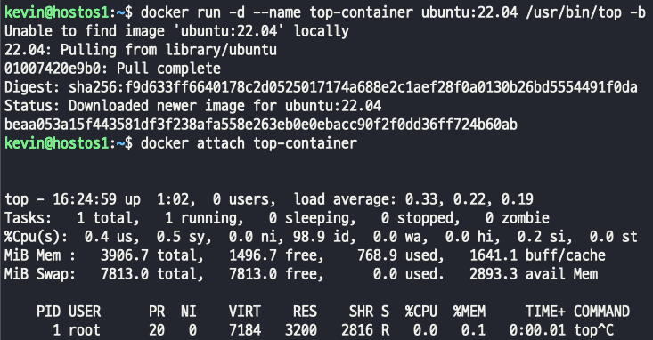
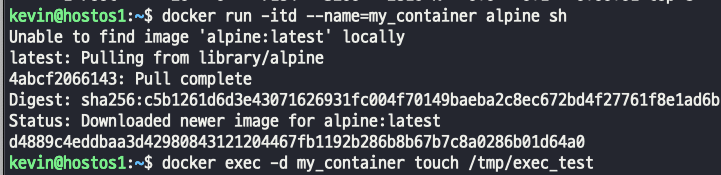
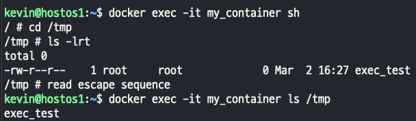
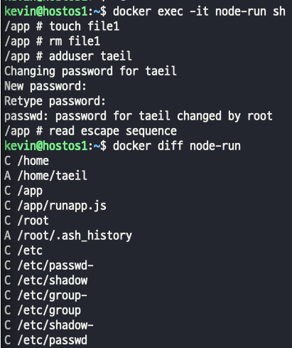
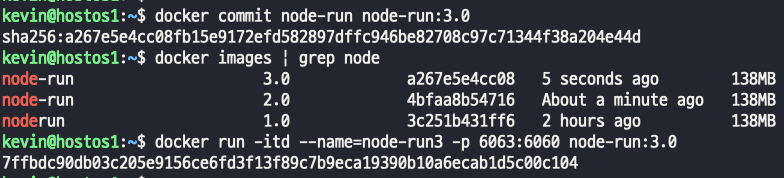

## Docker 컨테이너 관리를 위한 CLI(2)

#### docker 내부에서 발생한 실시간 로그를 확인하는 명령어
- docker events
> docker events --until time(h/m/s), --since date1 date2, --filter "key=value"
> 날짜와 시간을 지정해서 로그처럼 볼수도있고, 필터를 통해서 따로 출력할수도있음

#### docker exit code
> exit code 0 의도적으로 중지 : 컨테이너가 자동으로 중지되었음을 나타내기 위해 개발자가 사용  
> exit code 1 신청 오류 : 애플리케이션 오류 또는 이미지 사양의 잘못된 참조로 인해 컨테이너가 중지 됨  
> exit code 125 컨테이너 실행 실패 오류 : docker run 명령이 성공적으로 실행되지 않음  
> exit code 126 명령 호출 오류 : 이미지 사양에 지정된 명령을 호출할 수 없음  
> exit code 127 파일 또는 디렉터리를 찾을 수 없음 : 이미지 사양에 지정된 파일 또는 디렉터리를 찾을 수 없음  
> exit code 128 종료 시 잘못된 인수가 사용되었음 : 잘못된 종료 코드로 종료가 실행 됨(유효한 코드는 0-255 사이의 정수)  
> exit code 134 비정상 종료(SIGABRT) : 컨테이너가 abort() 함수를 사용하여 자체적으로 중단 됨  
> exit code 137 즉시 종료(SIGKILL) : 컨테이너가 SIGKILL 신호를 통해 운영 체제에 의해 즉시 종료 됨  
> exit code 139 분할 결함(SIGSEGV) : 컨테이너가 할당되지 않은 메모리에 엑세스하려고 시도하여 종료 됨  
> exit code 143 단계적 종료(SIGTERM) : 컨테이너가 곧 종료될 것이라는 경고를 받은 후 종료됨(graceful)  
> exit code 255 종료 상태가 범위를 벗어남 : 컨테이너가 종료되어 허용 가능한 범위를 벗어난 종료 코드를 반환. 오류의 원인을 알 수 없음을 의미  

#### docker attach | exec
- attach 와 exec의 차이는?
> attach같은 경우 내부에 돌아가는 실제 돌아가는 작업에 대한 로그를 출력하는것.  
>   
> exec는 내부에 들어가서 뭔가 작업을 해야하는 경우..  
>     
>   

#### docker idff 
- 실행 중인 컨테이너에 변경사항을 출력한다.
> 

#### docker commit 
- 실행 중인 컨테이너의 변경사항을 포함한 새로운 이미지 생성
> 

#### docker export | import
- docker export, 실행 중인 컨테이너의 파일 시스템을 tar archive로 내보내기(backup, migration)
- export는 image save와 다르게 이미지의 layer에 대한 내용은 포함되지 않고, 
- export로 추출한 컨테이너 내의 정보는 하나의 레이어로 통합된다.
> docker export를 해서 파일을 가져오는 경우 돌아가던 컨테이너의 모든걸 가져오는게 아니기 때문에, CMD 옵션을 부여하거나   
> dockerfile로 새로 빌드해서 사용하는 방법이 있다. -> 가져온 이미지를 base image로 ..