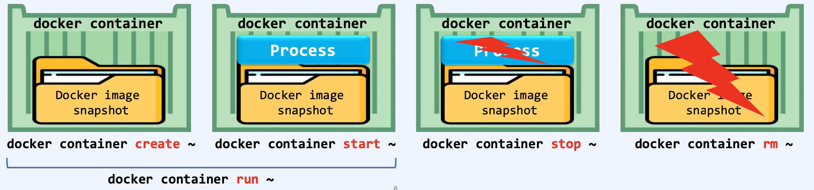

## 프로세스 격리 기술
- 컨테이너의 의미 
> docker run 명령어를 사용하면 컨테이너가 만들어진다.  
> docker 이미지를 복제(스냅샷)를 해서 process를 얹어서 컨테이너가 생성된다.   
> 이것을 <B>프로세스 격리 기술</B>이라고 한다.  
>
> docker run -it --rm --name=mycontainer ubuntu:14.04 bash 명령어를 실행하면 ?  
> 1. /var/lib/docker 영역에 이미지를 스냅샷, 복제본을 만든다.
> 2. 만들어진 스냅샷을 가져다가 동적인 활동이 가능하도록 layer를 붙인다 -> 계층형 구조로 되어있으니까.
> 3. 이때 만들어진 스냅샷은 R/O 인데, Read Write 가 가능한 컨테이너 레이어(프로세스 레이어)를 추가한다.
> 4. 이때 PID가 부여되는것이다.
> 5. PID가 부여된 후, Resource(CPU, 메모리, 저장공간 등...)이 부여된다   
> -> 컨테이너는 격리 기술이다. 하나의 독립적인 공간으로 만들어서 따로 운영될 수 있게 해주는 기술..

#### 컨테이너 격리 기술의 종류
1. chroot : 프로세스의 루트 디렉토리를 변경, 격리하여 가성의 루트 디렉터리를 생성한다.
2. pivot_root : 루트 파일시스템 자체를 바꿔, 컨테이너가 전용 루트 파일시스템을 가지도록 한다.(chroot 보완)
3. Mount namespace : namespace 내에 파일 시스템 트리를 구성한다.
4. UTS namespace : 컨테이너에 대한 hostname 격리를 수행하여 고유한 hostname 보유 가능
5. PID namespace : PID와 프로세스를 분리한다(systemd와 분리)
6. Network namespace : 네트워크 리소스(IP, PORT, route table, ethernet..) 할당
7. IPC namespace : 전용의 process table 보유
-> lsns 명령어를 통해서 생성된 name space에 대한 정보를 확인 가능 

#### docker 컨테이너 Lifecycle
- docker 컨테이너는 docker create 명령을 통해 image의 snapshot으로 /var/lib/docker 영역에 생성된다.
- docker start 명령은 읽고 쓰기가 가능한 Process영역 즉, container layer를 생성하여 동적 컨테이너를 구성하게 된다. 또한, docker stop은 생성된 container layer를 삭제한다.
- docker rm 은 생성된 snapshot을 삭제하는 과정을 통해 docker container lifecycle을 알 수 있다.
> 
-> 정리 하자면 docker lifecycle은 docker create, start, stop, rm 명령어를 통해 관리가 되는것이고, 이걸 한방에 할 수 있게 해주는게 docker run 명령어다. 

#### 수동생성하면 ?
  
-> 컨테이너의 상태를 보자..~  
-> docker 컨테이너는 image snapshot 이다. 그리고 그 위에 process가 얹어진 형태다!  
-> process -> Read/Write  
-> image snapshot -> Read/Only

#### 영역은 어디 위치일까?

- overlay, 저장소 hash값으로 merged에 위치해있다. 
- 동적인 활동이 가능한 컨테이너, 즉 동적인 프로세스에서 파일을 생성하면 해당 위치에도 동일하게 파일이 생성된다.
- 단, 이 위치는 파일 레벨이라고 생각하면 된다.