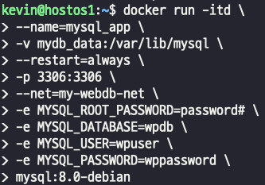
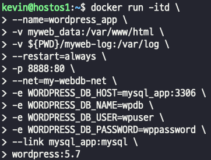
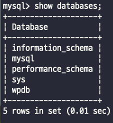
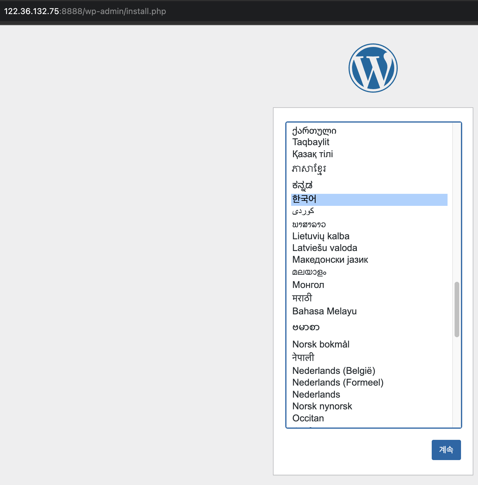
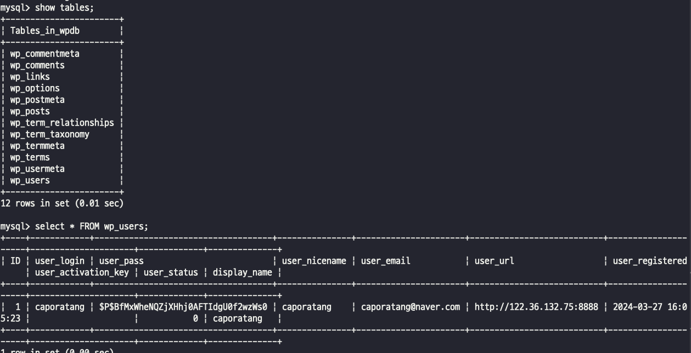
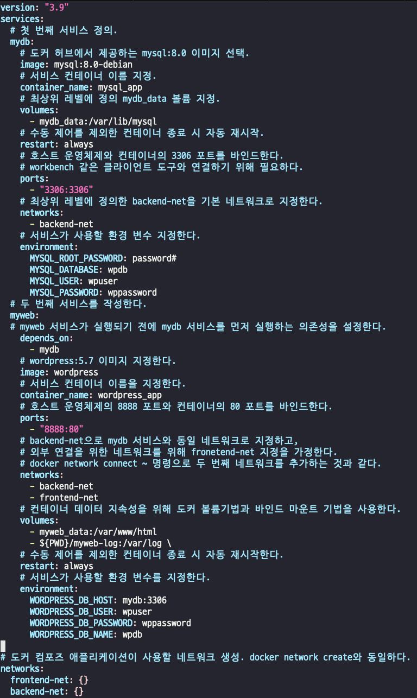
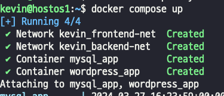

## 멀티 컨테이너 서비스 구성 비교
- 2tire (wordpress, mysql) 짜리를 compose와 단일 컨테이너를 연동하는 방식을 비교 해보자

### 단일 컨테이너 연동
- 볼륨생성, 네트워크를 생성하고 mysql 컨테이너, wordpress 컨테이너를 실행한다.  
- mysql 컨테이너 실행  

- wordpress 컨테이너를 mysql 컨테이너와 연결하고, 생성한다.  
     
- 컨테이너 생성시 설정한 db 생성 확인    
    
- 워드 프레스 접속 및 간단한 접속 테스트  
       
           
> - install 버튼을 누르면 자동으로 생성되는 db(설치한 mysql) 테이블에 유저 정보가 생성된다.     
>     

## 지금 이 과정을 docker compose로 변경해보자
- 기존에 사용하던 mysql, wordpress 컨테이너 삭제    
>     
>     
> - 사실상 도커 명령어를 비슷하게 그대로 사용하며, 단일 네트워크를 사용한다    
> - docker volumes, network 부분을 보면 : {} 이런식으로 되어 있는데, 저렇게 입력을 해주면 따로 create volume, create network가 발생  
- docker compose up  
>   
> - 당연히 동작도 동일하게 된다.

## docker compose?
- docker compose는 여러번의 docker CLI를 실행하지 않고, 한번에 관련 애플리케이션들을 YAML 파일로 구성하여 내부 환경 구성과 속성을 실행할 수 있다.
- 또한, docker compose는 설정 값을 캐싱하기 떄문에 재시작 시 변경이 없다면 캐싱된 정보를 그대로 사용하여 빠른 서비스 실행을 보장할 수 있다.
- YAML 코드에 포함된 애플리케이션들은 동일 네트워크에 포함되기 때문에 복잡한 연결 구성 없이도 쉽게 API 통신이 가능한 장점도 갖게 된다.
> - 네트워크를 따로 설정하지 않아도 docker bridge network 하나를 잡아서 yaml에 포함된 서비스들 간에 통신이 된다는 뜻.. 