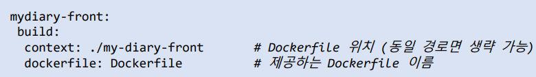
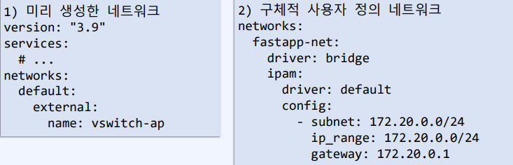
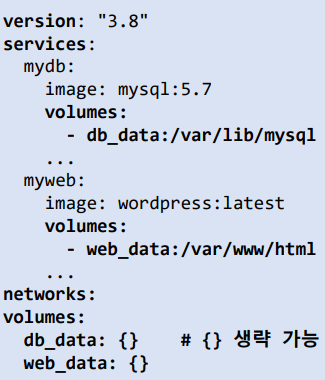
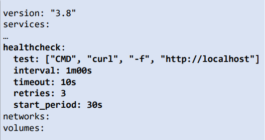

## docker compose yaml 

### verseion
- 일반적으로 docker-compose.yaml 코드의 첫 줄은 version을 명시한다 (순서 무관)
- version 명령은 docker engine release와 연관되는 Compse file format이다. 
- 현재 Dcoker 엔진에 맞는 버전을 사용하고, 만약 version이 맞지 않는 경우 오류가 발생한다.
> - 원인은 작성한 버전과 현재 docker compose 또는, Docker 엔진 릴리즈가 적합하지 않는 경우
> - docker compose 도구가 오래된 경우, 새로운 버전으로 업데이트 해야함
> - 버전 문제가 아닌 들여쓰기의 공백 수가 하위 레벨과 맞지 않아서 발생하는 경우

### services
- docker compose는 컨테이너 대신 service 개념을 사용하고, 상위의 version 명령과 동일 레벨로 작성되며 다중 컨테이너 서비스 실행을 목적으로 하기 때문에 복수형으로 작성한다.
- services 하위에는 실행될 컨테이너 서비스를 작성하고, 하위 레벨에 Docker 명령 실행과 유사하게 컨테이너 실행에 필요한 옵션들을 작성한다.
> - services 의 옵션
> 1. build : docker compose 실행 시 빌드 될 Dockerfile 명시
> >      
> 2. container_name 
> > - 디렉토리 단위 개발이 컨테이너 개발의 기본이다.
> > - 생략 시 자동으로 부여, "디렉터리명_서비스명_n".
> > - docker run의 --name 옵션과 동일
> 3. ports
> > - 서비스 내부 포트와 외부 호스트 포트를 지정하여 바인드, 외부 노출 포트 지정.
> > - docker run의 -p 옵션과 동일
 > 4. expose : 호스트 운영체제와 직접 연결하는 포트를 구성하지 않고, 서비스만 포트를 노출. 링크로 연결된 컨테이너 서비스와 서비스 간의 통신만 필요한 경우 사용
 > 5. networks
 > > - 최상위 레벨의 networks에 정의된 네트워크 이름을 작성한다.
 > > - docker run의 --net(--network) 옵션과 동일
 > 6. volumes 
 > > - 서비스 내부 디렉터리와 호스트 디렉터리를 연결하여 데이터 지속성 설정
 > > - docker run의 -v (--volume) 옵션과 동일하다.
 > 7. enviroment
 > > - 서비스 내부 환경 변수 설정
 > > - 환경 변수가 많은 경우, 파일(*.env)로 만들어 env_file 옵션에 파일명을 지정해서 사용 가능 -> env_file: ./envfile.env
 > > - docker run의 -e 옵션과 동일
 > 8. command
 > > - 서비스가 구동 이후 실행할 명령어 작성.
 > > - docker run의 마지막에 작성되는 명령어
 > 9. restart 
 > > - 서비스 재시작 옵션 지정.
 > > - docker run의 --restart 옵션과 동일
> 10. depends_on
> >  - 서비스간의 종속성을 의미하며 먼저 실행해야 하는 서비스를 지정하여 순서 지정.
> >  - 이 옵션에 지정된 서비스가 먼저 시작된다.
> 11. scale
> > - 해당 서비스의 복제 컨테이너 수 지정 (V2) -> (V3) deploy.replicas로 변경
> > - 이 옵션을 사용하는 경우 컨테이너 이름이 임의로 생성되기 때문에 이름을 따로 붙여서는 안된다.

### networks
- 다중 컨테이너들이 사용할 최상위 네트워크 키들을 정의하고 이하 하위 서비스 단위로 이 네티워크를 선택할 수 있다.
> - driver : 서비스의 컨테이너가 브리지 네트워크가 아닌 다른 네트워크를 사용하도록 설정
> - ipam : IPAM (IP Address Manager)를 위해 사용할 수 있는 옵션으로 subnet, ip, gateway 범위 설정
> - external : 기존의 네트워크를 사용하도록 설정
    
### volumes
- 데이터의 지속성을 유지하기 위해 최상위 레벨에 볼륨을 정의하고, 서비스 레벨에서 볼륨명과 서비스 내부의 디렉터리를 바인드 한다.
- docker volume create와 동일하게 Docker과 관리하는 /var/lib/docker/volume에 자동 배치된다.
- "docker volume ls" 명령과 "docker volume inpect 볼륨명" 으로 확인 가능  
  
### healthcheck 
- 컨테이너 서비스의 상태를 체크하는 명령
> - 예시로, 컨테이너 서비스 시작 후 30초 부터 1분마다 
> - 웹 서비스가 10초 이내에 기본 페이지를 응답해야 하고
> - 실패 시 3회 재시도 수행 한다.  
>   

### YAML 코드 작성 검증 (YAML code validator)
- 작성한 YAML 코드의 종속성 들여쓰기 검증을 받을 수 있는 사이트
- http://www.yamllint.com/
- https://codebeautyfy.org/yaml-validator
- https://onlineyamltools.com/validate-yaml

## docker compose CLI
- docker compose YAML 코드는 다양한 docker compose CLI를 통해 애플리케이션 실행, 관리 제거 까지 할 수 있다.
- docker compose CLI는 Docker 명령어와 크게 다르지 않기 때문에 Docker 명령어에 익숙하다면 쉽게 적용할 수 있다.
- 너무 많으니까 help를 통해서 CLI 별로 설명을 확인하고 잘 사용하자
> - docker compose -h

