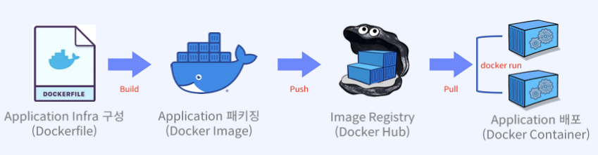

## docker_file 명령어
- docker file 같이 코드로 인프라를 구축하는것을 IaC(Infrastructure as Code, 코드형 인프라) 라고 한다.
> IaC가 필요한 이유?  
> 1. 커맨드 기반의 인프라 구성 시 사용자 실수 등의 인적 오류 가능성이 높다.
> > - APM(Apache + PHP + MySQL) 구축을 생각해보면 설치 순서와 상호 연관성 등을 고려하여 각종 라이브러리와 함께 복잡한 명령어들을 고민해야한다.
> > - 각종 환경 설정 정보와 설치 프로그램을 요구사항에 맞게 따져봐야 한다.
> > - 만일, 설치 이후에 잘못된 설정이 있다면 수정해야 하고, 재설치를 고려해야할 때도 있다.
> > - 이러한 수고로움을 하나의 이미지로 만들어 두고, 수정사항은 언제든 코드 변경이 용이하다면 개발 업무 목적을 이루는 것에 집중할 수 있다.
> 2. "코드형 인프라"는 탄력성, 확장성, 반복성을 부여하게 되어 눈송이 서버가 아닌 동일한 환경을 보유한 서버(컨테이너)를 수십~수백대를 운영, 관리하게 해준다.

### Dockerfile?
- Dockerfile은 Docker에서 동작하는 컨테이너의 구성 정보를 프로비저닝한 텍스트 template 파일이다.
> - 프로비저닝은 사용자의 요구에 맞게 시스템 자원을 할당, 배치, 배포해 두었다가 필요 시 시스템을 즉시 사용할 수 있는 상태로 미리 준비해 두는 것.
> - Dockerfile은 컨테이너에 설치해야 하는 패키지, 소스코드, 명령어, 환경변수설정 등을 기록한 하나의 파일이다.
- Docker 이미지는 컨테이너가 런타임 환경으로 동작하기 위해 필요한 특정 기술 또는 서비스를 사전에 구축한 환경이다.
- Dockerfile은 애플리케이션 배포에 필요한 컨테이너 인프라를 코드 형태로 정의한 파일이다.

### Dockerfile을 만들고 실행하는 과정
- Dockerfile : 원하는 환경의 Docker Image 개발에 필요한 instrucetion(명령)을 포함한 텍스트 파일
- docker build : Dockerfile을 사용하여 docker image 생성 과정을 트리거 하는 Docker CLI. -> Artifact를 만드는것!  
- Image registry : 생성된 이미지를 public or private하게 저장할 수 있는 영역
- Docker image에 포함된 애플리케이션 인프라에 프로세스를 붙여 서비스로 배포되는 것을 컨테이너라고 함.    
>   

## 명령어
- 대문자로 사용하는것이 권장사항임
- layer가 포함된 명령어는 계층을 만들기 때문에 당연히 남발하면 안된다.

#### 첫줄에 나오는 FROM (layer) 필수!!!!
- 생성하려는 이미지의 베이스 이미지 지정으로 hub.docker.com에서 제공하는 공식(오피셜, official) 이미지 권장하며 이미지 태그는 도커 허브에서 여러 태그(tag) 가 버전 정보처럼 제공된다.
- 이미지를 선택할 때 작은 크기의 이미지(Slim)와 리눅스 배포판인 알파인(alpine) 이미 지를 권장한다. 하지만, 모든 애플리케이션이 동일하지는 않다.
- 태그를 넣지 않으면 latest로 지정된다.
>  FROM ubuntu:20.04

#### MAINTAINER 
- 일반적으로 이미지를 빌드한 작성자 이름과 이메일을 작성한다.
> MAINTAINER caporatang <capo@example.com>

#### LABEL (layer)
- 이미지의 작성 목적으로 버전, 타이틀, 설명, 라이센스 및 작성자 정보 등을 작성하여 이미지 관리에 도움이 된다. 하나 이상 작성 가능
> 사용 방법)  
LABEL purpose = 'Nginx for webserver'  
LABEL version = '1.0'  
LABEL description = 'web service application using Nginx'  
권장 사항)  
LABEL purpose = 'Nginx for webserver' \  
version = '1.0 \|  
description = 'web service application using Nginx'  

#### RUN (layer)
- 설정된 기본 이미지에 패키지 업데이트, 각종 패키지 설치, 명령 실행 등을 작성한다. 
- 하나 이상 작성 가능하다.
> 사용 방법)  
apt, yum 방법 동일.  
RUN apt update  
RUN apt -y install nginx  
RUN apt -y install git  
권장 사항)  
> - RUN 명령어의 개별 수를 줄여서 여러 설치 명령을 연결하면 이미지의 레이어 수 감소 됨 -> 설치한 후 설치된 파일들의 잔여물을 지우는것임(auto remove)
> - autoremove , autoclean, rm-rf/var/lib/apt/lists/*을 사용하면 저장되어 있는 apt 캐시가 삭제되므로 이미지 크기가 감소.  
  RUN apt update && apt install -y nginx \ git \ vim \ curl && \  
  apt clean -y && | apt autoremove -y && \  
  rm-rfv/tmp/* /var/lib/apt/lists/* /var/tmp/*

#### CMD
- 생성된 이미지를 컨테이너로 실행할 때 실행되는 명령이고, ENTRYPOINT 명령문으로 지 정된 커맨드에 디폴트로 넘길 파라미터를 지정할 때 사용한다. 
- 여러 개의 CMD를 작성해 도 **마지막** 하나만 처리된다. 
- 일반적으로 이미지가 컨테이너 실행 시 애플리케이션 데몬이 실행되도록 하는 경우 유용하다.
- 정적인 이미지 환경에서 동적인 컨테이너 환경으로 넘어갈때 실행해야되는 요소를 CMD 절에 포함시킨다.
> 사용 방법)  
[Shell 방식]  
CMD apachectl -D FOREGROUND  
[Exec 방식]  
CMD ["/usr/sbin/apachectl", "-D", "FOREGROUND"]  
CMD ["nginx", "-g", "daemon off:"]  
CMD ["python". "app.py"]  

#### ENTRYPOINT 
- CMD와 마찬가지로 생성된 이미지가 컨테이너로 실행될 때 사용되지만, 다른 점은 컨테이 너가 실행될 때 명령어 및 인자 값을 전달하여 실행한다.
- CMD와 다르게 하나만 사용되는게 아닌 여러개를 사용할 수 있다.
> 사용 방법) CMD와 유사하지만 인자값을 사용하는 경우에 유용  
ENTRYPOINT ["npm", "start"]  
ENTRYPOINT ["python", "runapp.py"]  
사용 예)  
동일 환경에 entrypoint.sh 셀 스크립트를 이미지에 넣고(ADD) 실행 권한 설정(RUN) 후 컨테이너 실행 시 entrypoint.sh 를 실행(ENTRYPOINT).  
ADD./entrypoint.sh /entrypoint.sh  
RUN chmod +x /entrypoint.sh  
ENTRYPOINT ["/bin/bash", "/entrypoint.sh"]  

#### COPY (layer)
- 호스트 환경의 파일, 디렉터리를 이미지 안에 복사하는 경우 작성한다.
- 단순한 복사 작업만 지원한다. 빌드 작업 디렉터리 외부의 파일은 COPY 할 수 없다.
- 복사가 필요한 명시적 작업인 경우는 ADD 보다는 COPY 권장한다. COPY는 ADD 보다 더 예 측 가능하고 오류가 덜 발생한다.
> 사용 방법)  
COPY index.html /usr/share/nginx/html|  
COPY./runapp.py /  
(주의) COPY. app -> 작업 영역 전체를 COPY 하므로 비효율적  

#### ADD (layer)
- 호스트 환경의 파일, 디렉터리를 이미지 안에 복사하는 경우 뿐만 아니라, URL 주소에서 직접 다운로드하여 이미지에 넣을 수도 있고, 압축 파일(tar, tar.gz)인 경우에는 지정한 경로에 압 축을 풀어서 추가한다. 
- 단, 빌드 작업 디렉터리 외부의 파일은 ADD 할 수 없고, 디렉터리 추가 시에는 /로 끝나야 한다.
> 사용 방법)  
ADD index.html /usr/share/nginx/html  
ADD http://example.com/view/customer.tar.gz/workspace/data/  
ADD website.tar.gz /var/www/html  

#### ENV (layer)
- 이미지 안에 각종 환경 변수를 지정하는 경우 작성한다. 
- 애플리케이션 사용을 쉽게 하려면 사전에 구 성되야 하는 환경변수들이 있다.
- 예를 들어, 자바 홈 디렉터리, 특정 실행파일의 경로를 보장하기 위 해 절대경로 지정을 위한 PATH 설정, 프로그램의 버전 등을 사전에 설정한다. 
- 또한, 반복된 표현이 사용되는 경우에도 환경 변수 설정을 권장한다. Dockerfile에서 ENV를 설정하면 RUN, WORKDIR 등에서 환경변수를 사용해 반복을 피할 수 있다.
> 사용 방법)  
ENV JAVA_HOME /usr/lib/jvm/java-8-oracle  
ENV PATH /usr/local/nginx/bin:$PATH  
ENV Python 3.9  
사용 예)  
ENV NODE_VERSION v15.1.0  
RUN curl -SLO "http://nodejs.org/dist/SNODE_VERSION/node-$NODE_VERSION-linux-x64.tar.gz"\  
&& tar-xzf "node-SNODE_VERSION-linux-x64.tar.gz" -C /usr/local --strip-components=1\  
&& rm "node-SNODE_VERSION-linux-×64.tar.gz"

#### EXPOSE
- 컨테이너가 호스트 네트워크를 통해 들어오는 트래픽을 리스닝(listening)하는 포트와 프로 토콜을 지정하기 위해 작성한다. 
- Nginx나 apache는 기본 포트로 HTTP 80번과 HTTPS 443번 포트를 사용하고, 컨테이너 모니터링 이미지로 사용하는 Cadvisor 컨테이너는 8080번 포트를 사용한다. 
- 이미지 내에 애플리케이션이 사용하는 포트를 사전에 확인하고 호스트와 연결되도록 구성하는 경우 설정하고, docker run 사용 시 -p 옵션을 통해 사용된다.
> 사용 방법)  
EXPOSE 80 또는, EXPOSE 80/tcp  
EXPOSE 443  
EXPOSE 8080/udp  

#### VOLUME 
- 볼륨을 이미지 빌드에 미리 설정하는 경우 작성한다.
- 도커 컨테이너에서 사용된 파일과 디렉 터리는 컨테이너 삭제와 함께 사라진다. 
- 따라서, 사용자 데이터의 보존과 지속성을 위해 볼륨 사용을 권장한다.
- VOLUME으로 지정된 컨테이너의 경로는 볼륨의 기본경로 /var/lib/docker와 자동으로 연결된다.
> 사용 방법)  
VOLUME /var/log  
VOLUME/var/www/html  
VOLUME /etc/nginx  
HOST OS의 Volume 기본 경로와 container 내부의 /project 연결.  
VOLUME ["/project"]  

#### USER
- 컨테이너의 기본 사용자는 root다.
- 애플리케이션이 권한없이 서비스를 실행할 수 있다면 USER를 통해 다른 사용자로 변경하여 사용한다.
- 권장사항은 일반적인 서버와 마찬가지로 root계정은 사용하지 않는것이다. -> 보안에 좋지 않다.
> 사용 방법)  
RUN ["useradd", "caporatang"]  
USER caporatang  
RUN "/bin/bash", "-c", "date"]|  
또는,  
RUN groupadd -r mongodb && |  
useradd --no-log-init-r-g mongodb mongodb  

#### WORKDIR
- 컨테이너 상에서 작업할 경로(디렉터리) 전환을 위해 작성한다. 
- WORKDIR을 설정하면 RUN CMD, ENTRYPOINT. COPY. ADD 명령문은 해당 디렉터리를 기준으로 실행한다. 
- 지정한 경로가 없으면 자동 생성되고, 컨테이너 실행 이후 컨테이너에 접속 (docker exec-it my_con tainer bash)하면 지정한 경로로 연결된다.
> 사용 방법)  
WORKDIR /workspace  
WORKDIR /usr/share/nginx/html  
WORKDIR /go/src/app  

#### ARG
- docker build 시점에서 변수 값을 전달하기 위해 "--build-arg=인자"를 정의하여 사용한다.
- 비밀 키, 계정 비밀번호 같은 민감한 정보 사용 시 이미지에 그대로 존재하여 노출될 위험이 있으므로 이러한 정보는 주의해야 한다.
> 사용 방법)    
Dockerfile에 ARG 변수를 정의하고,    
ARG db_name  
docker build 시 변수 값을 저장하면 이미지 내부로 인자가 전달된다.  
docker build build-arg db_name=capodb.  
입력 받은 변수 값을 다음과 같이 명령에 사용한다.  
CMD db_start.sh-h 127.0.0.1-d ${db_name}  