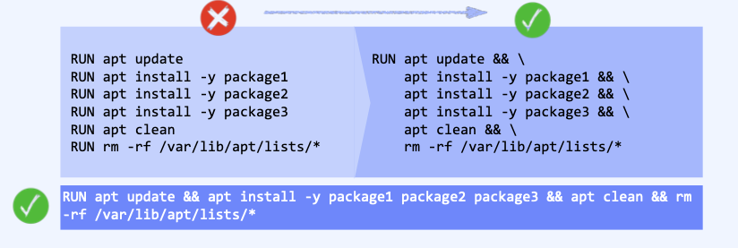

## Dockerfile 최적화 
- 최적화를 위해서 기본적으로 고려해야 할 요소는
> - 빌드 시간
> - 이미지 크기
> - 재사용성
> - 보안
> - 유지보수성
- 컨테이너는 경량의 가상화 서비스를 목적으로 한다.  
- Docker 에서 제공되는 base image들도 해당 이미지의 지향점에 필요한 프로그램, 라이브러리, 실행파일 만을 보유한다.  
- 여기에 애플리케이션에 필요한 추가 구성 요소를 포함시키는 경우 복잡성, 의존성 문제를 피해야 하고 언제든 빠른 컨테이너 배포를 위해 "최소한의 설정과 구성"이 권장된다.  
- 이미지 내부에 불필요한 파일을 포함하지 않기 위해 ".dockerignore" 사용으로 빌드와 관련 없는 파일을 이미지 내부에 넣지 않는다. -> .gitignore와 동일한 방식이다.

#### 경량 컨테이너 서비스 제공
1. 컨테이너 이미지에서 불필요한 바이너리를 모두 제거하여 이미지 크기를 경량화한다.
> - Dockerfile 작성 시 불필요한 패키지 설치를 피하고, 설치된 패키지 파일은 autoremove, clean 등의 명령어로 삭제한다.
> - apt 등을 통해 패키지 설치 시 자동으로 진행되는 불필요한 패키지 종속성 설치를 방지한다.
> > - 예를 들어, tensorflow 같은 패키지 설치 시 자동으로 필요한 라이브러리가 자동 설치되는데, 현재 환경과 맞지 않는 버전의 라이브러리가 다운로드 되는 경우가 있다.
> > - 이를 방지하기 위해 "apt install -y --no-install-recommends <패키지명>" 을 사용한다.
2. Docker에서 제공하는 최소 기본 이미지인 alpine Linux, 또는 scratch를 사용한다.
> - scratch 이미지에 Go와 같은 언어를 사용하여 정적 링크 바이너리를 만들어서 Dockerfile에 참조하면 애플리케이션으로만 구성된 경량화 된 이미지가 생성 된다.
> - Alpine Linux를 사용하면 생성되는 최종 이미지의 크기와 복잡성을 줄이는 데 도움이 되어 성능이 향상되고 빌드 시간이 빨라진다.
> - 최종 이미지에 존재할 수 있는 잠재적인 취약점의 수를 줄여 보안 향상도 기대할 수 있다.
3. multi-stage build를 사용하여 최종 이미지 크기를 최소화한다.
> - multi-stage build(다단계 빌드)는 여러 개의 base image를 사용한 docker build
> - Dockerfile의 FROM 명령어가 2개 이상 사용되어 분리된 작업 공간(stage)을 제공
> - 첫 번쨰 stage(빌드 도구)에서 생성된 실행파일 등을 두 번째 stage(배포이미지)에 제공, 마지막에 실행된 stage 작업이 Docker image로 최종 생성되어 이미지 크기가 감소한다.
4. Dockerfile 작성 시 생성되는 레이어(Layer) 수 최소화를 고려 하면 빌드 시간 및 이미지 용량을 최적화할 수 있다. Docker는 이미지가 가질 수 있는 레이어 수에 제한(127)을 갖는다.
> -  초과 시 Docker build 동안 최대 레이어 수 초과 오류 발생 -> Error response from daemon: maximum number of layers exceeded
> - New layer 생성 명령어 : FROM, RUN, COPY, ADD, ENV, LABEL
> - 다른 명령어는 build 과정에서 임시 이미지를 생성하고 삭제된다.
> > - Layer 수 최소화 예로, RUN 사용 시 가능하면 명령을 결합(그룹화)하여 사용한다.  
> > 
5. One application One container
- 하나의 컨테이너에 2개 이상의 애플리케이션을 설정하게 되면 애플리케이션의 결합성이 높고 확장성을 저해한다.
- 하나의 컨테이너에 하나의 애플리케이션 동작은 컨테이너 간의 독립성을 보장함과 동시에 애플리케이션 버전관리, 소스코드 모듈화 등에 장점을 제공한다.
- 모놀리식 구성보다는 결합 해제된 애플리케이션(Decouple applications) 설계, 마이크로서비스(MSA) 지향적 설계를 고려해야 장애가 발생해도 애플리케이션 자체가 유지될 수 있게 된다. 
- 애플리케이션을 여러 컨테이너로 분리하면 수평 확장이 용이해지고, 컨테이너의 재사용성이 좋아진다.
> - 3-Tier 웹 애플리케이션은 Frontend-Backend-Database로 컨테이너를 분리해서 관리하는것이 권장되는것과 같다.
- 많은 수의 프로세스가 하나의 컨테이너 내부에서 실행된다면 그만큼 CPU, Memory 등의 소비도 커진다
6. using cache
- Dockerfile을 통해 이미지를 빌드하면 자동으로 각 명령어 단위로 캐싱(caching, 임시 이미지 생성)한다.
- 동일한 명령의 실행은 이 캐싱을 통해 재사용되기 떄문에 빌드 속도를 빠르게 하고, 캐싱에 사용된 명령줄이 변경되면 (캐시 사용 시 checksum을 통해 검증) 기존 캐싱은 사용하지 못하고 재 캐싱된다.
- 캐싱 효과를 높이기 위해 명령어의 위치를 명확히 해야 한다. 
- **일정하게 유지될 명령은 Dockerfile의 위쪽에 배치(패키지 설치 등의 단계)하고, 변경될 수 있는 명령은 아래쪽에 배치(COPY 같은 빌드 단계)하면 기존 캐시를 부정할 가능성이 줄어든다.**
7. 보안 강화
- Dockerfile은 사용자를 지정하지 않으면 root 사용자를 사용한다. root 권한이 필요할까?
> - Docker container 실행 시 암시적으로 Docker Host에 대한 root access 권한을 갖게 되어 잠재적인 보안 문제를 갖게 된다.
> - 따라서, 의도하자면 컨테이너 애플리케이션 실행을 통해 Docker Host에 대한 권한이 쉽게 상승(escalation) 하게 된다.
> - 이미지는 컨테이너 보안 측면에서 첫번째 고려 대상이다. 
> > - 이미지가 보호되지 않고 제대로 구성되지 않으면 다른 여러가지 수단에 의해 컨테이너의 경계를 벗어나 호스트에 엑세스할 수 있기 때문에 컨테이너 이미지의 공격 대상 영역을 줄이는 노력이 요구된다.
- 이미지 서명이 사용되면 Docker는 매니페스트의 서명을 확인하여 콘텐츠가 신뢰할 수 있는 소스에서 생성되었고 위조, 변조가 발생하지 않았음을 보장한다.
> - Docker Singer(docker trust sign)
> - Notary (by Harbor)
> - DCT (Docker Contents Trust) -> export DOCKER_CONTENT_TRUST=1 
- Dockerfile에서 USER 명령어 사용으로 root 사용자 접근을 억제한다.
- USER 명령은 RUN, ENTRYPOINT 또는 CMD 명령을 실행하기 위한 특정 사용자를 지정할 경우 사용한다.
- 일반적으로 이미지 안에 무엇이 있는지 모르므로 Docker hub에서 인증된 이미지만 사용하고, 이미지에 취약성이 있는지 확인 후 사용하는 것을 권장.
> 취약성 목록 검사 사이트 -> https://vulnerablecontainers.org
- 익숙하지 않은 이미지를 사용하는 경우 "Dive" 를 사용하여 이미지 검사를 수행한다.
> - SETUID 및 SETGID 비트가 있는 모든 바이너리를 찾아서 제거해야 한다. 이러한 바이너리는 권한을 상승하는 데 사용될 수 있기 떄문이다.
