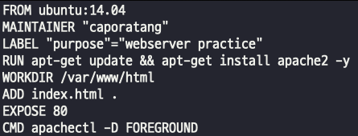

## Dockerfile build
### 기본 빌드
- docker build -t Image_NAME:TAG [-f DOCKERFILE_NAME] DOCKERFILE_LOCATION
> - IMAGE_NAME:TAG -> -t 생성할이미지명:버전  
> - DOCKERFILE_NAME -> 기본 Dockerfile이 아닌 다른 파일명인 경우 -f 사용  
> - DOCKERFILE_LOCATION -> 현재 경로면 "." | 다른 경로명 명시

### docker_file_build
    
  
  

### 불필요한 파일 제거를 통한 이미지 경량화
- apt를 통해 설치된 패키지 파일들을 삭제하지 않고 이미지에 방치한다.  
  
- apt를 통해 설치된 패키지 잔여물을 삭제한다.  
  
- 잔여물이 지워진 이미지들의 용량 비교  
    
> 잔여물을 지우고 안지우고의 차이는 15메가 정도 차이가 난다 -> 간단한 패키지들만 설치해서 그런듯..!  
- 리눅스를 사용해야 한다면, 업무요건에 꼭 특정 OS를 사용해야 하는게 아니라면 base image를 alpine Linux로 변경하여 이미지 크기를 줄인다.  
     
- 최종적으로 용량을 비교해보면 alpine이 압도적으로 가벼운 이미지인것을 확인 가능    
        

### multi-stage build를 통한 이미지 경량화
- multi-stage로 만들어진 dockerfile 과 multi-stage가 아닌 dockerfile의 용량을 비교해보자  
      
       
- multi-stage를 사용해서 build한게 확연하게 가볍다  
    

### ADD 기능, *.tar.gz -> 공유 받은 압축 파일을 바로 이미지에 적용하기  
    
> - 이미지로 빌드하고, 컨테이너로 만들었을때 압축이 풀린 파일들이 잘 적용 되어 있는지 직접 컨테이너에 접근해서 확인해보자  
>      

