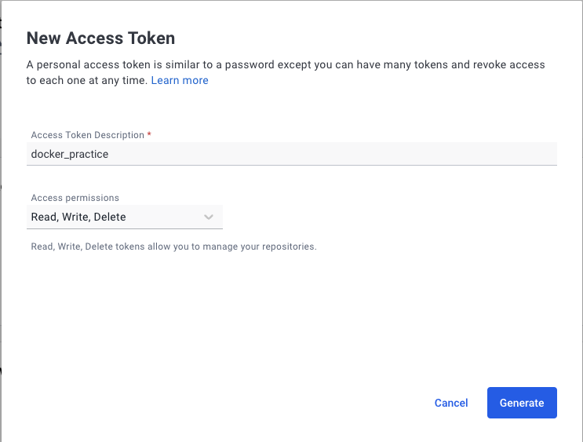
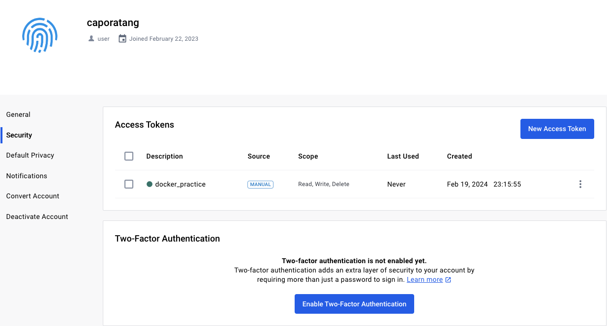
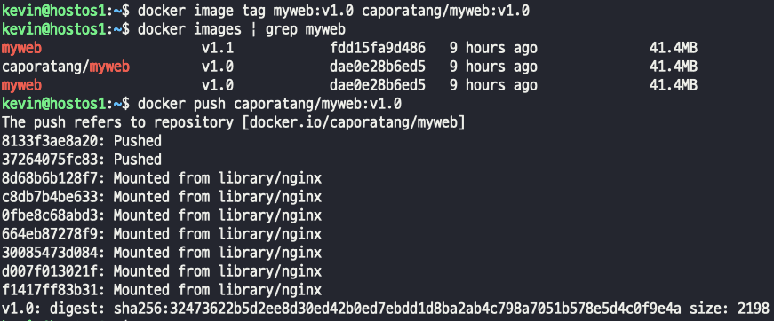

## docker image push
- Dockerfile을 통해 생성된 이미지나 docker commit을 통해 생성된 이미지를 저장하는 곳을 registry 라고 한다.
- Registry는 공개적으로 사용하는 Public registry와 회사 내부에서만 접근되도록 하는 Private registry가 있다.
> docker push를 수행하면 다음과 같은 작업이 전제 된다.  
> docker login : hub.docker.com에 가입된 본인ID와 암호로 현재 로컬에 계정을 등록한다. (해제는 docker logout)
> docker tage : hub.docker.com에 본인 계정의 Repositories에 넣기 위한 태그를 수행한다.  
> tag는 이미지의 새로운 참조명을 넣는 방법. 간혹, OS, 버전 표시로 활용 되기도 한다.

## docker login/logout
- hub.docker.com에 회원가입 후 서버에서 docker login을 통해 본인 저장소에 업로드한다.
- Docker는 3가지 접근 방법을 제공한다.
> ### 1. 암호로 접근하는 방법 
>   
> 경고가 출력되는 이유는 특정 경로에 패스워드가 저장은 되있지만 암호화는 안되어 있어서 경고가 출력되는 것이다.  
> base64 인코딩만 되어있다. 스크린샷은 찍지 않겠다 ^__^..  
> ### 2. 토큰 사용하는 방법
> 1. docker.io 에 myAccount -> security로 이동한다.
>   
> 2. new accessToken 선택하고 설명과 토큰이 갖게될 permission을 설정한다.
>   
> 3. 설정된 토큰을 확인한다.(permission을 설정하면 토큰 값이 보이고 복사 후 나가기를 선택하면 된다.)
>   
> ### 3. 투팩터 인증방법
> 투팩터 인증 방법은 accessToken을 만드는게 아니라 아래에 있는 Enable TwoFactor 버튼을 클릭하고 설정해주면 된다.
> 
> 
>
> ### 발급한 토큰을 서버에 저장하고 사용하기
> 원하는 경로에 .access_token 파일을 생성하고, 토큰값을 저장한다.
>   
> 이미지에 보이는 stdin은 standard input 방식을 쓰겠다고 옵션을 주는것이다. -> cat accesstoken 으로 나온 값을 input으로 사용해서 로그인 하겠다.  
> docker.io 에서 토큰은 활성화, 비활성화를 설정할 수 있다.  

## docker [image] tag -> push
- hub.docker.com에 본인 계정의 Repositories에 생성한 이미지를 업로드하기 위해서는 본인계정을 이미지명 앞에 붙여야 docker push 수행 시 계정으로 찾아가 저장된다.
>   
>   
> **private repository는 계정당 하나만 생성할 수 있다**  

## 올렸던 이미지를 다른 서버에서 Pull 받고 실행해서 정상 실행 되는지 확인하기
- hostos2 번으로 접속해서 Pull 땡기고 확인해보자^^!  
>   
>   
>   

##### 이미지를 공유하는 방법은 
1. registry에 push 하여 공유한다.
2. 이미지를 생성하는 Dockerfile과 소스를 Github에 올려서 공유한다.
3. 이미지를 docker save를 통해 파일로 백업해서 전달 후 docker load를 통해 공유한다.
 

### 파일로 공유하는 방법
- docker save 명령을 통해 Layer로 구성된 이미지를 *.tar 파일로 묶어 파일로 저장한다. (여러 계층으로 되어 있기 때문에)
- 해당 파일을 전달 받은 컴퓨터에서 docker load를 통해 이미지로 등록한다.

### docker image 삭제 
- docker image save를 통해 이미지를 백업하거나 주기적으로 업무에 사용하는 이미지와 사용하지 않는 이미지를 구분해서 관리, 불필요한 이미지는 삭제
> docker image rm [option] {이미지명[:태그] | 이미지ID}  
> docker rmi [option] {이미지명[:태그] | 이미지ID}
> 
> 이미지 전체 삭제
> docker rmi $(docker images -q)
>
> 특정 이미지명이 포함된 것만 삭제
> docker rmi $(docker images | grep debian)
> 
> 반대로 특정 이미지명이 포함된 것만 제외하고 모두 삭제. 
> docker rmi $(docker images | grep -v centos)

### example) alias를 등록해서 상태가 exited인 container 모두 삭제하기
- alias cexrm='docker rm $(docker ps --filter 'status=exited' -a -q)'  
>   
>   
> ### 더 간편하게 쓰려면 .bashrc # for example 영역에 붙여넣고 사용하면 편리하다.
>   