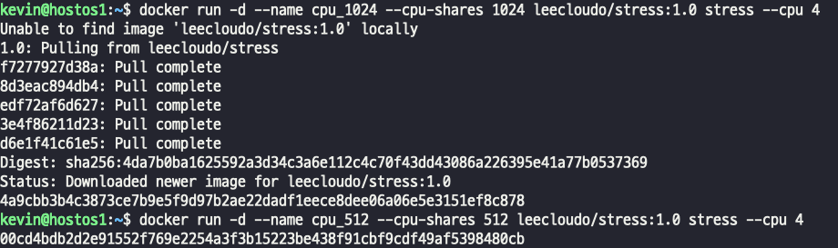
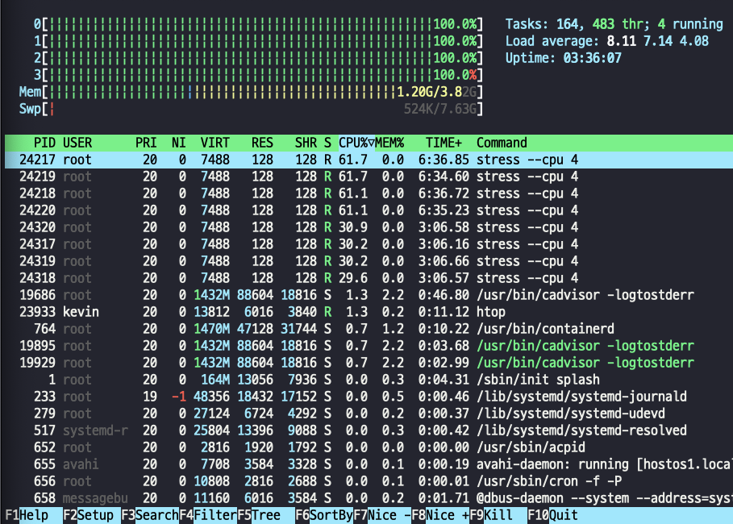
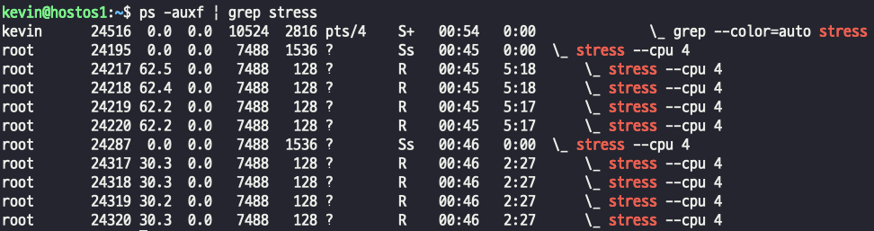
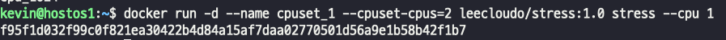
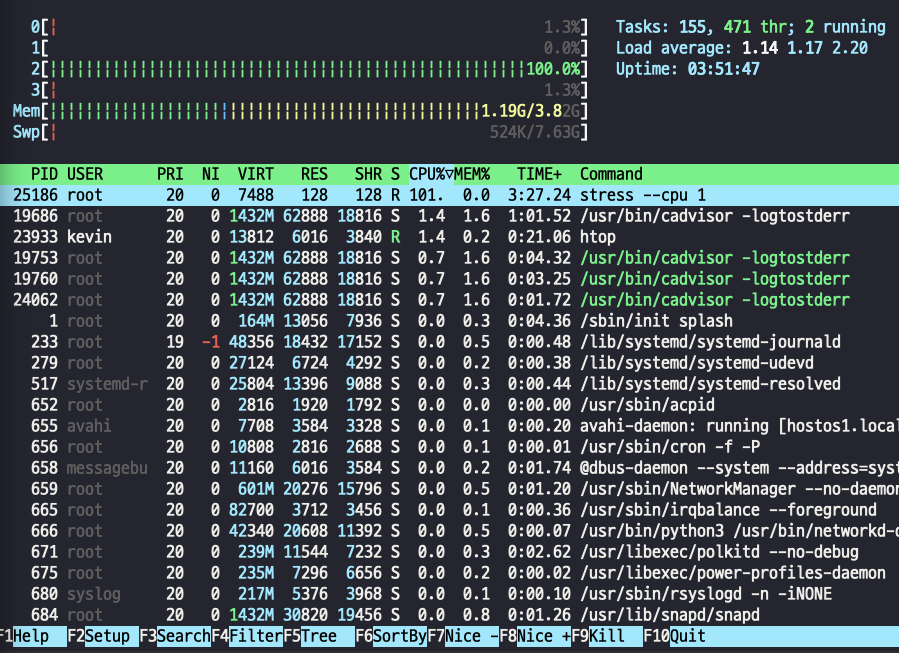
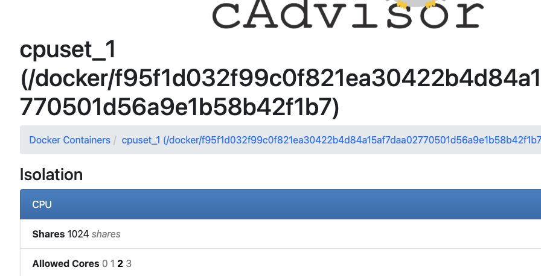
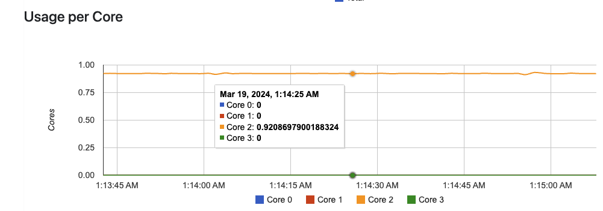
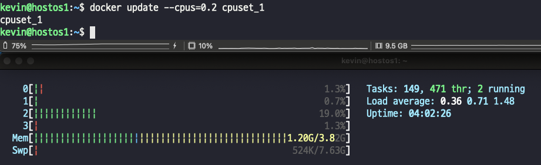

## 컨테이너 CPU 리소스에 대한 런타임 제한 (resource limit)
- CPU 자원을 어떤 프로세스(컨테이너)에 얼마나 할당하는지를 정책으로 만드는 것을 CPU 스케줄링 이라고 한다.
- CPU 사용량 제한을 위해 CFS(Completely Fair Scheduler) 스케줄러를 사용한다.
- 모든 프로세스가 공평하게 CPU 사용 시간을 제공 받도록 하는 OS 알고리즘이다.
> - --cpu-shares : 컨테이너가 사용할 수 있는 CPU 사용 시간에 대한 가중치를 설정한다. 기본값 1024. 2048 설정 시 다른 컨테이너에 비해 2배의 사용 시간 할당
> - --cpuset-cpus : 보유한 CPU core# 을 지정하여 컨테이너가 해당 core만 사용하도록 설정한다   
> ex) 0 / 1-2 / 0,2,3 으로 지정 가능.
> - --cpus : 컨테이너가 사용할 수 있는 CPU 사용 비율(%) 지정.   
> - ex) --cpus=0.25 설정 시 지정된 core 수의 25% 사용 가능

### CPU time scheduling, --cpu-shares
- 부하 테스트(stress)를 해보자
- 부하 테스트용 컨테이너 생성
    
> - --cpu 명령어의 비율을 지정하지 않았다. -> cpu 코어 4개의 100%를 사용하게 된다. 
> - stress는 과부하 테스트 명령어다.
> - 가중치를 적용한다는게, 512로 설정하면 무조건 절반만 사용하는게 아니라, CPU 사용률이 많은 경우에 설정된 가중치를 적용하겠다는 뜻이다. 
> - 즉, CPU 사용률이 많지 않으면 아무것도 없는 상태에서는 time scheduling은 동일하게 적용된다.

- --cpu에 코어수만 지정해서 CPU가 100% 할당하는 모습을 확인해보자
    

- stress 명령어를 통해 1024, 512 시간 가중치를 확인해보자

> - 완벽하게 절반은 아니지만 거의 절반에 가까운 시간 차를 확인할 수 있다 .

- **cpu-shares는 결론적으로 CFS 알고리즘을 쓰면서 사용시간을 제어하는 방법이다.**

### CPU 지정, --cpuset-cpus
- Host가 보유한 cpu 수에서 몇 번쨰를 사용하도록 할 것인지 지정한다.
- --cpuset-cpus="0,3" -> 1, 4번째 CPU 사용
- --cpuset-cpus="0-2" -> 1,2,3 번째 CPU 사용

- 0,1,2,3 CPU 중 3번째 CPU 를 사용하도록 지정
  
> - cpu 1 -> 하나의 cpu 사용 비율을 적지 않았으니 3번째 CPU 100% 소비

- cadvisor에서는?
- cpuset_1 컨테이너를 선택하고 들어오면
  

> - Allowed Cores에 선택한 cpu에만 bold로 표기되는것을 볼 수 있고, 사용 cpu도 선택한 코어만 사용중임을 알 수 있다.
> - 동일하게 2개를 설정해도 동일하게 동작한다.
> - docker run -d --name cpuset_2 --cpuset-cpus=0,3 leecloudo/stress:1.0 stress --cpu 2

### CPU 사용 비율 지정, --cpus
- cpuset_1 컨테이너는 현태 100% 로 2 코어를 사용하고 있다. 
- 컨테이너가 실행중일때 docker update를 사용해서 비율을 조정한다.
- 정확하게 20%가 아니라, 개발자가 설정한 비율에 under 아래로 사용하게 된다. (약간의 오차는 당연히 존재한다)
  

- 만약 특정 container를 실행하는 경우 cpu를 3개로 할당하고 실행한 상태에서
- 사용률을 30%로 설정하면 각각 코어의 30% 가 아니라, 3개 cpu 전체 합산 30%로 설정된다.