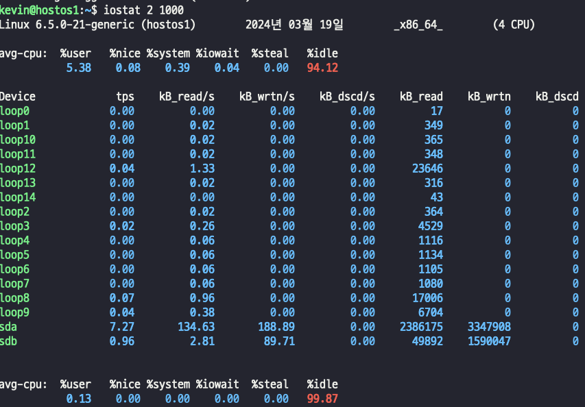
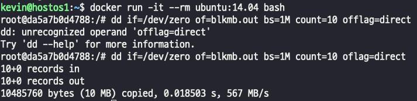

## 컨테이너 DISK 리소스에 대한 런타임 제한
- 이미지를 다운받으면 기본적으로 var/lib/docker에 저장된다. 
- 컨테이너를 만들면 var/lib/docker 영역에 이미지 스냅샷 즉, 복제본을 만들어서 컨테이너를 만들게 된다. 
- 결과적으로 컨테이너를 만들떄마다 host의 disk 용량을 사용하게 된다.
- DOcker image는 기본적으로 Docker Host의 공간을 사용하므로 지속적인 사용량 관찰이 요구된다.
- 컨테이너 I/O 제한을 설정하지 않으면 컨테이너 내부 I/O bandwidth(대역폭)에 제한이 설정되지 않기 때문에 옵션을 통해 Block I/O 제한이 필요하다.
- 단, DirectI/O의 경우에만 Block I/O 가 제한되며, Buffered I/O는 해당되지 않는다.

### 디스크 Block I/O 작업에 대한 제한은 디스크 성능 지표인 IOPS, MBPS에 따른다.
- --blkio-weight, blkio-weight-device 
> Block I/O의 할당량(Quota)을 10 ~ 1000으로 설정.
> 기본값은 500
- --device-read-bps, --device-write-bps
> 특정 Device에 MBPS를 제한한다.
> 초당 Block throughput(처리량)을 의미한다. b, kb, mb, gb 단위로 제한한다.
- --device-read-iops, --device-write-iops
> 특정 Device에 IOPS를 제한한다.
> 초당 Block I/O 횟수를 의미하고 0 이상의 정수로 표기한다.

### Disk I/O 측정 도구 sysstat
- apt install sysstat
- 2초마다 1000번 출력시키기
  
> - var/lib docker는 sdb 영역이고, 쓰기 작업을 유도했을떄 수치가 limit이 걸리는지 측정할 수 있다.

### ubuntu 컨테이너에서 파일을 생성 후 테스트 해보자
    
> - outfile blkmb.out 파일을 만들어라.
> - blockSize 는 1메가
> - count 는 용량이다. 10메가
> - flag는 direcI/O로 설정한다.  
> - 결과는 567 메가바이트가 나왔다.

### 이미지 첨부가 안된다..?
docker run -it --rm ubuntu:14.04 bash  
kevin@ed37bddb71c8:/# dd if=/dev/zero of=blkmb.out bs=1M count=10 oflag=direct    
10+0 records in  
10+0 records out  
10485760 bytes (10 MB) copied, 0.0128923 s, 813 MB/s  
  
docker run -it --rm --device-write-bps **/dev/sdb:1mb** ubuntu:14.04 bash  
kevin@ed346382ffe7:/# dd if=/dev/zero of=blkmb.out bs=1M count=10 oflag=direct  
10+0 records in  
10+0 records out  
10485760 bytes (10 MB) copied, 10.0274 s, **1.0 MB/s**  
  
docker run -it --rm --device-write-bps **/dev/sdb:10mb** ubuntu:14.04 bash  
kevin@2a8b1c431c73:/# dd if=/dev/zero of=blkmb.out bs=1M count=10 oflag=direct  
10+0 records in  
10+0 records out  
10485760 bytes (10 MB) copied, 1.01432 s, **10.3 MB/s**   

**결과를 보면 설정한 대로 제한이 설정된다.**