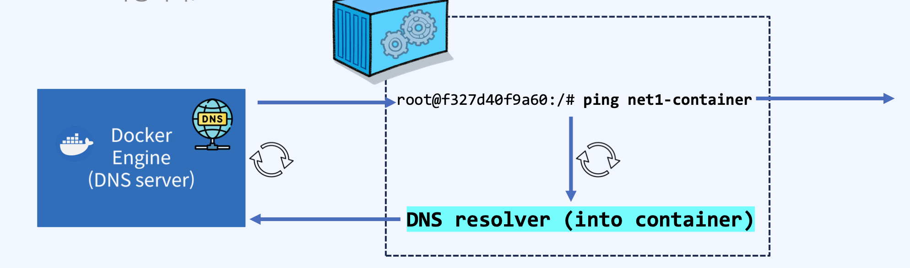
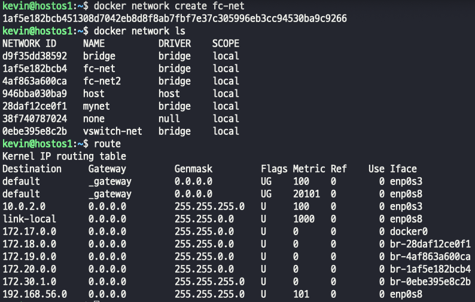
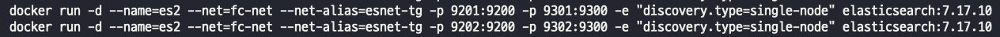
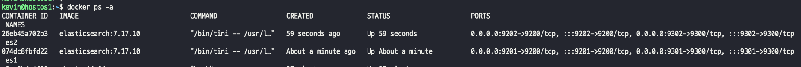
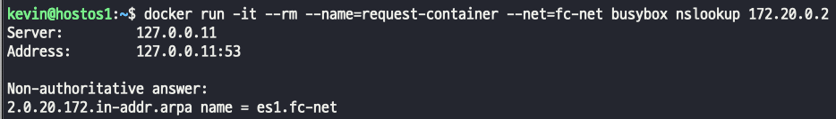
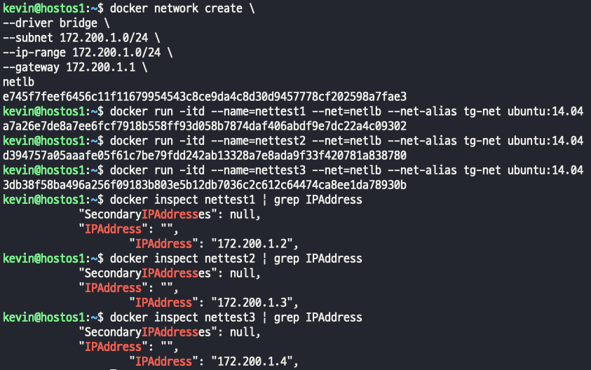
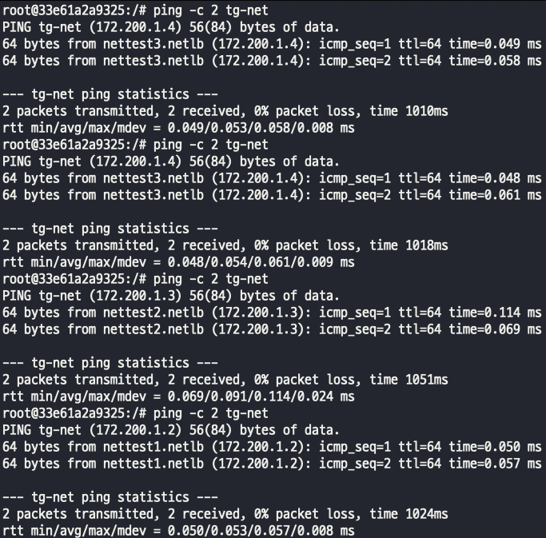
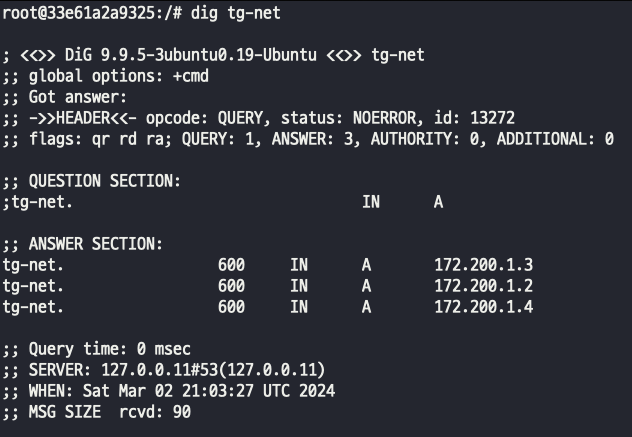

## docker_dns 
- Docker dns는 사용자 정의 네트워크를 만들었을때 자동으로 등록된다.
- Docker 컨테이너는 IP를 사용자 정의 네트워크의 컨테이너 이름으로 자동 확인하는 DNS 서버가 Docker 호스트에 생성된다(127.0.0.11)
> docker의 기본 docker0 bridge driver에는 DNS가 포함되어 있지 않으므로 DNS는 내장된 docker0 bridge driver에서 작동하지 않는다.
- 동일 네트워크 alias 할당을 통해 하나의 타겟 그룹을 만들어 요청에 Round Robin 방식으로 응답한다.
- 컨테이너 생성 시 호스트 시스템에서 다음 세 파일을 복사하여 컨테이너 내부에 적용하여 컨테이너 간에 이름으로 찾기가 가능해진다.
> 1. /etc/hostname
> 2. /etc/hosts
> 3. /etc/resolv.conf
- libnetwork는 핵심 네트워킹 뿐만 아니라 서비스 검색 기능 제공을 통해 모든 컨테이너가 이름으로 서로를 찾을 수 있게 한다. (--name or --net-alias 사용 시 DNS에 등록)
> 컨테이너 내부에서 동일 네트워크의 다른 컨테이너명으로 ping을 수행하는 과정  
>     
> 1. 같은 네트워크에 있는 컨테이너 이름으로 핑을 날린다.
> 2. 컨테이너 내부 DNS 에서 resolv conf 수행 -> 컨테이너 내부의 DNS와 일치한다면, DNS resolver가 정보를 먼저 찾는다
> 3. net1-container 이름으로 등록된 IP를 찾는다고 생각하면 된다.
> 4. 발견이 된다면 그대로 응답을 내린다.
> 5. 발견이 안된다면 docker-engine이 가지고 있는 docker_dns에 그 정보를 찾아달라고 요청을 보낸다.
> 6. docker-engine에 docker_dns에 있는 DNS resolver를 구동해서 정보를 찾는다.
> 7. 결과를 반환한다.

### 사용자 정의 네트워크와 동일 target group(--net alias)를 지정해서 DNS의 응답을 확인해보자.
>     
>     
>     

- 사용자 정의 네트워크에 자동으로 DNS 기능이 활성화되는지 확인해보자.  
> 
> - 특정 컨테이너의 네트워크가 어떤 Alias로 묶여있는지, 타겟 그룹은 뭔지 정보를 확인하고 싶으면 inspect에 Networks 를 확인하자. 

### docker DNS를 활용한 docker proxy (Load balancing)
- 사용자 정의 Bridge network 생성
- --net-alias를 이용한 Target group 생성
- 등록된 DNS 등록 확인 ("dig" tool 사용)
> 
- 트래픽을 전달할 목적으로 임의 컨테이너 같은 네트워크 그룹으로 생성  
>   
- 핑을 같은 network 그룹으로 날려도 각각 등록된 다른 ip에서 처리하는걸 확인할수있음
>   
- dnsutil을 설치하고 dig 명령어를 통해 dns를 확인해보자
> 
> tg-net 으로 들어오면, ANSWER 에 등록된 IP로 처리를한다.
> SERVER: 127.0.0.11 을 보면 docker의 자체 DNS 서버를 확인할 수 있다.