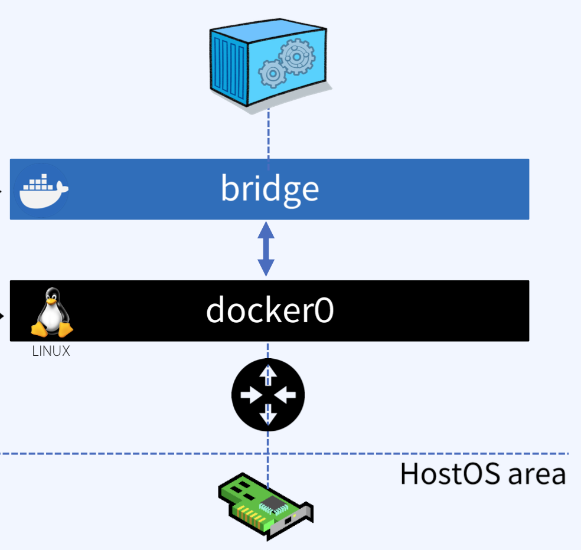
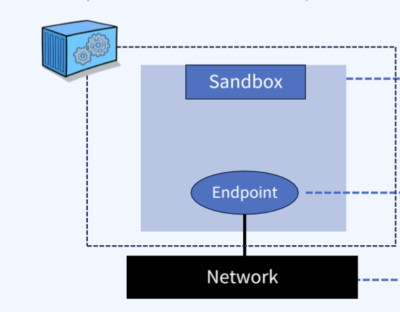
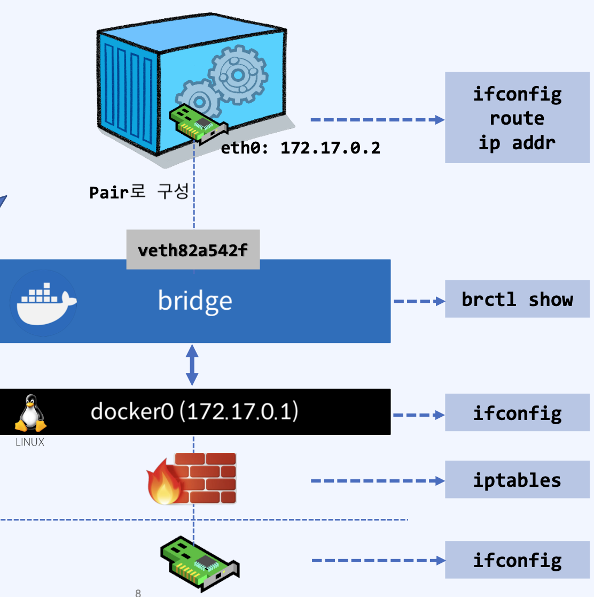
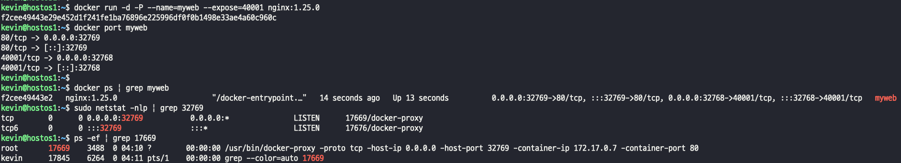
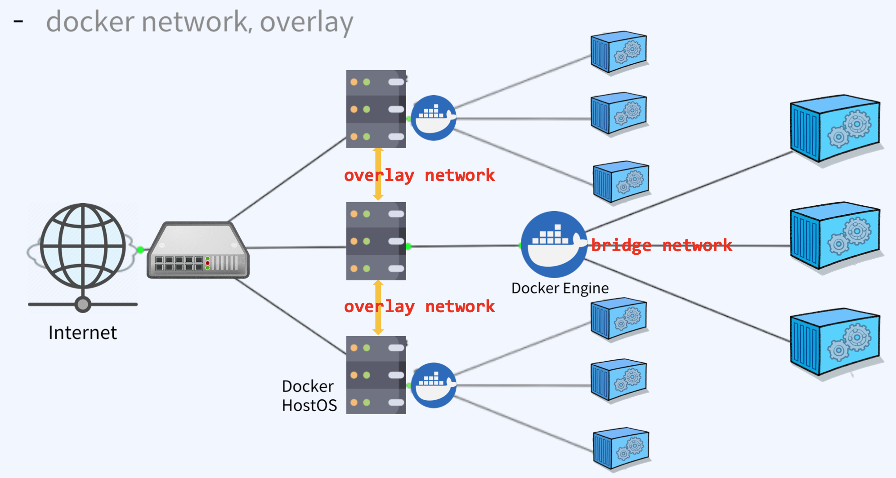

## docker network
- Docker network는 커널의 네트워크 스택의 하위로, 상위에는 네트워크 드라이버를 생성한다. 즉, docker network = Linux network
- Docker network 아키텍쳐는 CNM(Container Networking Model) 이라고 하는 인터페이스 집합 위에 구축한다.
- OS 및 인프라에 구애 받지 않으므로 인프라 스택에 관계없이 애플리케이션이 동일한 환경을 가질 수 있다.
- 리눅스 네트워킹 빌딩 블록 : 리늑수 브리지, 네트워크 네임스페이스, veth pair 및 iptables가 포함 되어있다.
- 이 조합은 복잡한 네트워크 정책을 위한 전달 규칙, 네트워크 분할 및 관리 도구를 제공한다.

#### Linux bridge
- 리눅스 브리지는 커널 내부의 물리적 스위치를 가상으로 구현한 OSI Layer 2 Device 다.
- 트래픽을 검사하여 동적으로 학습되는 MAC 주소를 기반으로 트래픽을 전달한다.
- bridge network의 기본 대역?
> 1. 172.{17-31}.0.0/16(65536개)
> 2. 192.168.{0-240}.0/20 (4096개)  
> 
> Docker bridge 는 Docker 엔진과 Docker CLI를 통해 관리된다.  
> docker0 는 Linux 커널과 OS 도구를 통해 관리된다.

#### Network namespace
- 컨테이너 내부에 네트워크 관련된 기술을 심어주는 역할을 하는게 namespace이다.
- 커널에 격리된 네트워크 스택으로 자체 인터페이스, 라우트 및 방화벽 규칙을 보유
- 컨테이너와 리눅스의 보안적인 측면으로, 컨테이너를 격리하는데 사용한다.
- 네트워크 네임스페이스는 도커 네트워크를 통해 구성된 경우가 아니라면 동일한 호스트의 두 컨테이너가 서로 통신하거나 호스트 자체와 통신할 수 없음을 보장한다.
- 일반적으로 CNM (Container Network Model) 네트워크 드라이버는 각 컨테이너에 대해 별도의 네임스페이스를 구현한다.

##### CNM의 구조
>   
> Sandbox : 격리된 네트워크 스택 -> Ethernet(eth0), port, route table, DNS 구성 등이 포함됨  
> Endpoint : Endpoint (가상 이더넷 인터페이스)  
> Network : 가상 스위치, Bridge  

#### veth (virtual ethernet device)
- 컨테이너는 다이렉트로 브릿지와 연결될 수 없다.
- 중간에 터널 역할을 하는게 veth다
- 두 네트워크 네임스페이스 사이의 연결선으로 동작하는 리눅스 네트워킹 인터페이스
- veth는 각 네임스페이스에 단일 인터페이스가 있는 전이중 링크(full duplex link)로 동작한다.
- 한 인터페이스의 트래픽을 다른 인터페이스로 전달한다.
- 도커 네트워크를 만들 때 도커 네트워크 드라이버는 veth를 사용하여 네임스페이스 간에 명시적인 연결을 제공한다.
- 컨테이너가 도커 네트워크에 연결되면 veth의 한쪽 끝은 컨테이너 내부에 배치되며, (일반적으로 EthN 인터페이스로 표시) 다른 쪽은 도커 네트워크에 연결된다.
>   
> veth는 OSI 2계층 서비스로 컨테이너 내부에 제공되는 네트워크 인터페이스 eth0와 한 쌍으로 제공되어 docker0와 가상의 "터널링 네트워크"를 제공한다.  
> -> virtual ethernet 앞에는 컨테이너가 있을거고, virtual ethernet을 통해 docker0를 통한 외부 네트워크로 패킷을 전달할수있다.. 

#### docker network option
- --add-host=[Host명:IP Address] : Container의 /etc/hosts에 Host명과 IP Address를 설정
- --dns=[IP Address] : DNS 서버의 IP Address를 설정 (/etc/resolv.conf) (168.126.63.1~3 / 8.8.8.8)
- --mac-address=[MAC Address] : Container의 MAC Address 설정
- --expose=[포트 번호] : Container 내부에서 Host로 노출할 포트 번호 지정
- --net=[bridge | none | host] : Container의 네트워크 설정 (bridge = docker0)
- -h, --hostname="Host명" : Container의 Host명 설정(default, container ID가 호스트명)
- -P, --publish-all=[true | false] : Container 내부의 노출된 포트를 호스트 임의의(32768~) 포트를 호스트와 연결(명시적)
- -p [Host 포트 번호]:[Container 포트 번호] --publish published=5000, target=80 : Host와 Container의 포트를 매핑(암시적)
- --link=[container:container_id] : 동일 Host의 다른 Container에서 액세스 시 이름 설정 → IP 가 아닌 container의 이름을 이용해 통신 가능

#### docker proxy?
- kernel 이 아닌 사용자 환경에서 수행되기 때문에 Kernal과 상관없이 host가 받은 패킷을 그대로 container의 port로 전달한다.
- Port를 외부로 노출하도록 설정하게 되면, docker host에는 docker-proxy 라는 프로세스가 자동으로 생성된다.
> -P 옵션을 사용하게 되면 docker porxy가 암시적 포트 매핑을 통해 임시 포트로 매핑하고, 이미지에 expose 되어있는 포트로 매핑한다.  
>   

#### docker network, overlay
- 브릿지로 네트워크를 사용하는 영역은 로컬 영역이다.
- Overlay network는 서로 다른 Host(node) 에서 서비스되는 컨테이너를 네트워크로 연결하는데 사용 되고, 이런 네트워크 생성을 위해 overlay network driver를 사용한다.
- 네트워크로 연결된 여러 Docker Host 안에 있는 Docker Daemon 간의 통신을 관리하는 가상 네트워크다.
- 컨테이너는 overlay network의 서브넷에 해당하는 IP 대역을 할당 받고, 받은 IP를 통해 상호간의 내부 통신을 수행한다.
- 따라서, overlay network에 포함되어 있는 모든 컨테이너들은 서로 다른 Docker Host에 있는 컨테이너와 같은 서버에 있는 것처럼 통신이 가능해 진다.  
> docker network inspect {network-ID} 를 통해 조회 가능하다.  
>   

