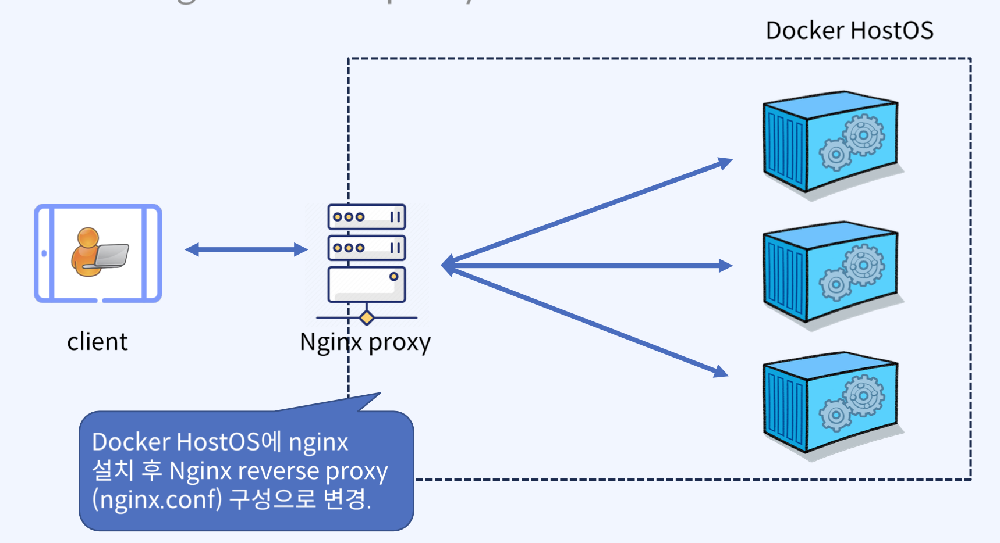
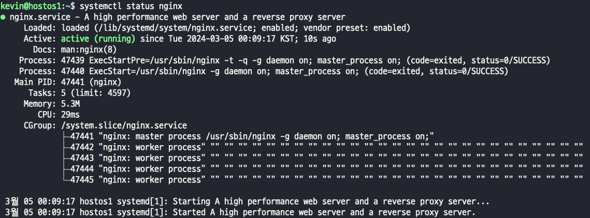
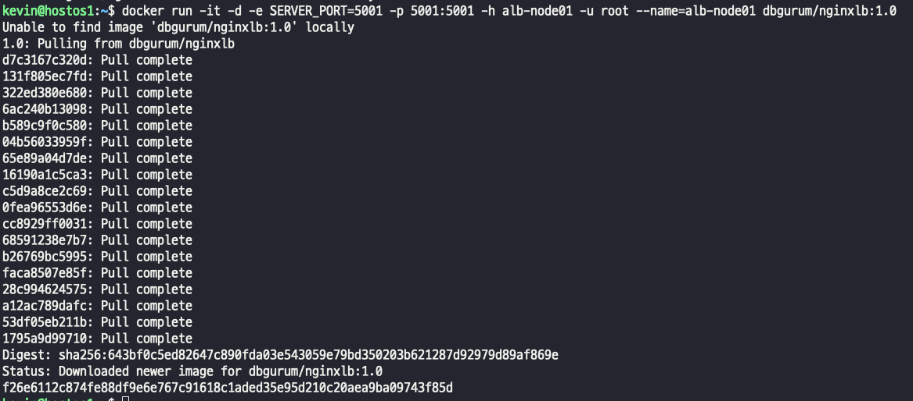
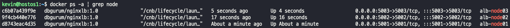
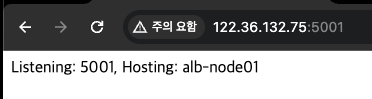
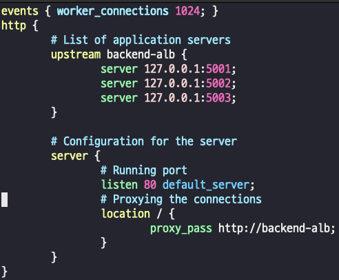
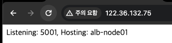
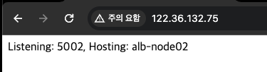
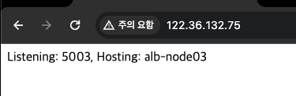
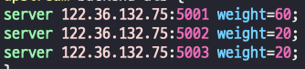

## Host Nginx reverse proxy 구성
>   

#### nginx
- nginx 설치 및 상태 조회
  
- Load balancing이 구현될 애플리케이션 컨테이너 생성  
  
   
- 접속  
  
  
> 기존에 가지고 있던 (default) nginx.conf는 웹서버 기능의 conf 파일이다.
> nginx conf를 백업 받고 새로 파일을 작성하자

 > - nginx의 디폴트 포트는 80이다. 당연히 80으로 listen 하고있다
 > - / 로 트래픽이 들어오는 경우에도 80으로 연결되고, proxy_pass에는 트래픽이 들어오면 backend-alb로 전달해라. 라는 명령이다.
 > - upstream backend-alb 로컬 5001 5002 5003 으로 트래픽이 전달된다 round robbin 은 명시되어 있지 않지만 round robbin 형태로 요청이 들어간다.
- 80 포트나 / 로 트래픽을 보내면 순차적으로 트래픽이 요청된다.  
    
-   
-   

### 컨테이너 nginx에 포워딩 하기
- 위에 예시는 OS에 설치된 nginx에 reverse proxy
- 컨테이너 nginx에 포워딩을 설정해보자
- 기존 OS에 설치되어 있는 nginx 삭제~  

> - 엔진엑스 컨테이너 실행
>   
> - nginx.conf 파일에 localhost 가 아니라 접속 도메인으로 변경
> - container 내부로 nginx.conf 복사 및 옮기기, 나머지 동일  
> docker cp nginx.conf proxy-container:/etc/nginx/nginx.conf

### 트래픽의 가중치 설정
- nginx의 config를 설정하면 트래픽의 가중치를 설정할수있다.
- > 
  
### 네트워크 삽질.. 
- VM을 이용해서 외부 접속 서버를 구성하는 경우
> - hostOS 의 ip에 포트를 포워딩 했으면, 외부 접속의 모든 포트를 포트포워딩 해줘야한다.  
> - 컨테이너 실행 포트를 5006 , 9123:5006 으로 설정하는 경우  
> - 외부접속 서버 공유기의 내가 접속할 포트(서비스 포트) - 9120으로 설정하고 hostOS의 포트(내부 포트)를 9120 으로 설정하고,    
> - VM 가상화 서버의 포트포워딩을 호스트IP에 9120으로 설정하고, 9123 (컨테이너 포워딩 IP)로 설정하고 접속 해야한다.  
> - 반드시, 꼭, 무조건, 제발,  