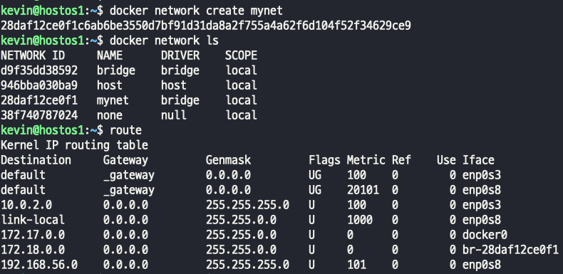
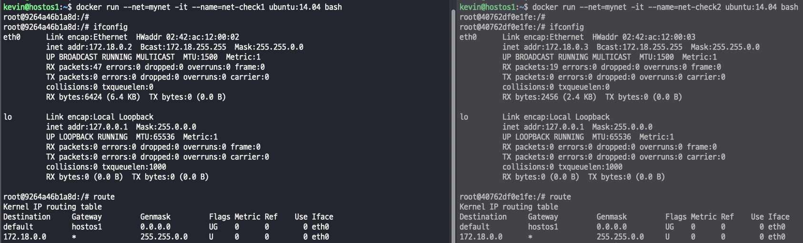
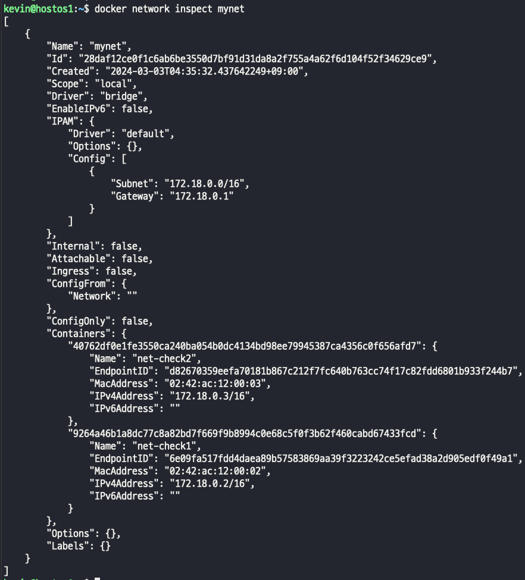
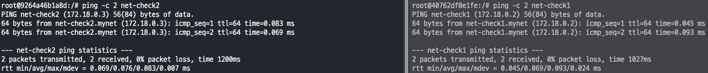
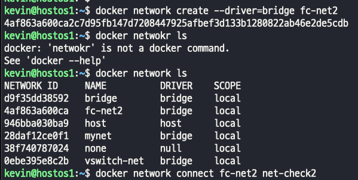
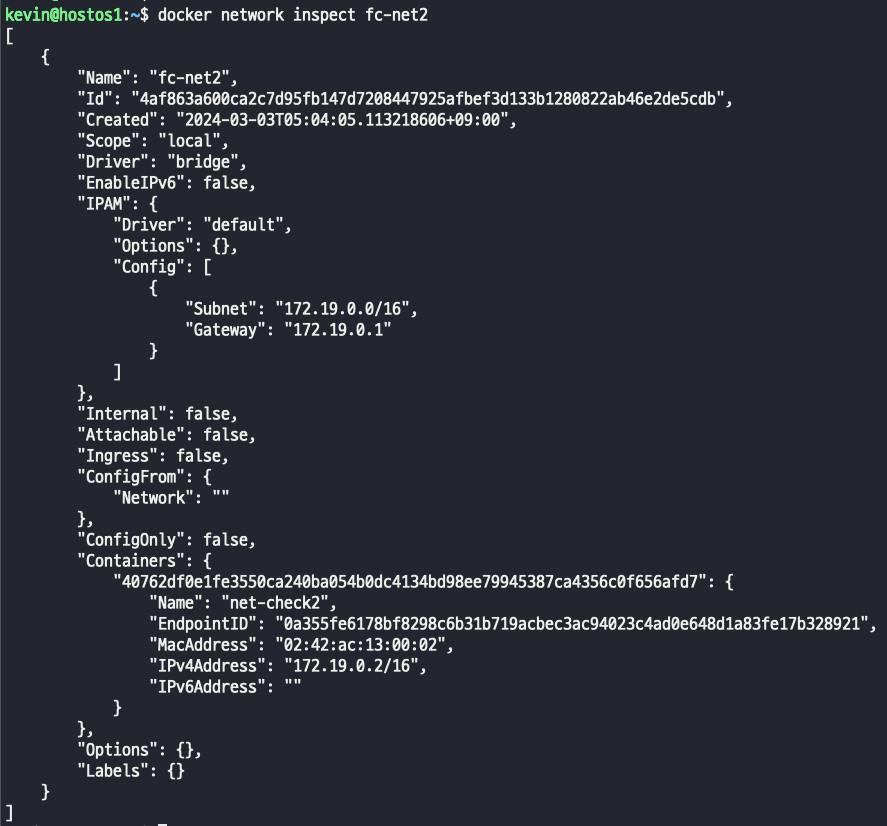

## 사용자 정의 네트워크
- docker는 기본적으로 Host OS와 bridge 연결을 하며, --net 옵션을 통해 네트워크 설정 가능
- docker network create로 "사용자 정의 bridge network" 생성
- 사용자 정의 네트워크에 연결하면 Container는 Container의 이름이나 IP 주소로 서로 통신 가능
- Overlay network(docker swarm)나 커스텀 플러그인 사용 시 multi-host 연결 가능
> bridge : bridge (default: docker0 – 172.17.0.0/16) : 172.17.0.2~  
> none : 네트워크에 접속하지 않음. 무지정(격리용)  
> container:[container_name|id] : 다른 Container의 네트워크를 사용 (container:ub_test)  
> host : Container가 Host OS의 네트워크를 사용  
> macvlan : 물리적 네트워크에 컨테이너 mac 주소를 통한 직접적 연결 구현 시 사용  
> NETWORK(사용자정의 network name) : 사용자 정의 네트워크 사용

### host
- nginx 이미지에 노출된 포트 80번을 호스트 포트 80번에 연결, 호스트 IP를 이용하여 서비스.
>     
>   
> -p 옵션으로 포트를 연결한 경우에는 docker-porxy를 이용했지마느 결과를 보면 호스트 운영체제에 직접 PID를 할당 받아 서비스한다. -> docker0 미사용
>  그리고 hostOS 네트워크에 연결되기 때문에 별도의 IP는 부여되지 않는다.

### docker network create
- 네트워크를 만들고 컨테이너에 적용한 후 리스트를 출력할 수 있다.  
>   
>   
>   

- 사용자 정의 네트워크 구성을 통해 컨테이너 이름으로 통신 가능하다. -> Docker DNS에 의한 Service Discovery(서비스 검색) 기능을 사용할 수 있다.
>   
> 자체 DNS에 컨테이너 이름과 IP가 등록이 되서 가능한일이다..

- 사용자 정의 네트워크 구성을 통해 특정 IP 대역 지정도 가능하다.
> ~$ docker network create \  
> --driver bridge \  
> --subnet 172.30.1.0/24 \ → CIDR 표기만 설정 가능, 255.255.255.0 과 같음.  
> --ip-range 172.30.1.0/24 \ → subnet 이하, IP 범위 조정 가능.(172.30.1.100/26)  
> --gateway 172.30.1.1 \  
> vswitch-net → 256개의 IP 중 254개 사용 가능.  
>   

### 각각 다른 네트워크에 연결되어 있는 컨테이너 간의 통신은?
- 전체 네트워크는 같은 네트워크에 연결되있다. 각각의 컨테이너가 다른 IP 대역에 연결되어 있다면 브릿지 간의 통신은 되지 않는다.
- connect | disconnect 를 이용해서 네트워크를 연결, 해제 해주면 된다.
>     
>     

