## docker_volume
- volume 기법은 mount 방식과 다르게 경로를 지정하지 않고, create로 생성한다

### docker volume을 생성하고 컨테이너와 연동
> 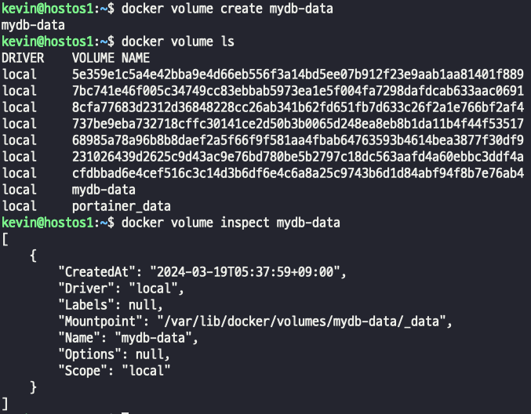        
> > - volume을 생성하면 /var/lib/docker/volumes 에 경로가 지정되는것을 기억하자.  
#### mysql container 생성 및 연동
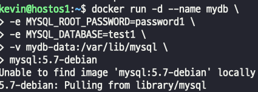    
> - 경로가 아닌 생성한 volume 이름으로 연동한다.
#### mysql은 생성과 동시에 여러가지 파일이 생성된다, volume으로 연결을 했기 때문에 /var/lib/docker/volumes/mydb-data/_data 경로에 test1이 생성되었는지 확인해보자
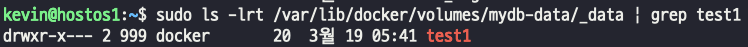  
#### mysql 컨테이너 내부에 접속해서 마운트가 잘 되었는지 확인해보자
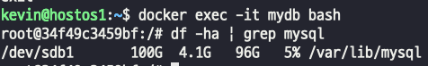          
#### mysql 컨테이너를 멈추고 지운 상태에도 데이터가 남아있을까 ? 
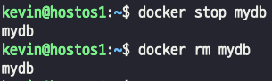      
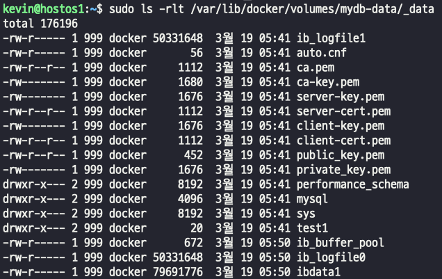    
> - volume 으로 잡았던 경로를 조회해보면 컨테이너가 지워져도 데이터는 유지된다.

### '암시적 docker volume', 볼륨 생성 없이 사용하는 방법
- 컨테이너 실행할때 volume 이름을 지정하지 않고 실행한다.  
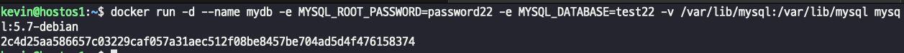        
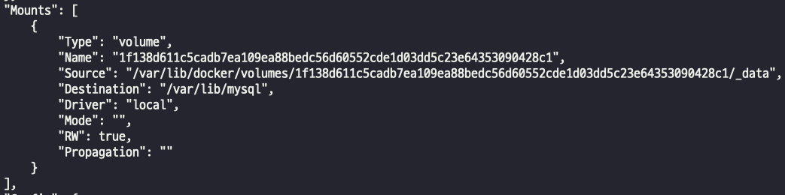         
> - volume을 이름이나 경로 아무것도 지정하지 않으면 임의의 hash값이 이름으로 자동 설정된다.

## Data Container
- 여러 컨테이너에 데이터를 공유하고자 하는 경우 '데이터 컨테이너' or '볼륨 컨테이너'를 만들고, "--volumes-from 공유 컨테이너명" 옵션을 사용하여 볼륨을 공유할 수 있다.
> - 데이터 공유 컨테이너를 만들고 그 컨테이너에 있는 데이터를 나눠서 사용한다고 생각하면 된다.  
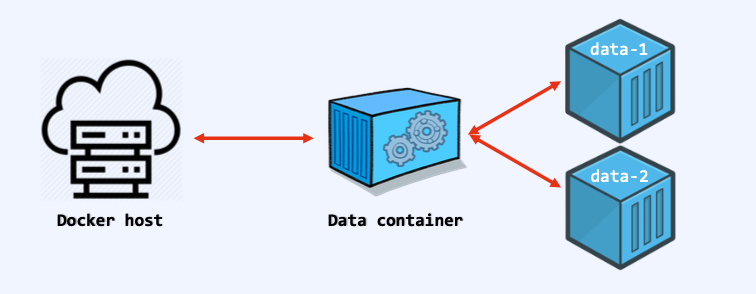         

- 암시적 volume으로 share container 생성  
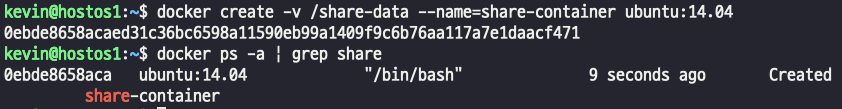     
- volumes from 을 사용해서 생성한 share-container 를 설정해주자  
        
      
- 컨테이너간의 볼륨 공유를 확인하기 위해 임의 파일을 하나 만들어보자 -> share_container에 생성되는것이다.  
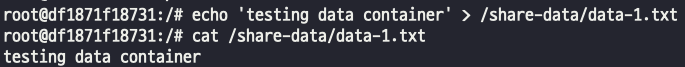  
- 파일을 생성한 data-1 컨테이너를 삭제하고 2번 컨테이너를 share_container로 volume을 설정한 후에 생성한 파일을 확인해보자  
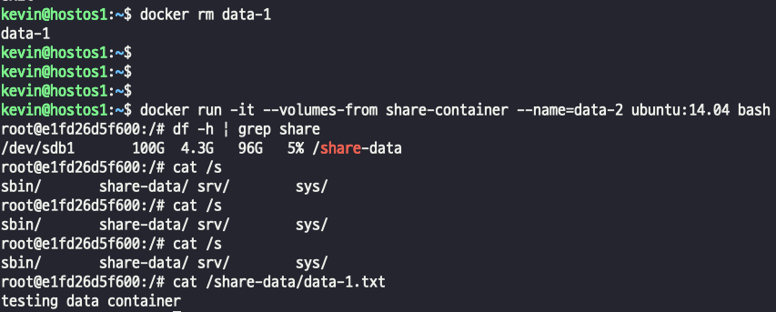  

### **share container는 bind mount로 경로를 직접적으로 설정해줘도 사용할 수 있다.**