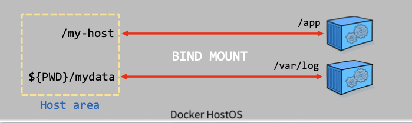
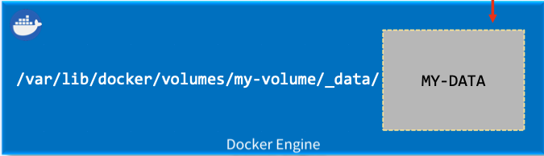
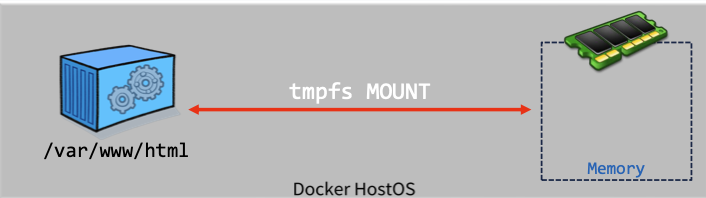

## volume 기술 이해 
- Docker에서 제공하는 volume 기술은 컨테이너 애플리케이션에서 생성되고 사용되는 데이터를 유지, 보존하기 위한 메커니즘을 제공한다.
- 컨테이너가 삭제되어도 volume은 독립적으로 운영되기 때문에 데이터를 유지한다.
- volume 기술은 Docker HostOS와 컨테이너에서 직접 접근이 가능하다.
- 일반적으로 컨테이너 내부의 데이터는 컨테이너의 생명 주기와 연관되어 컨테이너 종료 시 삭제되지만, 이를 지속적(Persistent)으로 보존하기 위한 방법으로 volume 기술이 사용된다.

### volume 방식
- Docker는 3가지 volume 기술을 지원한다.
>   
> 1. bind mount : 컨테이너의 특정 경로와 HostOS의 File system (디렉토리)의 경로를 붙여주는 방법이다.
> 2. volume : 직접 volume을 생성한다. 
> > - volume 기법과 bind mount 기법의 다른점은 bind mount는 임의의 경로를 잡을 수 있다. 
> > - 반면 volume 기법은 /var/lib/docker/volumes 경로에 생성된다.
> > - 즉, volume 기법은 docker에서 **직접** 관리하는 방법이다.
> 3. tmpfs mount : 임시 영역에 대한 부분, 일반적으로 컨테이너에서 관리하지 않아도 되는 데이터들을 임시로 관리하기 위해 선택하는 방법이다

### bind mount 기법
- Bind mount 기법은 **디렉토리** 뿐만 아니라 **파일**도 mount 가능하다.
- "호스트 파일 시스템 절대경로" : "컨테이너 내부 경로" 를 직접 mount 하여 사용한다.
- 사전에 연결할 파일 또는 디렉토리를 사용자가 생성하면 해당 호스트 파일시스템의 소유자 권한으로 연결되고, 존재하지 않는 경우 자동 생성되지만 이 디렉터리는 root 사용자 소유가 된다.
> 참고! : 컨테이너 가상화 기술이고, 전반적인 시스템에 대한 관리 권한이 필요하기 때문에 /var/lib/docker 는 어떤 계정으로 설치하던 root 계정으로 설정된다.
- 사전 정의 없이 컨테이너 실행 시 자동 생성되고, **컨테이너 제거 시 Bind mount가 자동 해제되지만 생성된 호스트 디렉터리와 데이터는 보존**된다.
- Bind mount 방법은 **데이터를 Host의 지정된 디렉토리에서 관리**한다.  
- "호스트 파일 시스템":"컨테이너 내부 경로"를 직접 연결(mount) 하여 사용한다.  
> - docker run .. -v /my-host:/app ..  
> - docker run .. --mount type=bind,source=${PWD}/mydata,target=/var/log  
>       
> - 위 사진에서 오른쪽에 컨테이너를 멈추고 삭제하는 경우, 컨테이너는 삭제되더라도 Host area 영역에 있는 데이터 -> mount가 되어 있는 경로에 데이터는 사라지지 않는다는 뜻이다.

### docker volume 기법
- Docker에서 권장하는 방법으로 "docker volume create 볼륨명" 으로 볼륨을 생성한다.
- Docker 볼륨은 Docker 명령어(CLI)와 Docker API를 통해 사용할 수 있다.
- docker volume 명령은 Docker root dir(/var/lib/docker) 영역에 volume 영역을 만들어 컨테이너 내부 경로와 연결(mount), 공유한다
- 볼륨 드라이버(vieux/sshfs plugin)를 통해 원격 호스트 및 클라우드 환경에 볼륨 내용을 저장하고 암호화가 가능하다. -> 이 방법을 통해 클라우드나 외부와 연결할 수 있다.
- 새 볼륨으로 지정될 영역(directory) 에 데이터를 미리 채우고 컨테이너에 연결하면 컨테이너 내에서 바로 데이터 사용이 가능하다
- docker volume은 볼륨 데이터를 Docker(/var/lib/docker)가 관리한다.
> - docker volume create my-volume
> - docker run .. -v my-volume:/app ..
> - docker run .. --mount source=my-volume,target=/app -> 위 명령어랑 이어서 쓰는게 아니라, 다른 방법임 (mount를 따로 잡아주는 방법)
> 
> - 위 명령어로 volume을 생성한다.
> - my-volume 으로 이름만 설정하면 /var/lib/volumes/[설정한 이름]/_data/ 아래 경로에 자동으로 데이터가 쌓이게 된다.
> - 명령어대로 my-volume은 /app 과 연동된다.
> - volume 기법도 컨테이너에 문제가 생겨 접근하지 못하더라도 /var/lib/volumes/[설정한 이름]/_data 경로에 데이터가 남기 때문에 데이터에 직접적인 접근이 가능해진다

### tmpfs mount 기법
- 위 두가지 방식과 다르게 tmpfs mount 방식은 Docker hostOS의 Memory에서만 지속되고, 해당 컨테이너가 중지되면 tmpfs mount 연결 해제와 함꼐 기록된 데이터도 사라진다.
- 이 방식은 컨테이너 간의 공유 설정이 불가능하고, Linux 기반 Docker 에서만 지원된다.
- 임시로 사용하고, 기록되지 않아야 하는 파일, 데이터 등을 사용할 경우에 유용하다. (host 영역 및 컨테이너의 write 영역에 파일이 기록되지 않음.)
> - docker run .. -tmpfs /var/www/html ..  
> - docker run .. --mount type=tmpfs, destination=/var/www/html ..  
> - /var/www/html 는 컨테이너에 내부 경로이다.  
>   

### 경로에 따라, 관리 관점에 따라 방법을 선택해서 사용하면 될듯
- 개발자가 직접적으로 경로를 관리하겠다. -> bind mount
- docker에게 관리 하게끔 설정하겠다, 혹은 volume에 맞는 다른 docker에 기술을 쓰겠다. -> volume