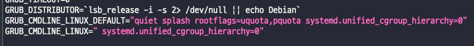
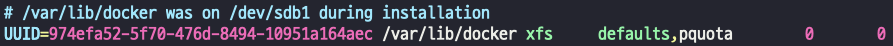
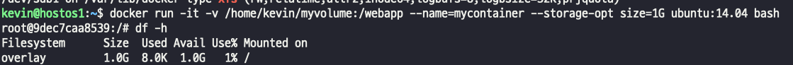
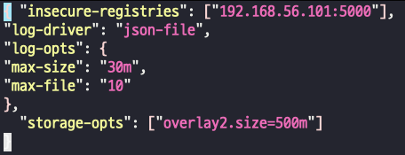
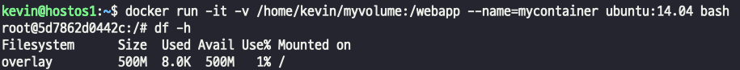

## Volume 사용량 제한 구성
- 일반적으로 volume을 설정하게 되면, 용량의 제한이 무제한으로 설정된다. 
- Docker는 컨테이너의 root file system(/) 영역의 개별적인 공간 할당 제한을 위해 --storage-opt 옵션을 제공한다.
- 이 옵션을 사용하려면, 해당 disk partition이 xfs로 지정되어야 하고, 추가 기능으로 pquota(project quota)가 설정되어 있어야 한다.

### 옵션 설정
- /etc/default/grub   
>   
- /etc/fstab  
>    

### 옵션을 설정하고 storage-opt를 사용해서 1기가로 제한  
> -     
> - 이건 컨테이너 하나에 대한 설정이라 비효율적이다.  
### 생성되는 컨테이너 전체에 rootfs(/) 용량을 500m 으로 제한하고 싶다면?  
- docker daemon에 제한 설정을 해주면 된다.  
- /etc/docker/daemon.json  
>     
> >      
> > 옵션을 따로 설정하지 않고 컨테이너를 실행해도 500M으로 제한된다.

