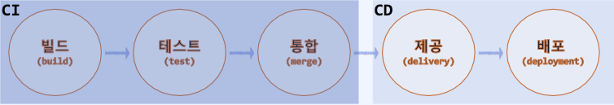
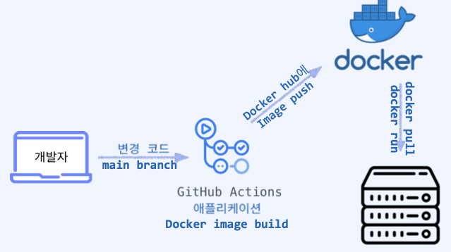
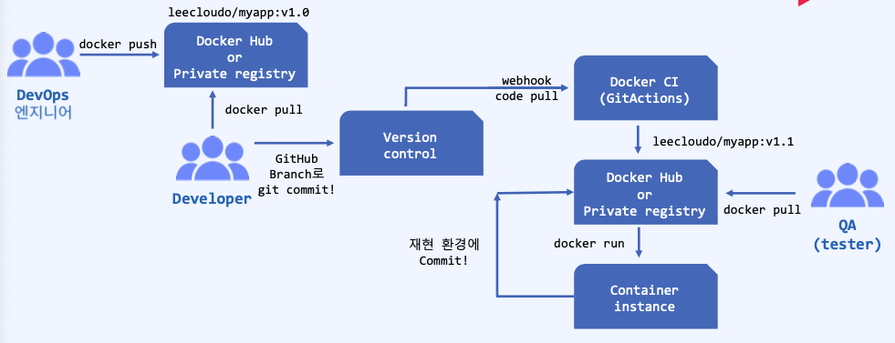

## 지속적 통합과 배포(CI/CD)가 필요한 이유
- 빠른 "배포 속도" 와 유연한 반영을 기반으로 하는 "효율성"
- 다차원 적인 요구사항과 빠른 비즈니스 변화에 맞는 개발 환경을 고려할 때, 시장 변화와 요구사항을 빠르고 유연하게 반영할 수 있는 방법론 제기
- 탄력적이고 민첩함(Elastic & Agile)의 강조와 개발과 운영의 긴밀한 협조 관계의 DevOps 문화의 도약
> - CI -> Continuous Integration, 지속적 통합
> - CD -> Continuous Delivery, 지속적 제공
> - CD -> Continuous Deployment, 지속적 배포

### 지속적 통합과 배포 
- CI/CD는 애플리케이션 개발 단계를 자동화하여 보다 짧은 주기로 변경을 제공하여 전반적인 개발 프로세스의 효율성과 지속성을 보장한다.
> - 반복적 작업의 자동화를 통해 업무 효율성을 올리고, 실수를 줄일 수  있다.
> - 개발 업무에 집중할 수 있는 환경을 제공한다.
> - "빌드-테스트-배포"의 자동화 프로세스를 통해 수동 작업을 줄여 오류 위험을 최소화
> - 일관된 빌드 및 배포를 보장할 수 있다.
- CI/CD 과정을 묶어서 CI/CD 파이프라인을 구축하면 애플리케이션의 통합 및 테스트 단계에서부터 제공 및 배포에 이르는 애플리케이션의 라이프사이클 전체에 걸쳐 지속적인 자동화 및 모니터링을 제공하여 안정적인 배포를 수행하는데 도움이 된다.

### 지속적 통합(CI)
- CI/CD = 지속적인 통합(CI) & 지속적인 서비스 제공 (CD) & 지속적인 배포(CD)로 구성
- CI는 현대적 애플리케이션의 다양한 기능 부여와 서로 다른 모듈까지 동시에 여러 개발자가 작업 가능하도록 구성하는 것을 목표로 한다.
- CI는 빌드 자동화를 통해 변경되는 개발 코드의 충돌이나 예상치 못한 문제 발생을 예방하고, 통합 과정에서 빌드 + 테스트를 수행하여 코드 문제점을 빠르게 확인한다.

### 지속적 제공(CD) 
- CD(지속적 제공)는 유효한 개발 코드를 repository에 자동 Release 하여 운영 환경으로 배포할 준비가 되어 있는 안정적 배포 준비 단계.
- CD는 CI단계를 거쳐 검증이 완료된 개발 코드를 저장소로 가져와서 수동 또는 자동으로 지속적 배포 단계로 넘겨 운영 환경으로 배포되게 된다.  
      

### CI/CD 자동화 배포 이후 
- 구성된 workflow에 맞춰 형상 관리 도구에 개발 코드를 통합한다.
- 빌드, 테스트가 자동으로 진행되므로 품질 관리가 되기 때문에 코드 검증에 들어가는 시간을 절약할 수 있다.
- Repository에는 테스트가 통과된 코드만 저장되어 좋은 코드 퀄리티 유지가 가능하다.
- 검증된 애플리케이션이 실제 운영 환경으로 자동 배포된다.

## Docker 환경에서의 CI/CD 파이프라인
- Docker 환경에서 CI/CD 파이프라인은 docker image를 생성(Dockerfile) 하는데 사용한다.
- 생성된 이미지는 docker hub(hub.docker.com) or Private registry에 push 하여 docker image 관리가 용이하다.
- 일련의 과정을 자동화 ..
> 1. Dockerfile 작성
> 2. Docker Image 생성
> 3. Image registry push
> 4. Docker Image deploy
> > - 버전 및 형상 관리를 위해 git 등에 변경 코드를 Push
> > - 사전에 구성된 CI/CD 파이프라인에서 자동으로 빌드를 트리거하여 Dockerfile을 사용한 새로운 docker image 생성
> > - 새롭게 생성된 docker image를 사용하고 있는 docker registry에 push한다 : (CI)
> > - 추가된 docker image를 가져와 테스트 환경에 배포한다.
> > - 애플리케이션 테스트가 마무리 되면 docker image 운영 환경에 배포된다.

## Docker 환경에서의 CI? 
- pull request or git push 로 코드가 입력되면 자동으로 docker build가 수행되고 성공, 실패를 나타내고 docker hub에 새로운 docker image가 build되어 저장되는 일련의 과정 이다  
      
      
