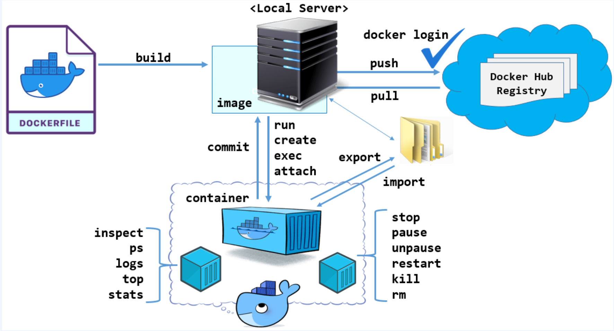
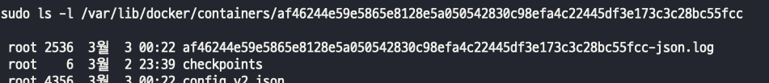
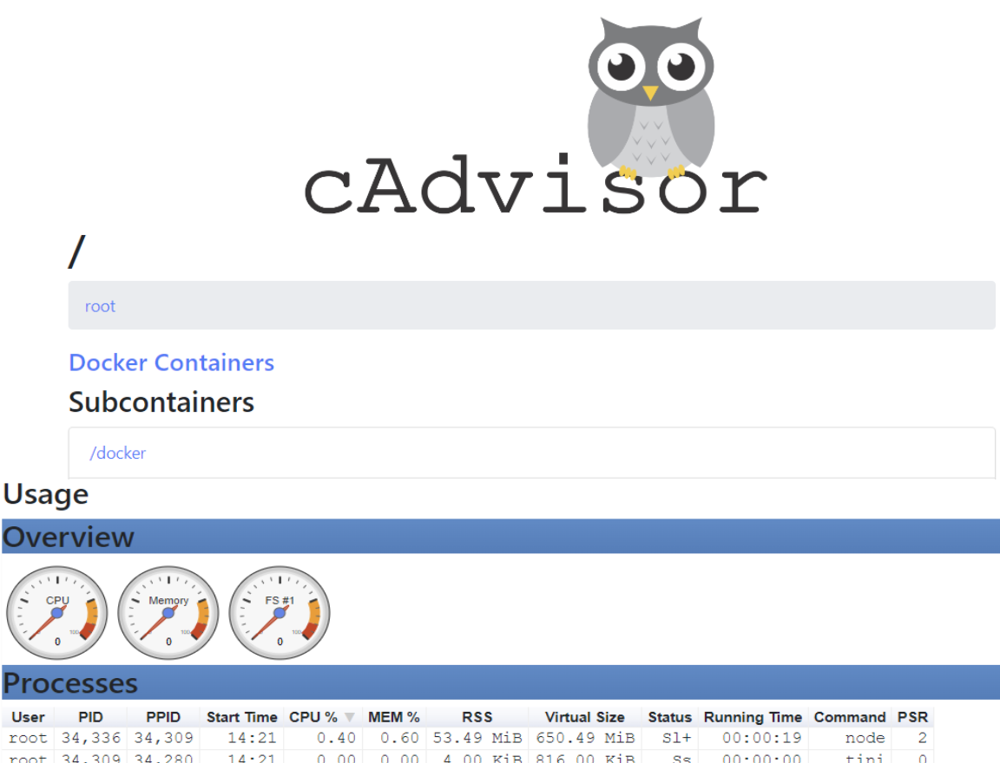

## Docker 컨테이너 관리를 위한 CLI  
  
- https://docs.docker.com/engine/reference/commandline/container

### option
- docker [container] run [option] docker_image [command]
> - -i, --interactive : 대화식 모드 열기
> - -t : TTY(단말 디바이스) 할당
> - -d, --detach=true : 백그라운드에서 컨테이너를 실행하고 컨테이너 ID 등록
> - --name : 실행되는 컨테이너에 이름 부여 (미 지정 시 자동으로 부여된다. 딕셔너리 워드 랜덤 선택)
> - --rm : 컨테이너 종료 시 자동으로 컨테이너 제거
> - --restart : 컨테이너 종료 시 적용할 재시작 정책 지정. (no |  on-failure | on-failure:횟수n | always) -> default는 no
> - --env, -e : 컨테이너의 환경변수 지정(--env-file은 여러 환경 변수를 파일로 생성하여 지정하는 방법)
> - -v, --volume=호스트경로:컨테이너경로 : 호스트 경로와 컨테이너 경로의 공유 볼륨 설정(Bind mount 설정하는 명령어)
> - -h : 컨테이너의 호스트명 지정 (미 지정 시 컨테이너 ID가 호스트명으로 등록)
> - -p [Host 포트]:[Container 포트], --publish : 호스트 포트와 컨테이너 포트 연결
> - -P, --publish-all=[true | false] : 컨테이너 내부의 노출된(expose) 포트를 호스트 임의의 포트에 게시 -> 암시적 포트 매핑
> - --wrokdir, -w : 컨테이너 내부의 작업 경로(디렉토리)

### 명령어 예시
- docker top | port | stats
> 컨테이너에서 실행 중인 프로세스 조회 -> docker top [name]  
> 컨테이너에 매핑된 포트 조회 -> docker port [name]  
> 컨테이너 자원에 대한 소비를 실시간 스트림 출력 (스트림 비활성화 --no-stream) -> docker stats [name] [name] ...   

- docker logs
> 컨테이너에서 발생하는 stdout(표준출력), stderr(표준에러) 출력
> while true; do curl 192.168.56.101:6060; sleep 3; done  
> docker logs -f [name]  
> docker logs [name] -> 컨테이너가 실행이 안될경우 에러 확인  

> 출력되는 로그 양이 큰 경우, disk full 조심!
> docker info | grep -i log  

> docker log는 어디위치에 쌓이게 될까?  
> sudo ls -l /var/lib/docker/containers  
>     
> 이 목록에서 컨테이너 이름과 가장 앞글자쪽이 일치되는 항목을 찾고 다시 조회 해보면  
>   
> json 파일에 로그가 쌓이게 된다 -> 주기적으로 관리해주자..~
> - 관리는 어떻게 해줄까
> - truncate 나 크론탭 이런걸로 날려도 좋고,
> > - /etc/docker/daemon.json 파일에 옵션으로
> > - "log-driver": "json-file",  
      "log-opts": {  
      "max-size": "30m",  
      "max-file": "10"  
      }    
이 옵션을 추가해주자

### 컨테이너 내부 구조 정보 확인
- docker inspect [name]   

### 복사 명령어
- docker cp [보낼파일]:보낼위치 및 파일 이름
> docker container cp <Container명 또는 ID>:<Container 내의 파일 경로> <Host 디렉터리 경로>      
> docker container cp <Host 파일> <Container명 또는 ID>:<Container 내의 파일 경로>    

### cadvisor
- Google 에서 제공하고 관리하는 오픈 소스 컨테이너 모니터링 도구. -> docker stats 와 동일한 결과를 볼수있다.  
> docker run \
--restart=always \
--volume=/:/rootfs:ro \
--volume=/var/run:/var/run:rw \
--volume=/sys/fs/cgroup:/sys/fs/cgroup:ro \
--volume=/var/lib/docker/:/var/lib/docker:ro \
--volume=/dev/disk/:/dev/disk:ro \
--publish=9559:8080 \
--detach=true \
--name=cadvisor \
--privileged \
--device=/dev/kmsg \
gcr.io/cadvisor/cadvisor:latest
>   
> 

