## nginx proxy를 docker compose에서 구현해보기  
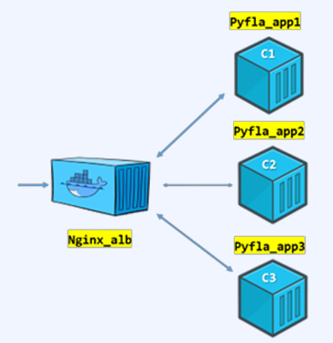    
- nginx proxy 구성과 실행은 다른 파일에 정리되어 있으니, compose yaml만 구성해보도록함  
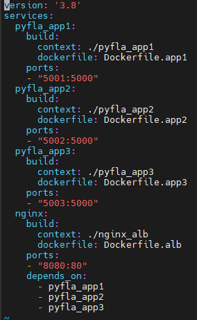    
> - pyfla_app 1,2,3 이 빌드되면서 어플리케이션이 실행이 될건데,  
> - depends_on 옵션이 nginx가 걸려있으니 nginx가 먼저 실행이 되면서 pyfla_app 1,2,3 을 가져올것이다.  
- docker compose up --build 명령어로 빌드와 함께 컨테이너를 실행시킨다.  
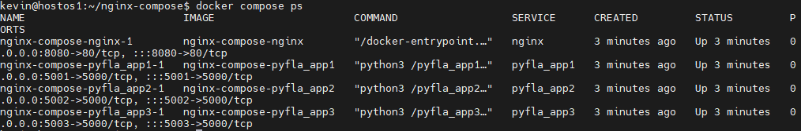      
- proxy 기능이 정상적으로 동작하는지 확인해보자  
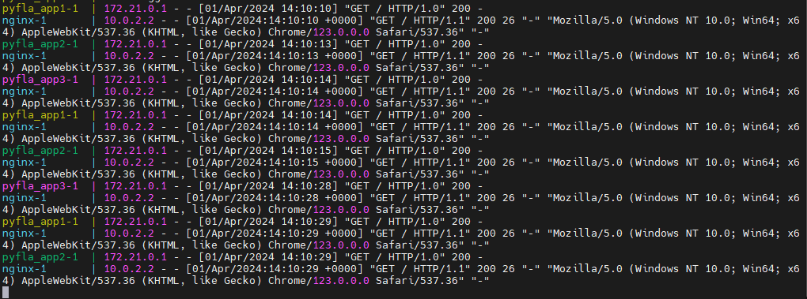    
> - 8080포트로 요청을 보내면 pyfla_app1 2 3 으로 요청이 들어가는것을 확인할수있음
> - 로그의 제일 앞 실행되는 app의 이름을 보면 1 2 3 으로 순차적으로 잘 실행된다.

## 3-tire web application 배포해보기
- back-end, front-end 이미지는 미리 빌드해놓았다.   
- compose yaml 파일을 보면  
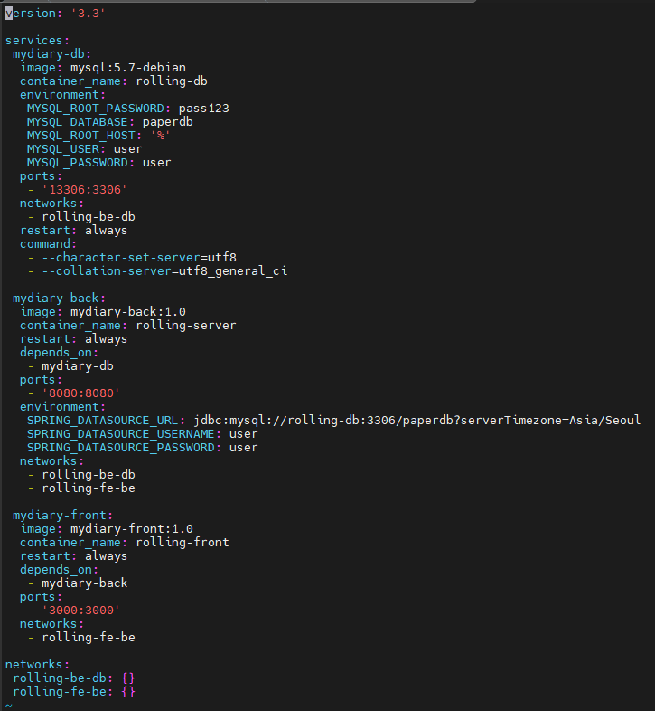    
> - spring boot 이미지이기 때문에 환경변수에 SPRING_DATASOURCE_URL이 들어감  
- docker compose up 으로 실행 시키면?  
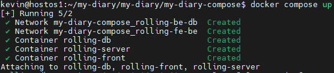  
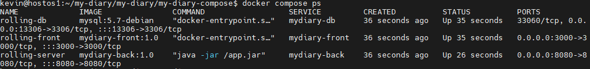  
- ip:3000 번으로 접속하면 웹이 잘 뜨는것을 확인할수있다.  
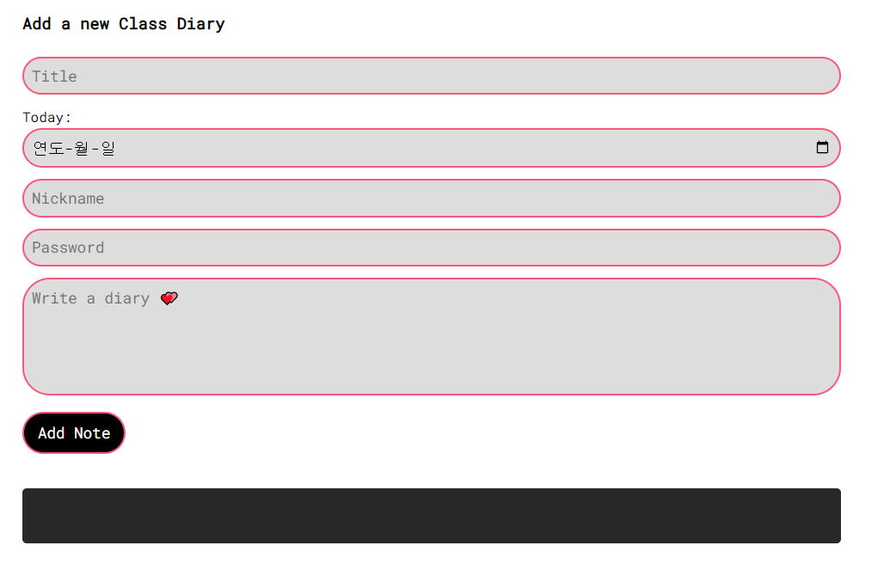  

- DB연동 확인하기  
> - Add Note 버튼을 클릭하고 로그에 insert 쿼리가 잘 실행되는지 확인해보자  
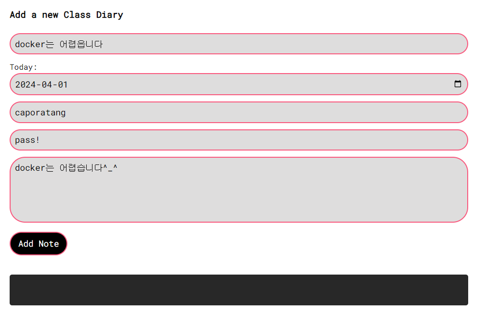    
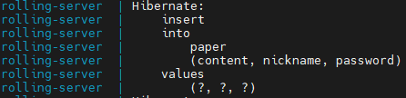    
> - 쿼리가 잘 날아갔다!  
- DB에 접속해서 확인해보자  
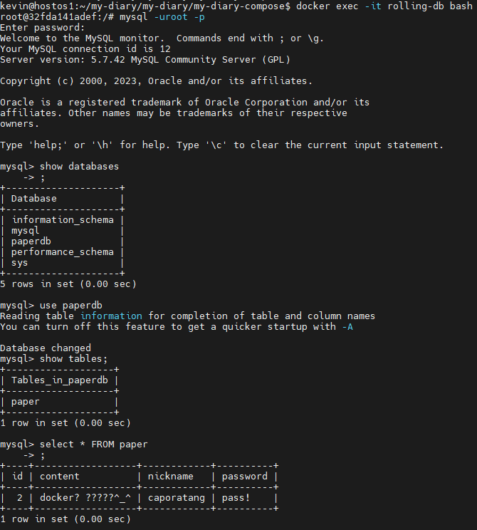  
> - 웹에서 입력한 데이터가 잘 저장되어있다. 

## 밖에서 따로 이미지 빌드하지 말고 yaml에 명시해서 하나의 디렉토리에서 한번에 빌드하기
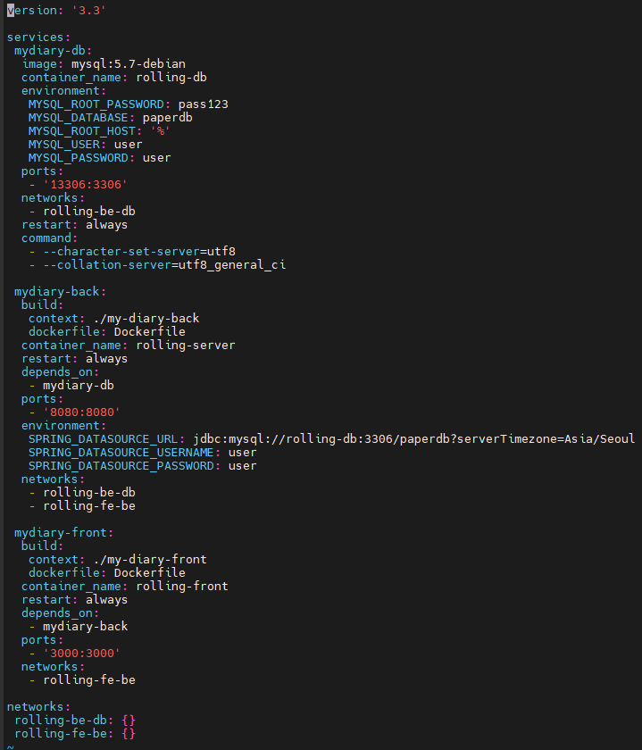    
> - 위에 yaml 과 차이점은 back, front 바로 아래에 build 옵션에 Dockerfile을 따로 설정해주는것을 확인할수있다.
> - 이렇게 하면 따로 이미지가 없어도 compose 실행 시 이미지 빌드를 한번에 수행한다.

## 프론트, 백엔드에 로드밸런스 결합해서 동일하게 동작하게 만들어보기
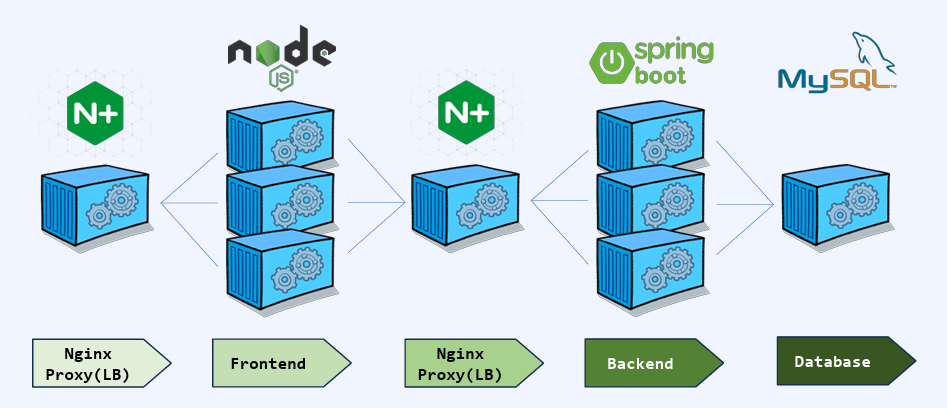    
```json
version: '3.8'

services:
 mydiary-db:
  image: mysql:5.7-debian
  container_name: rolling-db
  environment:
   MYSQL_ROOT_PASSWORD: pass123
   MYSQL_DATABASE: paperdb
   MYSQL_ROOT_HOST: '%'
   MYSQL_USER: user
   MYSQL_PASSWORD: user
  ports:
   - '3306:3306'
  networks:
   - mydiary-net
  restart: always
  command:
   - --character-set-server=utf8
   - --collation-server=utf8_general_ci

 mydiary-back:
  build:
   context: ./my-diary-back
   dockerfile: Dockerfile
  deploy:
   replicas: 3
  restart: always
  depends_on:
   - mydiary-db
  ports:
   - '8081-8083:8080'
  environment:
   SPRING_DATASOURCE_URL: jdbc:mysql://rolling-db:3306/paperdb?serverTimezone=Asia/Seoul
   SPRING_DATASOURCE_USERNAME: user
   SPRING_DATASOURCE_PASSWORD: user
  networks:
   - mydiary-net

 mydiary-front:
  build:
   context: ./my-diary-front
   dockerfile: Dockerfile
  deploy:
   replicas: 3
  restart: always
  depends_on:
   - mydiary-back
  ports:
   - '3000-3002:3000'
  networks:
   - mydiary-net

 proxy-be:
  image: nginx:1.21.5-alpine
  container_name: rolling-server-lb
  restart: always
  depends_on:
   - mydiary-back
  ports:
   - '8080:80'
  volumes:
   - ${PWD}/proxy/nginx-be.conf:/etc/nginx/nginx.conf
  networks:
   - mydiary-net

 proxy-fe:
  image: nginx:1.21.5-alpine
  container_name: rolling-front-lb
  restart: always
  ports:
   - '80:80'
  volumes:
   - ${PWD}/proxy/nginx-fe.conf:/etc/nginx/nginx.conf
  networks:
   - mydiary-net

networks:
 mydiary-net:
  driver: bridge
  ipam:
   driver: default
   config:
   - subnet: 172.20.0.0/24
   ip_range: 172.20.0.0/24
   gateway: 173.20.0.1
```  
- 기존 yaml들과 비슷하지만 deploy에 replicas 옵션을 줘서 각 front, back 컨테이너를 3개까지 복사한다. -> ports 옵션에 port를 하나씩 지정하는게 아니라 포트를 범위로 지정한다  
- 컨테이너들의 conf 파일을 volumes 설정을 통해서 따로 작성해둔 conf 파일로 대체한다.  
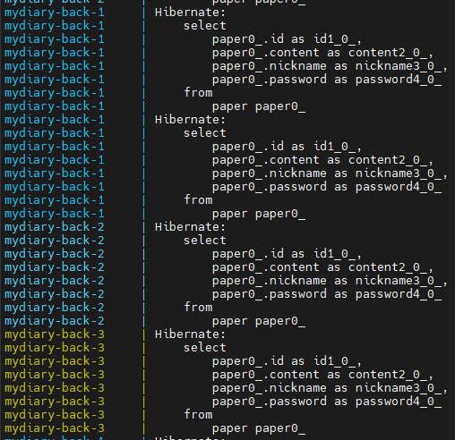  
> - 위 yaml 로 실행시에 네트워크 충돌에 주의..!
> - 똑같이 3000번 포트로 접속해서 트래픽을 계속 보내면 로드밸런스가 제대로 동작하고 있는것을 확인할수있다.