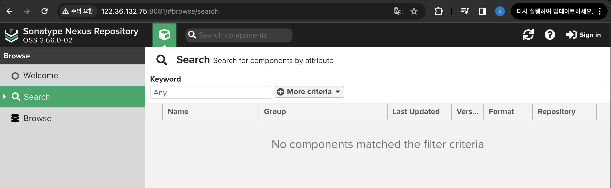
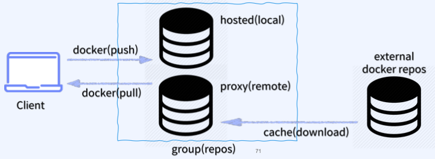
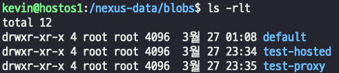
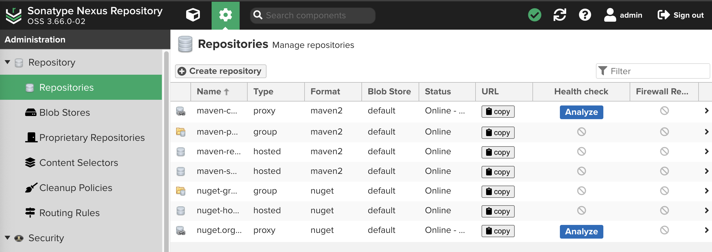
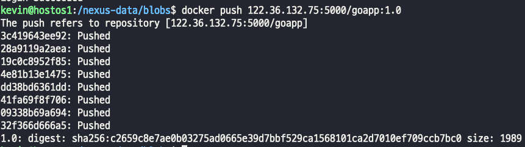
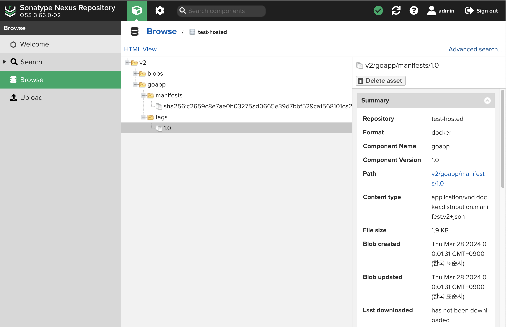
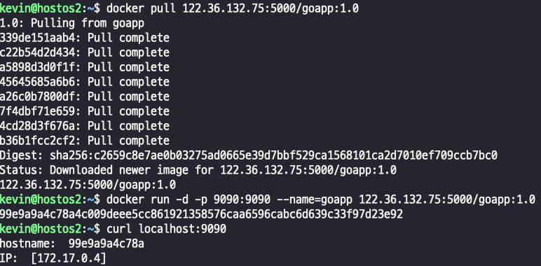

## sonatype Nexus private registry ?
- nexus는 오픈소스 아티팩트 저장소 관리 도구로 사용되고 있다 
- 다양한 패키지 저장소를 지원한다 (docker, maven, npm, yum, go..)
- 사내에서 사용할 수 있는 private registry를 구축해서 내부 프로젝트에서만 사용 가능한 아티팩트(docker image) repository로 사용할 수 있다.

### nexus 컨테이너 설치하기
    
> - nexus run 
> - 5000번 포트는 Docker repository 접근을 위해 할당
> - 8081 포트는 UI를 통해 접근하기 위해 할당

    
> - nexus는 설치하면 기본 어드민 계정을 제공한다
> - 초기 암호는 설정한 volume 영역 혹은 컨테이너 내부 영역에서 admin 계정의 초기 암호를 확인할 수 있다.

- 로그인 후 비밀번호 변경까지 한 후에 선택  
  
> - Enable Anonymous Access : 기본적으로 사용자들이 자격증명 없이 접속할 수 있도록 허용.
> - Disable Anonymous Access : 자격증명이 있는 사용자만이 접근할 수 있도록 제한.

### sonatype Nexus private registry 구축
- nexus3를 이용한 private registry 구축에 필요한 저장소 : BLOB repository 생성
> - BLOB repository? 
> 1. 아티팩트(image)의 바이너리 저장소
> 2. 로컬 or 클라우드 저장소 사용 가능
> 3. 단일 및 다중 repository 사용 가능
1. hosted (local) : 내부에서 생성한 아티팩트(docker image) 배포(docker push) 에 사용
2. proxy (remote) : 외부 저장소로부터 아티팩트들을 저장하거나, 내부 사용자에게 전달하기 위한 캐시 역할로 사용
3. group(repos) : 여러 hosted, proxy 저장소를 그룹으로 묶어 단일 경로를 제공(선택)  
    

### BLOB stores 생성 -> 업로드되는 모든 파일을 저장하는 Nexus 저장소
- Blob의 생성 순서는 Hosted, Proxy 순으로 한다.
- Create Blob Store  
     
> - blob store는 S3 와도 연동이 가능하다. 나중에 꼭 연동해보자

   
    
> - Type 을 file 로 잡고 생성했기 떄문에 로컬 서버에 volume 경로에 blob 레포지토리가 생성된것을 확인할수있다.  

### 생성한 Blob sotre를 repository와 연동하기
- create repository  
    
- 목록에서 docker_hosted 선택  
    
- 설정값  
       
> - 위에서 부터 
> - 저장소 이름 설정
> - 5000번 포트로 설정
> - 익명의 사용자 docker pull 허용
> - docker api 연동 여부 허용
> - 실제 만들어져있는 blob store
- 프록시도 설정까지 가는 길은 똑같고, 설정만 약간 다르다.  
    
> - 저장소 이름 설정
> - 익명 사용자 docker pull 허용
> - 기본적으로 제공되는 docker.io registry 주소
> - nexus 인증서 사용
> - nexus 인증 관련 정보 사용
> - index는 Docker hub
- 설정된 모습  
  
> test-hosted : 저장소
> test-proxy : proxy 역할
> > 추가적으로 security 설정에서 docker bearer 토큰 사용 허가도 반드시 해줄것.

### nexus registry에 push 해보기
- 기본적으로 private registry 설정은 되어 있어야한다.
- nexus 웹에 admin 계정으로 로그인을 했기 때문에 로컬에서도 admin 계정으로 로그인을 해야 푸시가 가능하다. 안하면 인증 안되서 푸시하지 못함
   
- 로그인 후 푸시 완료!  
    
- web에서도 확인해보자.
  
> - 푸시한 이미지에 대한 정보까지 그대로 잘 push됐다!

### push한 이미지를 2번서버에서 pull 받고 실행시켜보자
   
