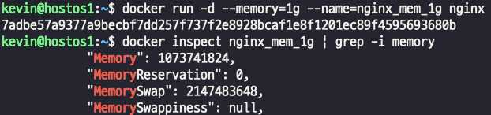

## 컨테이너 Memory 리소스에 대한 런타임 제한
- 메모리는 프로세스들의 작업 공간
- Docker HostOS의 총 메모리 양과 작업에 사용될 예상되는 메모리 크기를 사전에 파악하여 메모리 최적화를 유지한다.
- 만일 특정 컨테이너가 과도한 메모리 사용 시 메모리 부족(OOM) 으로 인해 프로세스, 즉 다른 컨테이너의 예기치 않은 강제 종료가 발생할 수 있다.
> OOM Killer 가 프로세스를 kill 하지 못하게 보호하는 명령어 : --oom-kill-disable (당연히 좋은 방법은 아니다)
- 특히 컨테이너들의 과도한 메모리 사용으로 인해 Docker Daemon이 커널에 의해 강제 종료되면 전체 컨테이너 서비스들에 영향을 주게 된다.
- hard limit : 물리적인 제한
- soft limit : 소프트웨어 제한
- --memory (-m) :
> - k g m 단위로 설정가능.
> - (hard limit) 컨테이너가 사용하는 최대 메모리 사용량 제한.
> - 설정 값을 초과해서 사용하면 OOM 발생. 최소 6MB
- --memory-reservation : 
> - (soft limit) Docker가 contention을 감지하거나 HostOS의 메모리 가용율이 현저히 떨어지는 경우 활성화되어 최소한의 보장 값으로 사용.
> - (soft limit) -m=1g --memory-reservation=500m (최대 1g 사용 가능하고, 적어도 500m 을 보장한다.)
- --memory-swap 
> - 컨테이너가 사용할 수 있는 swap memory 사용량 제한 (-1은 무제한.)
> - -m=300m 설정 시 자동으로 --memory-swap=600m 설정됨
> - 이는 전체 600m에서 -m 값을 뺀 나머지만큼 swap이 사용된다는 의미.

### memory hard limit, --memory(-m)
- 컨테이너 물리적 메모리 크기를 제한
  
  

- memory swap 설정

> swap 메모리 설정시 주의점!!  
> 첨부한 이미지 처럼 메모리를 200으로, swap 메모리를 300으로 잡은경우 사용 가능한 스왑 메모리는 100이다.  

  

**CPU와 마찬가지로 docker update 를 사용하면 메모리도 수정할수있다.**  