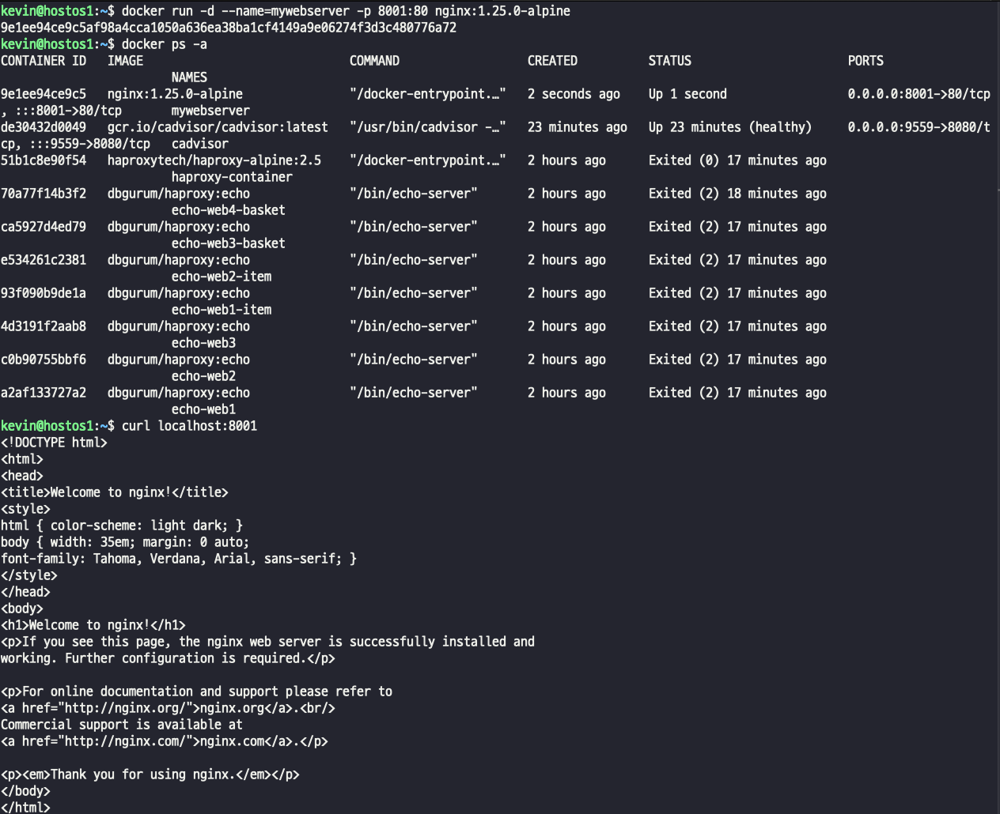
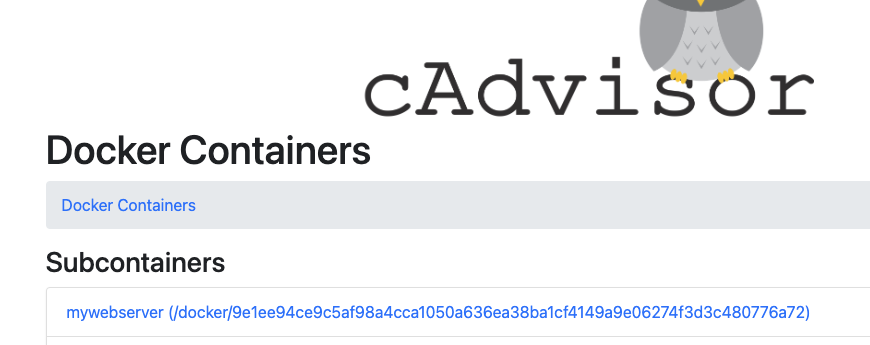

## Monitoring?
- 모니터링은 시간의 흐름에 따른 시스템 및 여러 구성 요소의 동작과 출력 등을 관찰, 확인하는 작업을 통해 자원의 효율적인 사용을 식별, 평가한다
- 모니터링 전략을 세우려면, 무엇을, 왜, 어떻게 모니터링해야 하는지 우선 고려해야 한다.
- 모니터링은 활용률 및 처리량 같은 Metric(지표)에 중점을 두고 시스템 전반의 성능을 알 수 있다.
> Ex) 메모리 사용량 급증, 캐시 적중률 감소, CPU 사용량 증가 등을 관찰한다.
- 다만 모니터링은 애플리케이션 중심의 MSA 같은 복잡한 아키텍처를 진단하기에 어려움이 있다.
- 몇 가지 Metric 간의 상관 관계는 애플리케이션 장애 진단에 충분한 정보를 제공하지 못하기 때문에 복잡한 MSA 환경의 애플리케이션에 대한 가시성 있는 관찰을 위해서는
- Observability(관찰 가능성 -> Monitoring, Logging, Tracing, Visualization) 도구가 요구된다.

### 컨테이너 리소스 Metric 정보를 수집하는 cadvisor
- Google에서 제공하고 관리하는 "오픈 소스 컨테이너 모니터링 도구"
- Docker 컨테이너와 다른 컨테이너 플랫폼에도 기본적으로 지원 가능
- cAdvisor는 Docker HostOS에서 실행 중인 컨테이너에 대한 정보를 수집하고 해당 데이터를 처리한 후 내보내는 "단일 컨테이너 데몬" 으로 구성
- cAdvisor는 이전 리소스 사용량, 리소스 격리 매개 변수 및 각 컨테이너 머신 전체에 대한 네트워크 토계 등을 기록한다.
- 각 컨테이너는 독립적인 개별 환경이고, 이를 모니터링하여 각 애플리케이션의 정보를 수집하여 현재의 성능과 개선점을 진단할 수 있다.
- cAdvisor는 컨테이너에 포함된 애플리케이션 Metric을 수집하여 활성 및 읽기 연결 수, 애플리케이션에 적절한 CPU 및 메모리 할당이 있는지를 알 수 있다.
- 이 정보(metric data)는 **"전용 웹 인터페이스"** 또는 **Google Big Query, ElasticSearch, Kafka, Prometheus, Redis**와 같은 데이터 분석 가능 도구와 연동할 수 있다.

## cAdvisor
- 8080 port가 기본적으로 설정되어 있다. -> 충돌 가능성이 높아 기본 포트는 사용 지양하자..~
  
> - CPU, MEMORY, 전체 프로세스, Network, Subcontainers를 실시간으로 확인할 수 있다.  
> - 기본적으로는 host가 아니라 docker engine이 사용하고 있는 자원에 대한 모니터링이다.  
> - /docker 혹은 Docker Containers를 클릭하면 현재 실행중인 프로세스(컨테이너)에 대한 정보를 확인할 수 있다.

### cAdvisor의 활용
- 샘플 컨테이너를 생성해서 cadvisor에서 실시간 스트림 출력을 확인해보자  
  
- cAdvisor 에서 생성한 nginx 컨테이너 확인하기  

- 여러번 요청을 보내는 경우 바로 네트워크 Metric(지표)에 출력된다. 
  
> 요청을 보내는 경우 network 뿐만 아니라, 당연히 cpu, 메모리쪽도 같이 조금씩 올라간다.

### cadvisor와 연동 가능한 Observability tool, Prometheus + Grafana
- cadvisor는 좀 가시성이 떨어진다. -> 다른 도구와 연동이 필요하다
- Observability, 즉 관찰 가능성 도구는 4가지 특징 및 도구를 가지고 있어야한다.
> 1. Monitoring : 모니터링 도구는 인프라 로그 메트릭을 검사하여 작업 및 인사이트를 수행
> 2. Logging : 로그는 특정 시간에 발생한 이벤트 기록
> 3. Tracing : 추적은 원인 관련 이벤트의 요청 흐름을 캡처하는 데 사용
> 4. Visualization : 시각화는 이 모든 정보를 차트 등의 시각적 효과를 통해 제시하여 빠른 인사이트 제공  
> > - prometheus? 
> > - 오픈 소스 도구, 실시간으로 들어오는 데이터를 저장할 수 있는 데이터베이스.
> > - PromQL 쿼리 언어로 조회 및 분석 가능..
- prometheus를 Grafana를 연동해서 시각화가 가능하다. 원하는 패턴으로 구성이 가능함.

### 간단하게 prometheus grafana 연동 
- **따로 공부 필요..어렵다**
  
> prometheus 는 9090 포트로, node-exporter 9100 포트로, cadvisor는 사용하던 포트 그대로, grafana는 3000번 포트로 실행
> cadvisor에서 발생되는 정보를, prometheus가 수집하고, 수집된 데이터를 grafana가 시각화하게끔 연동.

  
> - 연동은 해서 접속까진 했는데, 시각화하고 하는건 나중에 따로 해보자..~

## 컨테이너 리소스 측정 도구, htop
- 자원 소비 측정을 위한 htop 도구를 설치한다.
- htop은 각 코어수를 확인해서 각 프로세스 정보를 좀 더 자세히 보여주는 실시간 모니터링 도구이다.
> 
> 1. F1 Help  : 단축키 기능 확인
> 2. F2 Setup : htop 설정메뉴
> 3. F3 Search: 프로세스 검색
> 4. F4 Filter : 프로세스 필터링(ps -ef | grep [프로세스] 와 같은 의미) -> 필터링할 키워드 입력
> 5. F5 Tree : 부모-자식 관계 보여줌 -> 트리관계로 변화
> 6. F6 Sort : 정렬 -> sort by 기준 선택
> 7. F7 Nice (+) : 우선순위 올림
> 8. F8 Nice (-) : 우선순위 내림
> 9. F9 Kill : 프로세스 종료(kill -9 [pid] 와 같은 의미)
> 10. F10 Quit : htop 종료

## 컨테이너 리소스에 대한 런타임 제한 (resource limit)
- 왜 resource를 관리하고 제한을 해야하는가?
- 컨테이너를 생성하는 경우 가상화해서 컨테이너를 생성하는것이다. 즉, HostOS의 자원을 가져다가 사용한다.
- 문제는 아무런 옵션이나 제약없이 컨테이너를 생성하는 경우 컨테이너는 unlimited(자원 제한 없이) 하게 생성된다
> 정리하자면
> 1. docker run(or create)를 통해 컨테이너 생성 시 주요 자원(CPU, Memory, Disk)에 대한 자원 할당 조정이 가능하다.
> 2. 이러한 옵션을 사용하지 않는 경우 Docker HostOS의 자원 제한 없이 사용된다.
> 3. 자원 소비 제한을 하지 않으면, 잘못 관리되는 경우 resource를 독점해서 다른 컨테이너의 자원 사용 및 전반적인 성능에 영향을 줄 수 있다.
> 4. docker update 명령어를 통해 실행중인 컨테이너에 resource 제한을 해줄수도있다..!  