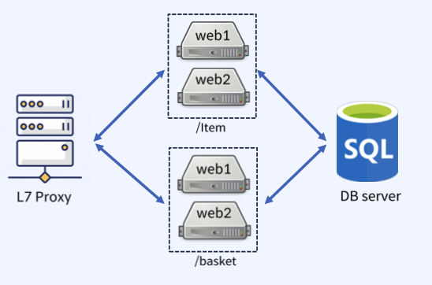
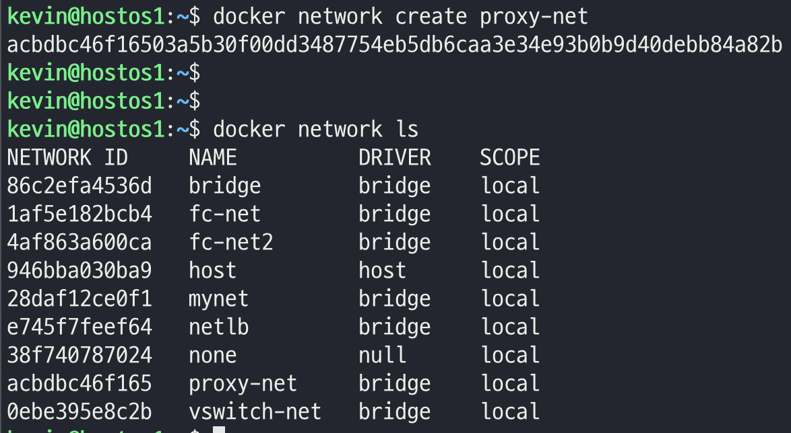
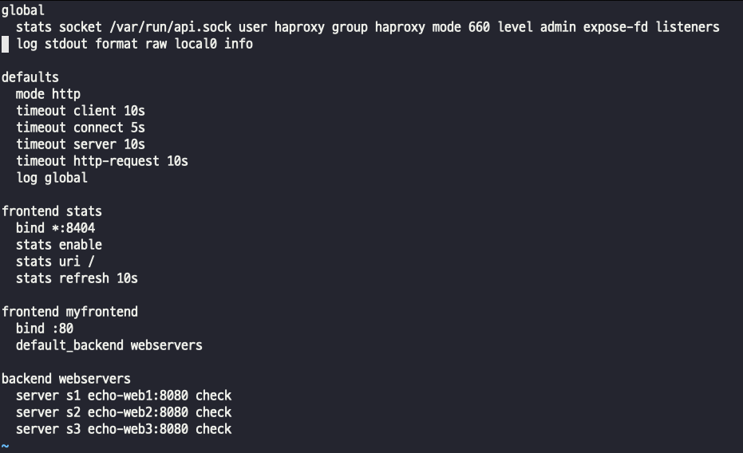
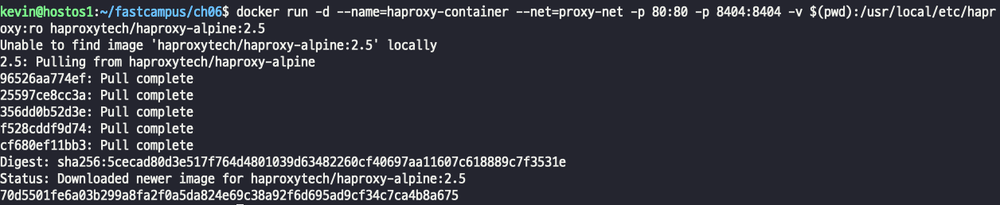
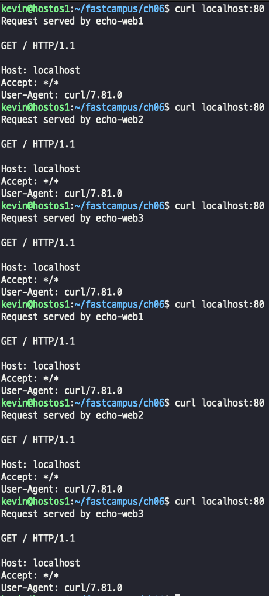
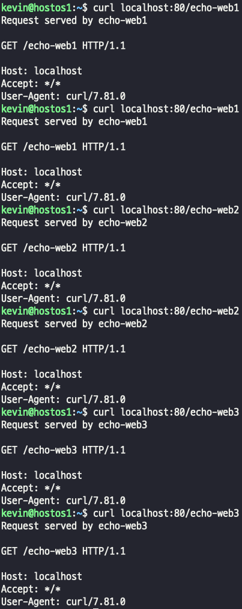
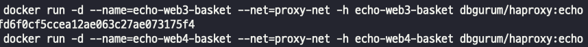
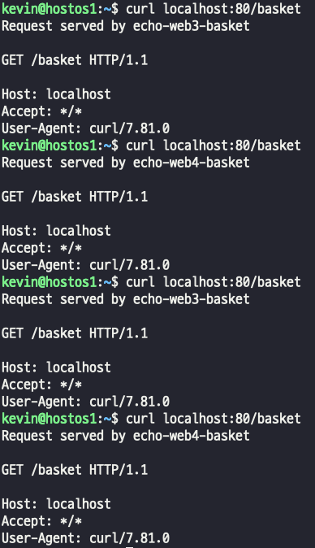

## HAproxy, L7
- OSI 7계층 중 Layer 7은 HTTP 기반의 URI를 이용한 트래픽 전달이 특징이다.  
- 
- 특정 URI로 요청이 들어오면 각각 분산해서 트래픽을 처리할 수 있다.

### 환경 구성
- proxy-net network 설정
  
> proxy-net 할당된 ip 대역은 172.21.0.0이다.  
- proxy-net을 사용하고 이는 echo 이미지 컨테이너 3개 생성  
  
- 컨피그 설정파일 생성 및 설정 (cfg 확장자)
- 
> - 일반적인 설정값이며, mode http -> 7계층 레벨, TCP로 변경하는 경우 4계층 레벨로 사용할 수 있다.  
> - 자체적으로 stats 영역을 보면 8404포트를 사용해서 통계도 수집함
> - 80번으로 들어오는 트래픽을 webservers에 전달하겠다.  

- 컨테이너 실행
  
- 통신 결과 확인 (curl)  
요청을 보냈을 때 round robbin 형태로 통신이 잘 된다!  
  
- 통계 정보 확인(config 파일에 설정한 frontend, backend 트래픽을 확인할 수 있다.)  
  

### URI 방식으로 수정해서 테스트 해보기
- 컨피그 파일을 수정한다
  
>  각 echo-web1 - 3 값을 넣으면 각각 s1, s2, s3에 요청이 들어가게 된다.
- 컨테이너 멈추고, 지우고 새로 실행
- curl에 주소를 붙여서 요청을 보내보자
  
> 각 echo1-3 에 맞게 요청이 할당되는걸 확인 가능하다.

## URI 방식으로 컨테이너를 두대씩 할당해서 트래픽 처리해보기
- IP/item 컨테이너 2대
- IP/basket 컨테이너 2대  
 
- conf 파일 수정  
  
> item으로 들어오면 web1_backend로 , basket으로 들어오면 web2_backend로 할당  
> 주소 없이 그냥 들어오면 기존 roundrobin 방식으로 처리.  
 
- item, basket 각각의 컨테이너 생성 및 실행  
  
  
 
- item , basket으로 요청했을 때 트래픽 분산이 잘 되는지 확인해보자.  
    
  
> - item은 1, 2 번 컨테이너에 요청이 잘 들어가고, basket은 3,4 번 컨테이너에 요청이 잘 들어가는것을 확인할수있다.   

