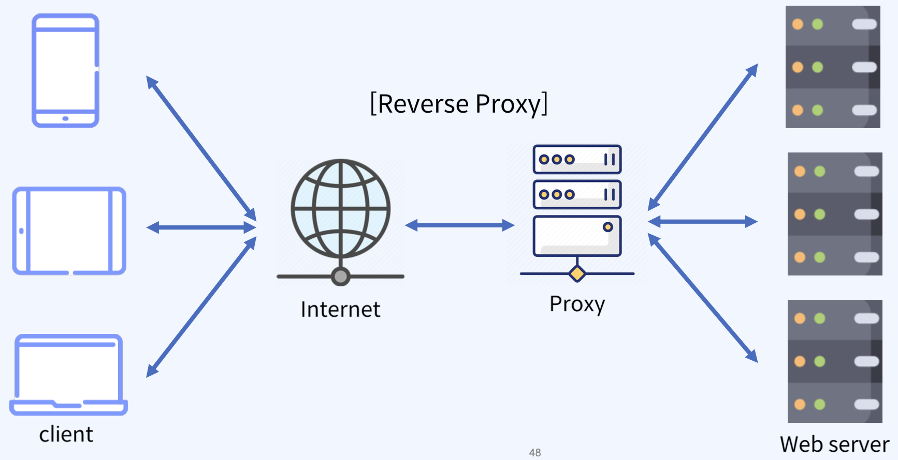

## docker_proxy
- No config proxy (no Load Balancer) ?
- Proxy 구성이 없으면 사용자의 요청은 직접 웹서버에 전달되어 서버 부담을 가중하게 된다.
- 단일 웹서버 구성은 장애 발생 시 서비스 가용성에 치명적이다.
- 다중 웹서버 구성으로 여러 사용자의 요청을 처리할 경우에도 요청한 부하를 적절히 분산시켜 주지 못하면 한 서버에 부하가 몰리는 Hotspot이 발생하는 등의 문제가 발생 가능하다.
- 최종 사용자 관점의 응답 시간 만족을 얻기 힘들다. 
> 

### proxy?
- 요청자와 응답자 간의 중꼐 역할. 즉, 통신을 대리 수행하는 서버를 proxy server라 함
- Proxy server의 위치에 따라 forward proxy, reverse proxy로 구분한다.

### forward Proxy?
- forward proxy는 client와 internet 사이에 있어서 client 정보가 서버에 노출되지 않음 
> 

### Reverse Proxy ? 
- Reverse Proxy는 client 요청을 서버 대신 받아서 전달한다. client에게 서버 노출 안된다.
>   

### Nginx
- 기본 구성 값으로 "웹 서버"를 실행한다. 동일 계열 점유율이 제일 높다.
- 추가 구성으로 "Reverse Proxy" 구현이 가능하다.
- Kubernetes의 ingress controller로 "nginx ingress controller" 선택이 가능하다.
- API 트래픽 처리를 고급 HTTP 처리 기능으로 사용 가능한 "API Gateway" 구성이 가능하다.
- MSA 트래픽 처리를 위한 MicroGateway로 사용 가능
- 설정은 (linux 기준) /etc/nginx 하위에 nginx.conf 변경을 통해 구성할 수 있다.
> ### Nginx reverse proxy
> - 클라이언트 요청이 80 포트로 들어오면 준비해둔 애플리케이션 서버의 주소로 각 서버로 트래픽을 분배한다.
> - 기본 분배 방식(LoadBalancing)은 round-robin 방식으로 처리한다.
> - 요청이 적은 서버로 분배하는 least_conn 방식.
> - IP당 서버를 분배하는 ip_hash 등 여러가지 부하 분산 알고리즘을 사용할 수 있다.
 
### HAproxy
- 하드웨어 기반의 L4/L7 스위치를 대체하기 위한 오픈소스 소프트웨어 솔루션 
- TCP 및 HTTP 기반 애플리케이션을 위한 고가용성(Active-Passive).
- Load Balancing 및 프록시 기능ㅇ르 제공하는 매우 빠르고 안정적인 무료 Reverse Proxy다.
> 주요 기능
> 1. SSL
> 2. Load Balancing
> 3. Active health check
> 4. KeepAlived (proxy 이중화)
### HAproxy, L4 
- OSI 7 계층 중 Layer 4는 IP를 이용한 트래픽 전달이 특징이다.
- Haproxy L4 구성 시 IP와 Port를 기반으로 사용자 요청 트래픽을 전달하도록 구성.
- 요청에 대한 처리는 웹서버로 구성된 web1 ~ 3에 round-robin 방식으로 부하 분산 된다.
>   

### Haproxy, L7 
- OSI 7계층 중 Layer 7은 HTTP 기반의 URI를 이용한 트래픽 전달이 특징이다.
- 동일한 도메인(example.com)의 하위에 존재하는 여러 웹 애플리케이션 서버를 사용할 수 있다.
- 사용자의 요청과 설정에 따른 부하 분산이다.
