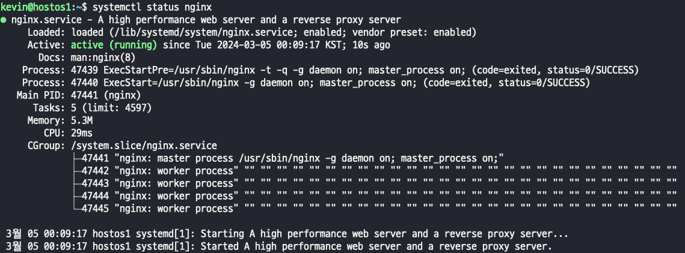
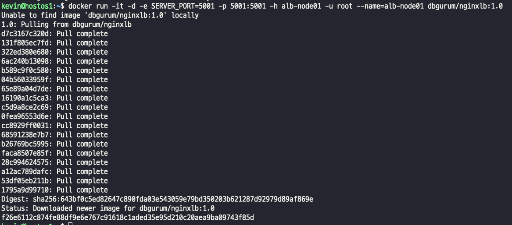
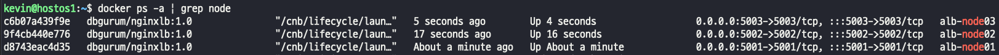

## Host Nginx reverse proxy 구성
>   

#### nginx
- nginx 설치 및 상태 조회
  
- Load balancing이 구현될 애플리케이션 컨테이너 생성  
  
  

## 네트워크 삽질..
- VM을 이용해서 외부 접속 서버를 구성하는 경우
> - hostOS 의 ip에 포트를 포워딩 했으면, 외부 접속의 모든 포트를 포트포워딩 해줘야한다.  
> - 컨테이너 실행 포트를 5006 , 9123:5006 으로 설정하는 경우  
> - 외부접속 서버 공유기의 내가 접속할 포트(서비스 포트) - 9120으로 설정하고 hostOS의 포트(내부 포트)를 9120 으로 설정하고,    
> - VM 가상화 서버의 포트포워딩을 호스트IP에 9120으로 설정하고, 9123 (컨테이너 포워딩 IP)로 설정하고 접속 해야한다.  
> - 반드시, 꼭, 무조건, 제발,  