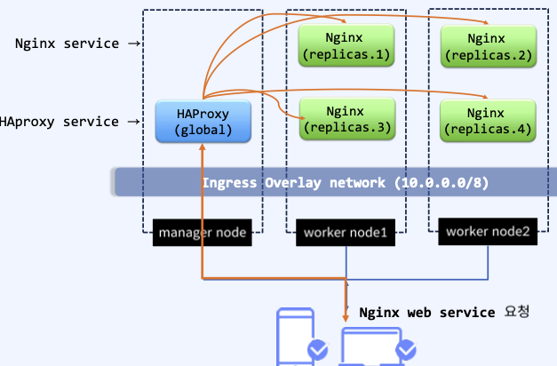
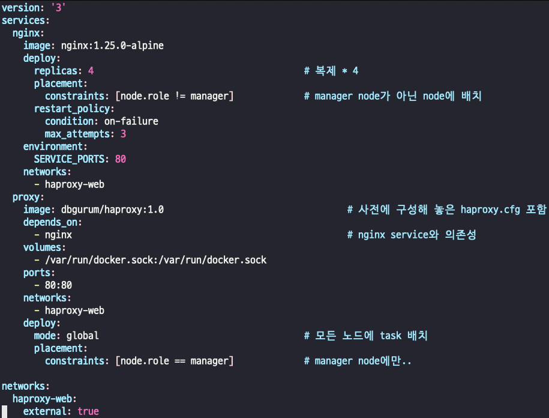
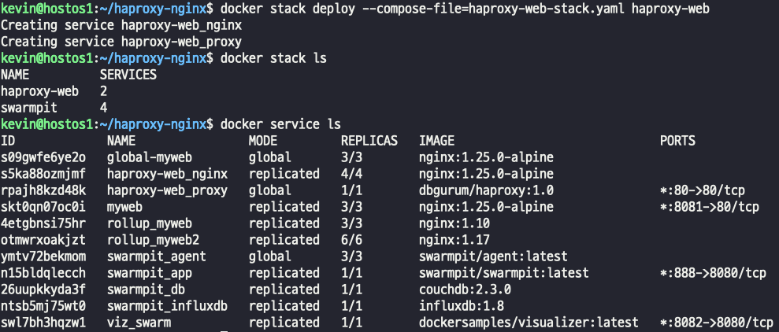
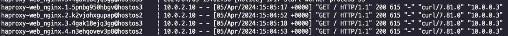

## docker stack
- docker swarm은 여러 노드로 구성된 클러스터 환경에서 서비스를 통해 컨테이너 애플리케이션을 배포한다.
- docker compose는 YAML 코드를 통해서 컨테이너 간의 연결성을 제공하지만, 동일 호스트에서 실행되므로 수평 확장은 하나의 호스트의 리소스로 제한된다.
- docker stack은 두 기술을 연결하고 docker-compose.yaml 코드를 사용하여 swarm에 연결된 클러스터의 노드에 연결된 컨테이너 서비스를 실행하여 연결성을 제공한다.
>  docker stack = docker swarm mode + docker compose

## docker stack 을 활용한 간단한 웹 서비스 배포
- manager node에 haproxy service를 생성하고, 해당 IP로 웹 접속이 있을 경우 이를 동일 overlay network 내에 있는 nginx service로 트래픽을 분산시킨다.  
        

- docker swarm route mesh는 Service의 port를 게시할 경우 해당 port가 모든 swarm node에 게시되도록 한다 (IPVS 사용)  
- 사용할 network 먼저 생성    
      
> - overlay network는 단일에서는 사용이 불가능하다. -> swarm 모드에서 사용 가능함
- yaml 파일 작성
  
- 작성한 yaml 파일을 deploy 배포
    
- 요청을 보냈을떄 로드밸런싱..
      