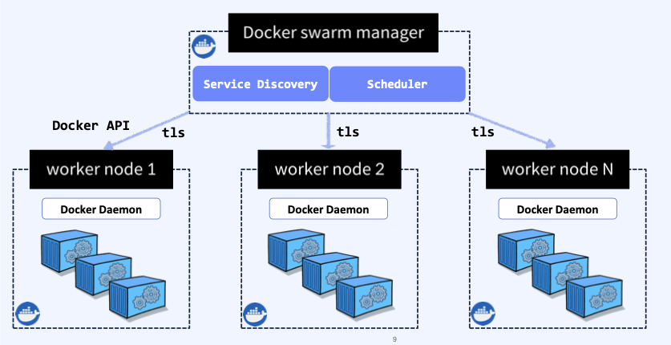
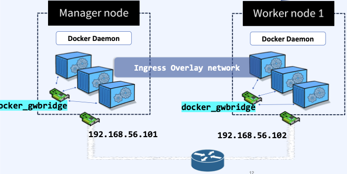

## docker_swarm

### docker swarm mode
- Docker swarm은 Docker 컨테이너를 위한 분산 환경 클러스터링 및 **스케줄링** 도구다.
- Docker는 단일 호스트, Docker swarm mode는 다중 호스트 기반의 컨테이너 기반 애플리케이션 관리 도구다. -> Orchestration tools
- 즉, "컨테이너화 된 애플리케이션에 대한 자동화된 관리 및 제어를 수행하는 도구".
- 여러 대의 노드 기반의 클러스터를 구축하여 별도의 추가 비용 없이 swarm mode를 초기화 하여 사용한다

### Docker swarm mode 주요 기능
- DNS 서버를 통해 서비스 검색(Service Discovery) 기능 구현 가능
- 서비스용 포트를 외부 Load Balancer에 연결하여 부하 분산 구현 
- 각 노드는 TLS(Transport Layer Security) 상호 인증 및 암호화를 통해 노드 간 통신에 대한 보안 기능 구현
- 점진적 서비스 업데이트 및 롤 아웃을 위한 rolling update 및 rollout 기능
> 1. Docker 엔진과 통합된 multi host 기반의 분산 Cluster 운영
> 2. 선언적 접근 방식(YAML) 을 통한 원하는 상태의 애플리케이션 스택(stack) 정의 
> 3. 원하는 상태를 유지 하기 위한 Auto scaling 지원
> 4. 서비스에 대한 멀티 호스트 클러스터 네트워크(overlay) 사용으로 overlay network의 컨테이너 주소 자동 할당

### Docker swarm mode 주요 용어
- Node : Docker swarm cluster를 구성하는 각각의 Docker host
- Manager Node : Cluster 관리 및 컨테이너 오케스트레이션을 담당하는 node.
- Worker Node : 컨테이너 기반 서비스들이 실제 동작하는 node 
- Stack : 다중 컨테이너 애플리케이션을 동작시키는 서비스 묶음
- Service : Node에서 수행하고자 하는 작업(배포)의 단위
- Task : 애플리케이션이 동작할 컨테이너. 하나의 Service는 replica 수에따라 여러 개의 Task 보유, 각 Task에는 하나의 컨테이너 포함 (가장 작은 scheduling 단위)
- Scheduling : Service 명세에 따라 Task(컨테이너)를 node에 분배하는 작업. 균등 분배(spread) 방식이나 labeling을 통해 노드 범위 제한

### Docker swarm architecture
- 단일 매니저인 경우
    
> - manager가 지정이 되면, 로드밸런싱, 디스커버리, 스케쥴링 등을 담당한다.
> - worker node들은 init을 하게 되면 합류시킬수 있게 해주는 join key를 제공한다. -> join key로 연결하면 manager와 연결된다.

- 매니저가 여러대인 경우  
  
> - Raft 합의 알고리즘은 다중 Manager 환경에서 작업 스케쥴링 담당 Leader인 Manager node 장애 시 다른 Manager node를 선출하여 작업 조정을 수행하는 "합의, 선출" 알고리즘이다.

### Docker swarm service 배포  
    
> - Docker Swarm 에서 Service 생성 요청을 받은 경우, Task를 Worker Node에 Scheduling 하는 방법.
> 1. 명령을 수락하고 Service 객체를 생성
> 2. Service 객체에 대한 Task를 생성하는 조정 루프 
> 3. Task에 IP 주소 할당
> 4. Node에 Task 할당 
> 5. worker node에 Task를 실행하도록 지시
> 6. 할당된 Task를 확인하기 위해 Dispatcher에 연결 
> 7. worker node에 할당된 Task 실행

### Docker swarm network  
    
> - manager node와 worker node는 docker swarm 생성 시 제공되는 ingress (overlay network) 로 연결 
> - ingress는 task간의 통신 및 load balancing할 때만 사용
> - Load balancing은 IPVS 라는 기술을 사용하여 수행한다.
> - docker_gwbridge : docker0 호스트 내부 통신용이다.  
> > - 노드 하나에 네트워크는 총 3개가 할당이 되는것이다.
> > 1. **docker0** : 데몬이 갖고있는 기본 네트워크 (port를 지정하지 않은 경우. 172.17.0.x 대역 할당)
> > 2. **IPVS** : Host 간에 통신을 지원하는 Ingress network
> > 3. **gwbridge** : Cluster 환경에서 컨테이너 배포 시 gwbridge에 연결. -> 외부와의 연결에 관여한다. (port를 지정한 경우. 10.x.x.x 대역 할당)

### IPVS (IP Virtual Server (load balancer))
- 외부에서 어떤 Node에 접근 하더라도 IPVS 와 ingress network 를 사용하여 worker-node들이 제공하는 모든 task에 접속 가능.
- Docker swarm routing mesh는 Service의 port를 게시할 경우 해당 port가 모든 swarm node에 게시되도록 한다.
> - IPVS 네트워크 전달하는 과정
> 1. 서비스 생성 시 8888로 요청을 전달한다.
> 2. 생성한 서비스의 task는 현재 모든 node에 있으므로 모든 node에 IPVS에 접근 가능하다.
> 3. 원하는 서비스를 찾기 위해 Service Discovery를 수행한다. -> DNS
> 4. 내부 key, value 저장소 (etcd/consul 등) 에서 task name, service name과 일치하는 IP 확인 후 해당 서비스의 VIP를 요청자에게 재 반환 -> ingress network에 연결
> 5. docker는 서비스 task 간의 트래픽 **균등 분배**
> 6. 서비스의 VIP는 각 task IP로 부하 분산되어 트래픽 전달