## cluster 구성

### swarm mode 구성
- 초기화(init)를 통해 manager node 에서 swarm cluster를 시작한다.
- --advertise addr 은 다른 swarm node들이 manager node에 접근하기 위한 IP를 입력한다.  
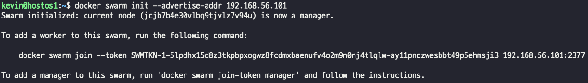  
> - swarm manager는 default port=2377, node간 통신은(7946/tcp, 7946/udp) 을 사용한다.
> - ingress overLay network는 (4789/udp), 사전에 firewall에 open 하거나 stop한다.
- 다른 host에서 발급받은 토큰으로 연결한다
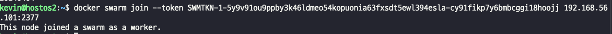  
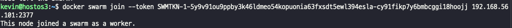    
- 매니저 노드에서 워커 노드가 잘 등록 됐는지 조회해보면  
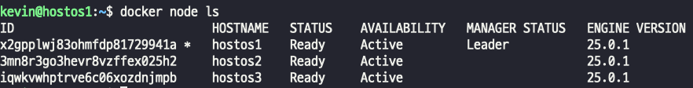  
- 노드가 연결되고 나면 swarm에서 기본적으로 설정하는 포트가 잘 열려 있는지 확인해보자  
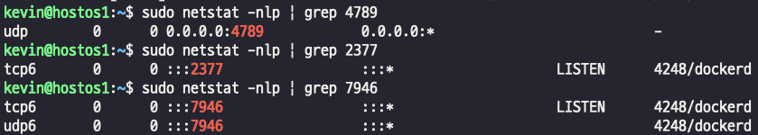    
> - 클러스터 관리 통신용 TCP 포트 2377 (MGMT plane)  
> - 노드 간 통신을 위한 TCP 및 UDP 포트 7946 (Control plane)  
> - 오버레이 네트워크 트래픽용 UDP 포트 4789 (VXLAN data plane)  

## portainer에서 docker swarm 확인하기
- portainer 접속
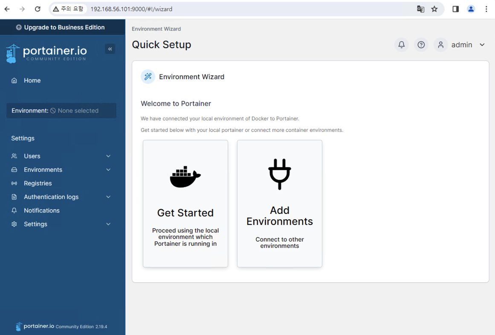  
- portainer에서 swarm 영역을 클릭하면 등록된 node 들을 확인할 수 있다  
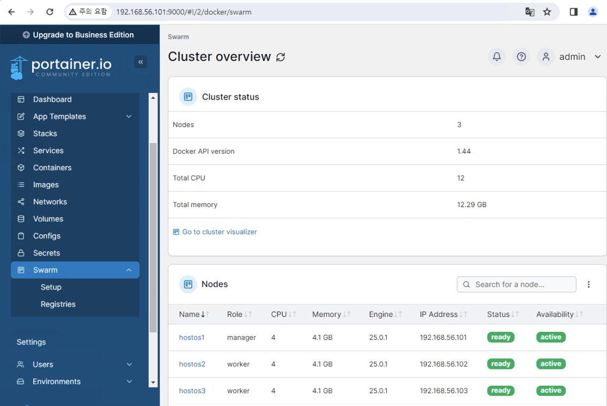    
- resource 모니터링
> - Containers -> 컨테이너 선택 -> stats 를 선택하면 모니터링 도구로도 사용할 수 있다.  
> 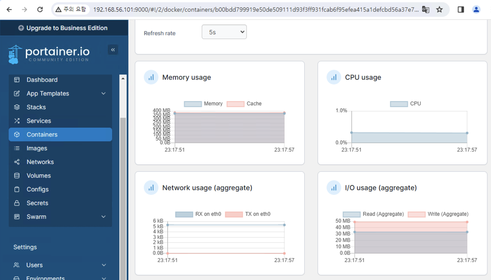      

## swarm 전용 : visualizer
- visualizer는 어디에 뭐가 현재 올라가 있다 를 편하게 알 수 있는 서비스다.
- visualizer 만들기  
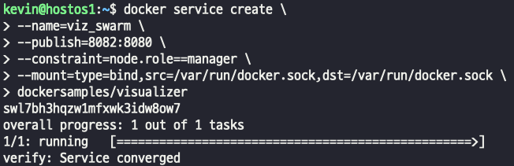      
> - 만들어진 service 확인하기  
> 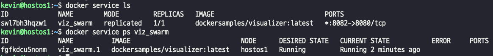    
> - running 되고 있는 task(container)를 확인할 수 있음.  
- visualizer 접속  
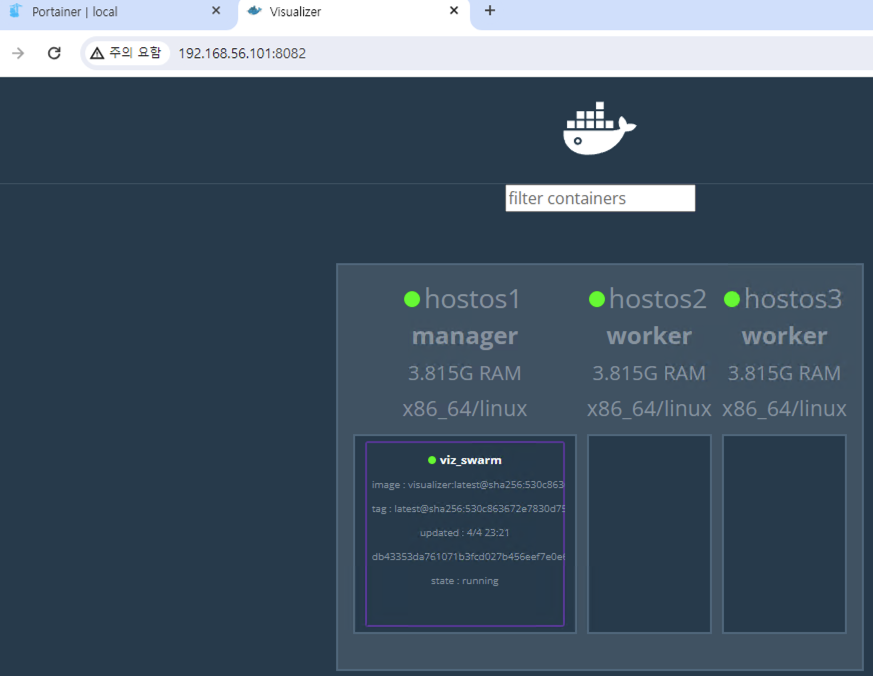    
> - visualizer는 다른 기능은 없고, 그저 swarm으로 어떤 node가 있는지, 그리고 어떤 host인지, 어디에 어떤 컨테이너가 실행중인지만 볼수있다.  

## swarm 전용 : swarmpit  
- docker stack 으로 구동되며, app, agent, db, influxdb의 4개 스택으로 구성되어 있다.  
- swarmpit 구동하기  
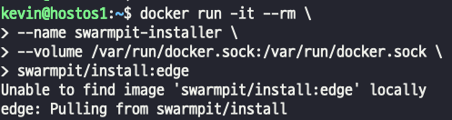    
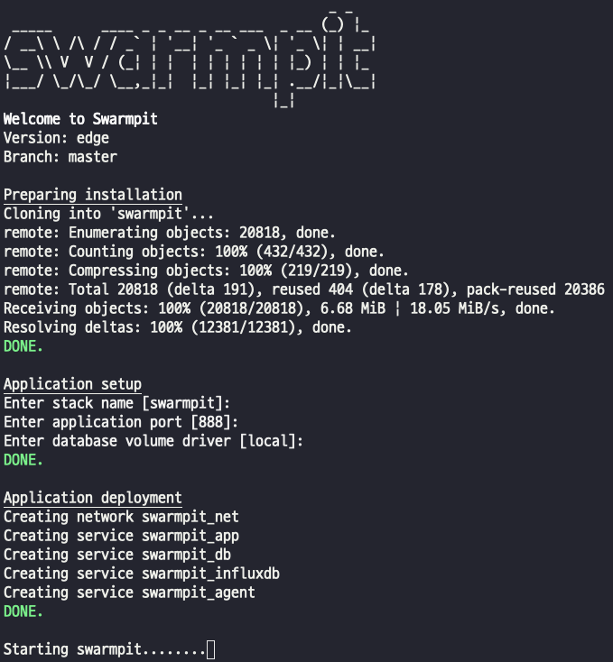    
- 웹으로 접속하기  
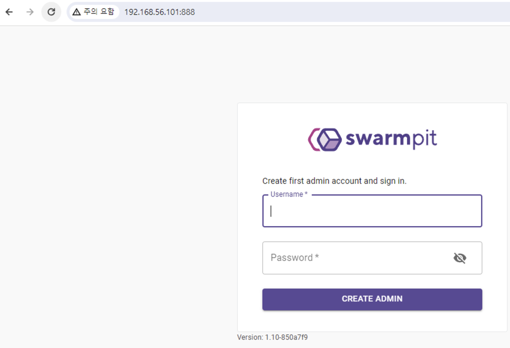    
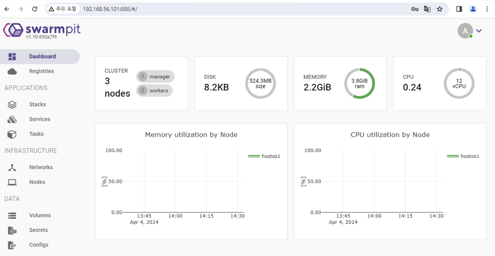    
> - swarmpit도 portainer와 마찬가지로 스택, 서비스, 태스크, 네트워크를 모니터링 할 수 있다.
> - 다만, swarm 전용이라는 점만 다른듯 하다.
> - 업무에 따라 필요하거나 마음에 드는걸로 골라 쓰면 될듯
