## basic docker swarm service
- swarm으로 기본적인 서비스를 만들어보자

## stdout 발생 서비스 생성해보기
- 3초마다 입력한 문구를 출력하는 간단한 service  
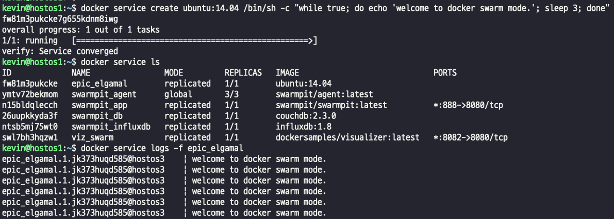  
> - 요청을 던졌을 떄, API가 받아서 오케스트레이터에 의해서 전달이되고  디스패처 스케쥴러에 할당이되서 노드로 할당이 된다. 
- 모니터링 도구에서 확인해보면 ?
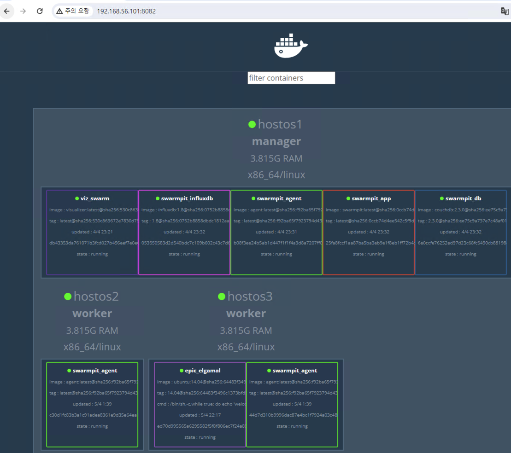    
> - hostos3 영역에 생성됐다!

## nginx service 생성
- service에 replicas 옵션으로 클러스터를 복제해서 사용하는 것이 가장 중요한 개념이라고 할 수 있다. -> 안정적인 서비스가 가능하기 때문.  
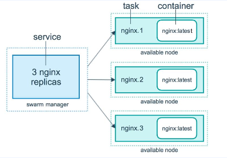    
> - Nginx 이미지를 이용해서 3개의 복제본이 있는 nginx(http) 서비스를 만든다. 세 가지 인스턴슨는 각각 swarm의 task가 된다.
> - 인스턴스는 '작업' 을 뜻하고 task는 Nginx 이미지와 함께 Nginx 컨테이너를 보유하게 된다.
> - 서비스라는 개념이 가장 큰 개념이다.
- service 생성
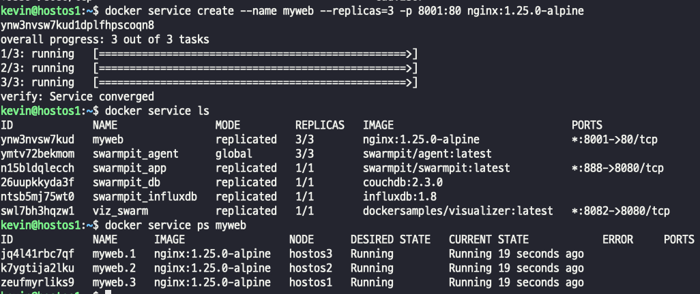      
> - 현재 클러스터의 매니저는 hostos1인데, 매니저에도 할당이 되어있다. -> 매니저 노드도 다른 노드와 동일하게 사용이 가능하다
- IVPS 에 의해서 부하분산이 되는지 확인해보기    
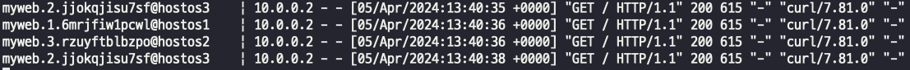
> - hostos2에서 curl localhost:8081 에 요청을 여러번 보낸결과 , myweb 1 2 3 에 하나씩 분산이 잘 된것을 확인할 수 있다.
> - 외부 요청을 보냈을 때 외부요청인 ingress로 들어오고, 
> - ingress에 IPVS가 내부 key, value로 이루어진 data store 에서 service discovery ,
> - 해당 task의 ip 확인,
> - 해당 task 연결,
> - 컨테이너 연결

## nginx 서비스 확장과 축소
- scale 을 통해서 확장을 하면 균등 배분 정책에 의해 균등하게 늘어난 갯수만큼 지정된다
- 당연히 지정도 가능하다.  
> 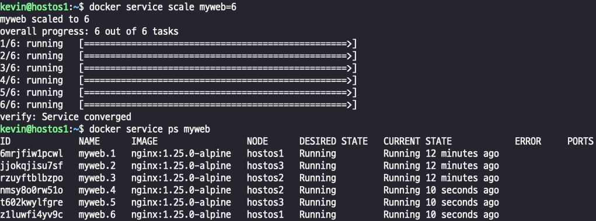  
> - 6개로 늘렸다 -> hostos1 2개 , hostos2 2개, hostos 3개 

## swarm service mode
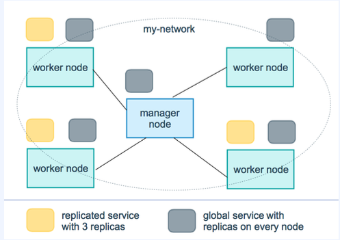  
> - [service 배포 유형]
> - "replicated" Service는 사용자가 원하는 수만큼 Task를 동일하게 생성하여 실행되는 Service. (기본).
> - "global" Service는 모든 Node에서 하나의 Task를 실행하는 Service다. replicas 옵션을 주지 않음
> - mode 옵션으로 설정 가능하다. 

- global 옵션  
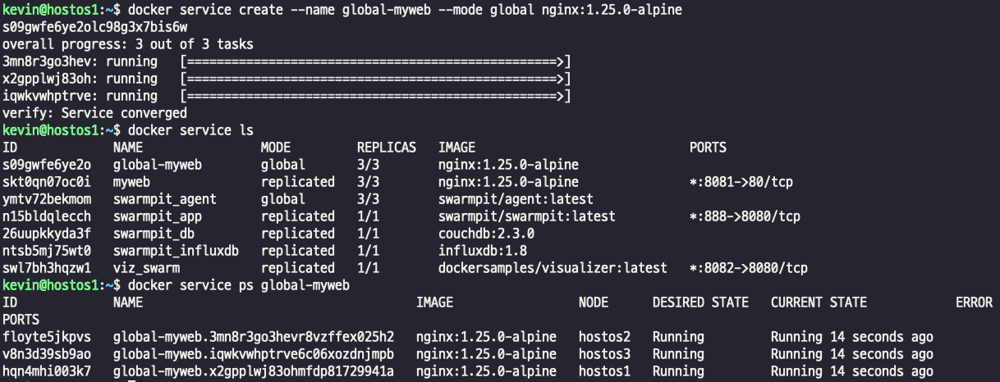  
> - node별로 무조건 하나씩만 배치된다 
> - 어떤 경우에 사용할까? -> 모니터링에 주로 사용된다. 특정 Node에 정보 수집  
> - 특정 task나 Service에 문제가 생겨서 중지되거나 죽게되면, 무조건 하나는 할당 되어야 하는 옵션이기 때문에 자동으로 재생성. 

## 장애 복구
- replicated mode 로 설정된 서비스의 container가 정지하거나 특정 Node가 다운되면 Swarm Manager는 새로운 task(container)를 생성해 자동으로 복구를 수행한다.

### task 장애
- 위에서 만들어둔 my-web 을 강제로 삭제하면 ?  
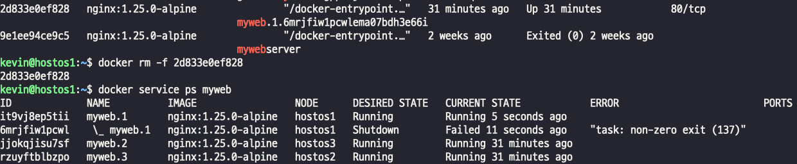  
> - 하나가 죽었더니 바로 자동으로 생성

### node 장애  
- 3번 노드를 강제로 docker stop을 시키면 ?  
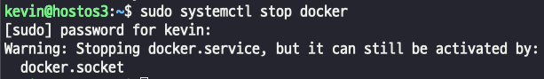      
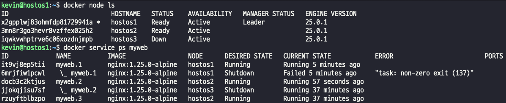      
> - 3번 노드를 강제로 죽인 후 service를 보면 자동으로 매니저 노드, 남은 노드에 나눠서 할당 받은 모습을 확인
> - 이거 좀 쩐다...

## rolling update
- 운영 상태에서 이미지 버전을 바꾸는 rolling update  
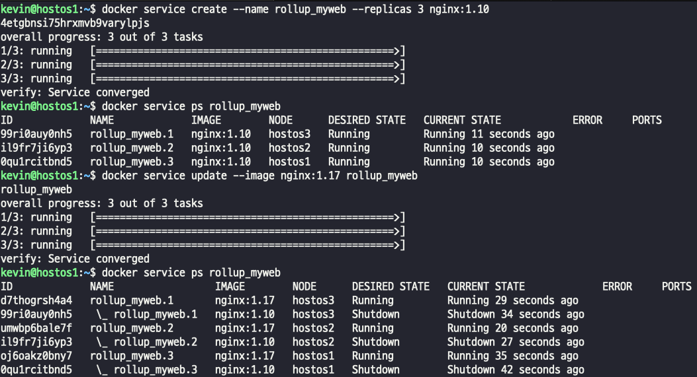  
> - visualization 을 켜놓고 rollup 을 하게 되면 실시간으로 업데이트 되는 모습을 확인할수있다.
> - 하나씩 정지, 업데이트, 기동한다.

### 대규모로 컨테이너를 업데이트 해야 한다면? 
- update 주기. update를 동시에 진행할 container 수, update 실패 시 대처 등을 설정한다.
> 1. task(container) 복제를 10초 단위로 업데이트 수행 (--update-delay 10s)
> 2. update 작업을 한번에 2개의 task(container)에 수행 (--update-parallelism 2)
> 3. 미 설정 시 주기 없이 차례대로 container를 한 개씩 update 함

> 추가 옵션   
> 1. start-first면 새 컨테이너를 먼저 생성한 뒤에 기존 컨테이너를 삭제. stop-first면 기존 컨테이너를 먼저 삭제하고 그 다음에 새 컨테이너 생성 (--update-order)
> 2. 업데이트에 실패할 경우 이 값이 pause면 업데이트를 멈추고, continue면 업데이트를 계속하고, rollback 이면 업데이트를 롤백 한다. (--update-failure-action)
> 3. 실패 비율이 지정한 값 이상이면 업데이트 실패로 간주한다. (--update-max-failure-ratio)

### 업데이트나 특정 작업을 수행한 직전으로 돌아가고 싶은 경우?
- rollback 명령어를 사용한다.
> - docker service rollback rollup_myweb

## node의 유지보수
- swarm node에 대한 정기 작업 등으로 인한 downtime이 필요한 경우, drain 수행
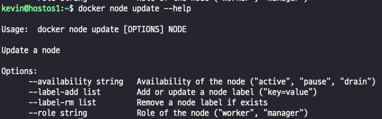    
> - drain 옵션은 특정 node에 배치되어 있던 서비스를 모두 소거하고, 다른 노드에 재배치 시켜주는 옵션이다.
> - 한번 소거된 node가 다시 active 상태가 되더라도 기존 서비스들이 rebalance 되지 않는다. -> Global mode service 는 재배치된다