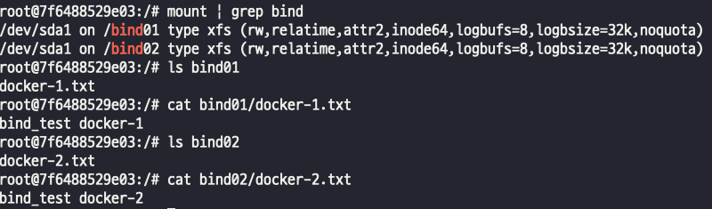
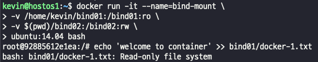
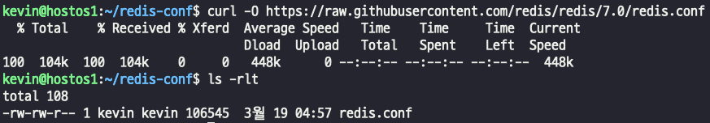
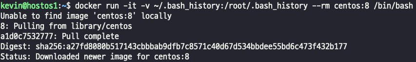

## Bind mount 연결!
- test 파일 생성 -> 이 파일들을 컨테이너 내부와 연결 하고 싶다.  
    
- bind volume 생성
>   
> - 테스트 파일을 만든 경로 bind01,02를 컨테이너 내부에 있는 bind01,02로 연결하겠다.  
> - 이렇게 경로를 설정하면 컨테이너 내부에 자동으로 생성된다.
- ubuntu 컨테이너 내부에 자동 생성 확인 (sda 영역)  
    
- mount 및 volume이 연결되어 파일 host에서 생성한 파일과 그 파일 내용이 정상적으로 확인된다.  
      
- inspect를 사용하면 연결된 volume의 정보를 확인할 수 있다.  

#### 볼륨 연결할 경로에 read write 권한 설정
- Bind mount로 연결된 양쪽 경로의 기본 권한은 read/write(r/w)다.
>   
> - bind01의 권한을 ReadOnly 로 설정하고 write을 하려고 하면 에러가 발생된다  

### Bind mount 설정 파일 공유
- redis DB는 제공되는 기본 설정 파일을 통해 redis-cli 접근인증 암호를 포함시켜 공유하면 해당 암호를 이용해 인증이 가능하다.
- redis.conf 파일을 다운로드 받아서 password를 설정하고 파일 volume을 연결한다음 컨테이너를 실행시키면? 
- 정상 패스워드로 인식되고 컨테이너 기동이 가능하다.
- redis.conf 다운로드  
      
- redis.conf 비밀번호 설정  
    
- redis 컨테이너 볼륨설정 및 실행  
>      
> - 레디스 기본포트 설정  
> - redis data영역을 볼륨으로 설정  
> - 현재 경로의 redis.conf를 컨테이너 redis.conf로 volume 연결    
- redis 비밀번호 인식 잘되는지 확인..~  
      

**config 파일을 만들어놓고 차후에 컨테이너 내부로 옮기고 복사하는게 아니라, hostOS에서 컨테이너를 실행할떄 설정해서 같이 실행되게끔 할 수 있는것이다.**  

### file Bind mount 
- 컨테이너 내부의 특정 파일과 호스트의 파일을 직접 연결한다.
- .bash_history 파일을 컨테이너와 공유시키면 컨테이너와 hostOS에서 사용한 사용자의 명령어가 공유된다. -> 컨테이너에서 동작한 내용을 로그로 hostOS에도 남길 수 있는거지~  
- volume 설정 및 centos 컨테이너 실행  
  
- 볼륨을 확인하기 위해 centOS에서 명령어 아무거나 입력하자  
  
- hostOS에서 volume 설정한 bash_history를 보면?  
  

### 시간 동기화
- hostOS에 설정되어 있는 date와 컨테이너로 실행한 서버의 date가 안맞으면 여러가지 문제가 발생할수있다.
- docker run --rm -v /etc/localtime:/etc/localtime ubuntu:14.04 date 
- 위 명령어로 localtime 파일 자체를 동기화 하는것도 방법이지만
> - 매번 시간 동기화하는건 비효율적이기 때문에 docker image 생성시 Dockerfile에 timezone을 설정하고 사용하는게 더 효율적이다.
> - FROM ubuntu:20.04
> - ENV TZ Asia/Seoul
> >- TimeZone 설정
> > - RUN ln -snf /usr/share/zoneinfo/$TZ /etc/localtime && echo $TZ > /etc/timezone
